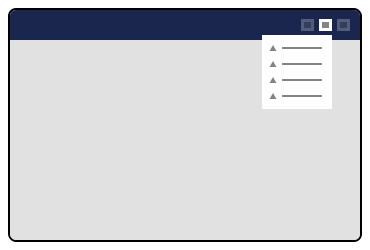

# Extending the Help Menu

This tutorial explains how to extend the Help Menu in the Backoffice UI. The Help Menu serves the purpose of gathering help materials for a Backoffice user.

The Help Menu is an extension built on the `menu` extension type. You can add menu items to the Help Menu by creating a `menuItem` extension targeting the `Umb.Menu.Help` alias.

The Backoffice comes with two default Help Menu items that are visible to all Administrators:

* A link to the Umbraco Learning Base
* A link to the Umbraco docs.

The Help Menu is located in the top right of the UI.

<figure><figcaption><p>Help Menu</p></figcaption></figure>

## Manifest

To add a menu item to the Help Menu, create a `menuItem` extension targeting the `Umb.Menu.Help` alias. Here is an example manifest:

```json
{
    "type": "menuItem",
    "kind": "link",
    "alias": "My.MenuItem.Help.Name",
    "name": "Name Of The Help Menu Item",
    "weight": 300,
    "meta": {
        "menus": ["Umb.Menu.Help"],
        "label": "My Help Menu Item",
        "icon": "icon-link",
        "href": "https://link.to/help"
    }
}
```

If your manifest is written in JavaScript/TypeScript, import the `UMB_HELP_MENU_ALIAS` from the `@umbraco-cms/backoffice/help` package.

```typescript
import { UMB_HELP_MENU_ALIAS } from "@umbraco-cms/backoffice/help";
```

You can find more information about menus and menu items in the [menu documentation](../customizing/extending-overview/extension-types/menu.md).

## Conditions

The Help Menu Item is visible to all users by default. If you want to restrict the visibility of the menu item to specific users or based on certain conditions, you can use the [condition system](../customizing/extending-overview/extension-types/condition.md).
