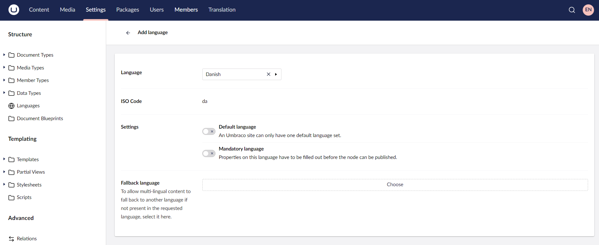
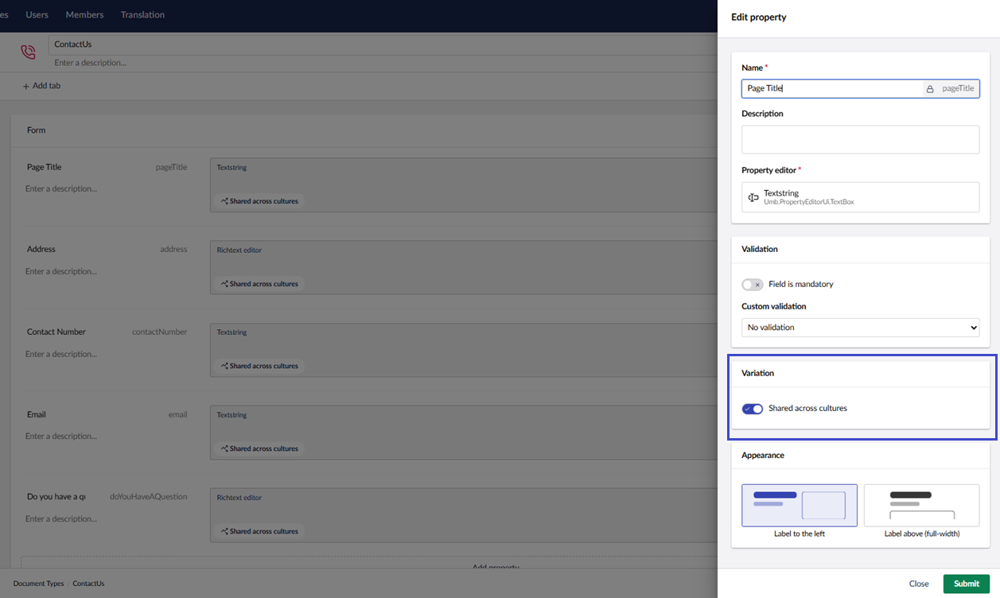
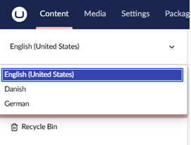
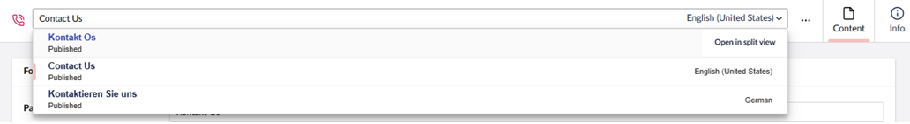
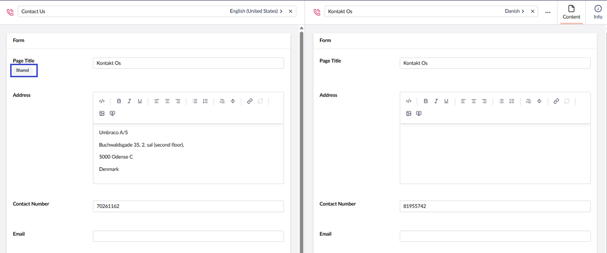
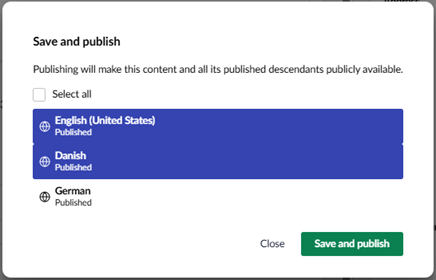
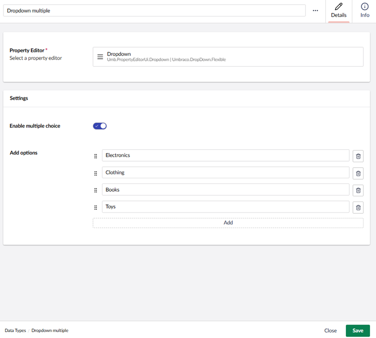
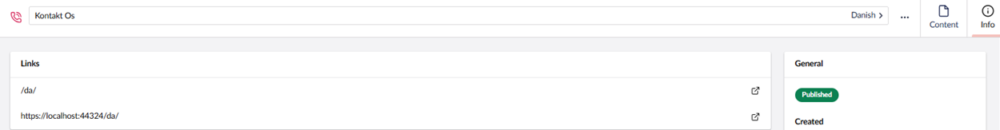

# Creating a Multilingual Site

You can use **language variants** to setup a multilingual site. **Language Variants** allow you to have variants of the same content all under the same project. If you open a page and a language variant is enabled, there will be an option to switch the language from the drop-down list. Additionally, you can view or input the translated content.

This tutorial explains how to set-up a basic multilingual website.

## Adding a New language

To add a new language, follow these steps:

1. Go to the **Settings** section.
2. Go to **Languages** in the **Structure** tree.
3. Click **Create**.
4. Select a **Language** from the dropdown list. In this tutorial, we will pick _Danish_.

    
5. In **Settings**, select the following options to set the new language as the:
   * Default language for your site, toggle **Default Language**.
   * Mandatory language for your site, toggle **Mandatory Language**.
6. Select a **Fallback Language**.

    
7. Click **Save**.

### Adding Multiple Languages

We can add multiple languages depending on our website requirements. In the previous step, we have already set Danish as our default language. We will now set-up English and German as our variants for this tutorial.

1. Go to the **Settings** section.
2. Go to **Languages** in the **Structure** tree.
3. Click **Create**.
4. For English Variant:
   * Select **English (United States)** from the drop-down list.
   * Click **Save**.
5. For German Variant:

    * Select **German** from the drop-down list.
    * Toggle **Mandatory Language** option.
    * Select **Danish** from the **Fallback Language** drop-down list.
    * Click **Submit**.
    * Click **Save**.

    

### Changing the Default Language of a Website

To change the default language of a website:

1. Go to the **Settings** section.
2. Go to **Languages** in the **Structure** tree.
3. Select the language you want to set as the new default language.
4. Toggle **Default Language**.

    
5. Click **Save**.


To change the default backoffice language, update the `Umbraco:CMS:Global:DefaultUILanguage` value in the `appsettings.json` file. For more information, see the [Global Settings](../reference/configuration/globalsettings.md) article.


### Changing the Default Backoffice Language of a User

To change the default language of a User:

1. Go to the **Users** section.
2. Select the user whose backoffice language you wish to change.
3. Select the new language from the **UI Culture** drop-down list.

    
4. Click **Save**.

## Document Types

For this tutorial, we will create the following document types:

* Home Page

    
* Blogs

    
* Contact Us

    

## Enabling Language Variants on Document Types and Properties

To enable language variants on Document Types, follow these steps:

1. Go to the **Settings** tab.
2. Select **Contact Us** from the **Document Types** folder.
3. Go to the **Settings** tab and toggle **Allow vary by culture**

    
4. Click **Save**.
5. Go to the **Design** tab.
6. Click on the Data Type of the **Page Title** and toggle **Shared across cultures**.

    
7. Click **Update**.
8. For this tutorial, we will not make any changes to the **Address**.
9. Click **Save**.

## Viewing the Language Variants in the Content section

When you return to your content node, you will notice two things:

1. At the top of the content tree, there is a dropdown to view the content tree in the language of your choice.

    
2. To the right of the content name, there is now a dropdown where you can select a language. You can also open a split view so you can see two languages at once.

    

## Adding Culture and Hostnames to the Root Node of the Website

To add culture and hostnames, follow these steps:

1. Go to the **Content** tab.
2. Click on the **...** dots next to the **Contact Us** content node.
3. Select **Culture and Hostnames**.
4. Add a domain for each hostname, like it's done here:

    .png>)
5. Click **Save**.

## Using Side-by-Side Mode for Editing Content

To use side-by-side mode for editing content at the same time, follow these steps:

1. Go to the **Contact Us** node. You will find a language dropdown next to the title at the top:

    
2. Click **Open in Split view**. In this splitview, we can see the content node with each language side by side.

    You may notice that the **Address** and other fields do not have a **Shared** tag. This is because the **Shared across cultures** toggle is disabled for these fields.

    

    To enable these fields, follow the steps mentioned in the [Enabling Language Variants on Document Types and Properties](multilanguage-setup.md#enabling-language-variants-on-document-types-and-properties) section.

## Adding Language Variants to the Content

To add language variants to the content.

1. Go to the **Contact Us** node.
2. Enter the **Name** for your content node and the **Page Title** in the new language.
3. Click **Save and Publish**. The **Save and Publish** window opens providing the options to publish in one or more languages.

    
4. Select either one or multiple languages and click **Save and Publish**.

## Rendering Variant Content in Templates

To render the values of the Contact Us page, use the following in the template:

```csharp
@Model.Value("pageTitle")
```

The `.Value()` method has a number of optional parameters that support scenarios where we want to "fall-back" to some other content, when the property value does not exist on the current content item. To use the fallback type, add the `@using Umbraco.Cms.Core.Models.PublishedContent;` directive.

To display a value for a different language, if the language we are requesting does not have content populated:

```csharp
@Model.Value("pageTitle", "en-Us", fallback: Fallback.ToLanguage)
```

For more information, see the [Using fall-back methods](../fundamentals/design/rendering-content.md#using-fall-back-methods) article.

## Using Dictionary Items

Depending on how your site is set up, not all content is edited through the content section. Some of the content may be written in the template or labels of the content node and dictionary items can play a part here. Dictionary items store a value for each language. They have a unique key and can be managed from the **Translation** section. For this tutorial, let's add dictionary items for the **Address** and **Contact Number** labels of the Contact Us page.

### Creating Dictionary Items

To create dictionary items:

1. Go to the **Translation** section.
2. Click on the **...** dots next to **Dictionary**.
3. Select **Create**.
4. Enter a **Name** for the dictionary item. Let's say **Address**.
5.  Enter the different language versions for the dictionary item.

    
6. Click **Save**.
7. Similarly, we will add different language versions for the **Contact Number** field.

### Rendering Dictionary Items

To render dictionary items in the template, replace the text with the following snippet:

```csharp
@Umbraco.GetDictionaryValue("Address")
@Umbraco.GetDictionaryValue("Contact Number")
```

### Translating Multi-Value Property Editors

Property editors such as Dropdown, Checkbox List, and Radiobutton List enable you to specify a set of options for selection within the Content section. By using dictionary items, you can ensure that these options are appropriately translated according to the current language of the site.

To use property editors with dictionary items:

1. Create a corresponding dictionary item with the same name for each option in your property editor. For example:

    | Key         | English Value | French Value |
    | ----------- | ------------- | ------------ |
    | Electronics | Electronics   | Électronique |
    | Clothing    | Clothing      | Vêtements    |
    | Books       | Books         | Livres       |
    | Toys        | Toys          | Jouets       |

2. In your Document Type, set up a property editor and use the keys of the dictionary items as the **Options**:

    _Option 1:_ Electronics, _Option 2:_ Clothing, _Option 3:_ Books, and _Option 4:_ Toys

    

3. Use the following code in your template to retrieve and display the translated value:

    ```cs
    @{
        var selectedValues = Model.Value<IEnumerable<string>>("dropdown");
    }

    @if (selectedValues != null)
    {
        foreach (var key in selectedValues)
        {
            <span>@Umbraco.GetDictionaryValue(key)</span>
            <br />
        }
    }
    ```

    The code retrieves the selected value from the property editor and translates it using the corresponding dictionary item.

## Adding a Translator to the Website

You can assign a Translator when you need a 1-1 translation of your site. For example, let's say we originally created a website in "Danish" which works from a `.dk` domain and now there is a need for an "English" site on a `.com` domain. In this case, it might be easier to copy the entire danish site and then provide access to a Translator who can then translate the site page by page.

Translators are used for the translation workflow. By default, Translators have permission to **Browse** and **Update** nodes. Someone must review the translations of site pages before publishing the nodes. For more information on managing User Groups, assigning access or User permissions, see the [Users](../fundamentals/data/users/) article.

## Viewing the Language Variant on the Browser

To view the language variant on the browser, follow these steps:

1. Go to the **Content** tab.
2. Select your new language from the language dropdown above your content tree.
3. Select the **Contact Us** node and go to the **Info** tab.
4. The Links section contains the language variant links. If it's not there, you might need to refresh the page.

    
5. Click on the link to view the varied node in the browser.
6. Alternatively, you can add the domain name to your localhost in the browser. For example: `https://localhost:xxxx/da/`

For screenshot purposes, there's a stylesheet added to the website. The final result should look similar to the image below:

Danish Version:

<figure><figcaption></figcaption></figure>

German Version:

<figure><figcaption></figcaption></figure>

## Using Multiple languages across APIs

When requesting content over an API, the culture will fall back to the default, unless explicitly set.

You can use the `IVariationContextAccessor` to set the culture context for your API requests.

Follow these steps to create an API controller that returns content in different languages:

1. Create a folder named **Controllers**.
2. Add a file named **ContentApiController.cs**.
3. Add the following code snippet:

```csharp
using Microsoft.AspNetCore.Mvc;
using Umbraco.Cms.Core.Cache;
using Umbraco.Cms.Core.Logging;
using Umbraco.Cms.Core.Models.PublishedContent;
using Umbraco.Cms.Core.Routing;
using Umbraco.Cms.Core.Services;
using Umbraco.Cms.Core.Web;
using Umbraco.Cms.Infrastructure.Persistence;
using Umbraco.Cms.Web.Common;
using Umbraco.Cms.Web.Website.Controllers;

public class ContentApiController : SurfaceController
{
    private readonly ILanguageService _languageService;
    private readonly IVariationContextAccessor _variationContextAccessor;
    private readonly UmbracoHelper _umbracoHelper;

    public ContentApiController(
        IUmbracoContextAccessor umbracoContextAccessor,
        IUmbracoDatabaseFactory databaseFactory,
        ServiceContext services,
        AppCaches appCaches,
        IProfilingLogger profilingLogger,
        IPublishedUrlProvider publishedUrlProvider,
        ILanguageService languageService,
        IVariationContextAccessor variationContextAccessor,
        UmbracoHelper umbracoHelper)
        : base(umbracoContextAccessor, databaseFactory, services, appCaches, profilingLogger, publishedUrlProvider)
    {
        _languageService = languageService;
        _variationContextAccessor = variationContextAccessor;
        _umbracoHelper = umbracoHelper;
    }

    [HttpGet]
    public async Task<IActionResult> GetContent(int id, string? culture = null)
    {
        if (!string.IsNullOrWhiteSpace(culture))
        {
            var languages = await _languageService.GetAllAsync();
            var requestedCulture = languages.FirstOrDefault(l => l.IsoCode == culture);

            if (requestedCulture != null)
            {
                _variationContextAccessor.VariationContext = new VariationContext(requestedCulture.IsoCode);
            }
        }

        var content = _umbracoHelper.Content(id);

        if (content == null)
        {
            return NotFound();
        }

        return Json(new
        {
            name = content.Name,
            title = content.Value<string>("pageTitle"),
            culture = culture ?? "default"
        });
    }
}
```

4. Build and run your project.
5. Test the API endpoint using: `https://localhost:xxxxx/umbraco/surface/ContentApi/GetContent?id=1177&culture=da`

When you call the API with different cultures, you should receive different values. For example, Danish (da):

```json
{
  "id": 1177,
  "name": "Kontakt Os",
  "title": "Contact Us",
  "culture": "da"
}
```

### Creating a Language Switching Navigation

To navigate between languages, you need to do two key things:

1. Get all the languages that the site can provide
2. Identify the language used on the current page

Once you have these, you need to loop through the languages and provide links to each home node.

### Getting all the languages for a site

The recommended way to retrieve all configured languages is to use `IlanguageService.GetAllAsync()`, which retrieves items from the cache efficiently.

Alternatively, you can get the Home node and find all of the cultures associated with it. This approach has benefits including speed and providing you with URLs to show users.

### Identify the language for the current page

This is achieved in `.cshtml` files using `umbracoHelper.AssignedContentItem.GetCultureFromDomains();`

#### Steps

Now that you have what you need, take the following steps to create a working example.

1. Create a new view called `Navigation.cshtml`
2. Paste in the following code:

```cshtml
@using Umbraco.Cms.Web.Common
@inject IUmbracoHelperAccessor _umbracoHelperAccessor;
@{
    _umbracoHelperAccessor.TryGetUmbracoHelper(out var umbracoHelper);
    var homePage = umbracoHelper.ContentAtRoot().FirstOrDefault(c => c.ContentType.Alias == "{{homeNodeContentAlias}}");
    var cultures = homePage?.Cultures;
}
@if (cultures.Count > 1)
{
    <ul aria-label="Language switcher">
        @foreach (var cult in cultures)
        {
            //get the settings for this culture
            System.Globalization.CultureInfo culture = new System.Globalization.CultureInfo(cult.Key);
            //if the current page has a language variant, otherwise link to the homepage language variant
            string langUrl = umbracoHelper.AssignedContentItem.Url(cult.Key, UrlMode.Relative) ?? homePage.Url(cult.Key, UrlMode.Relative);
            <li>
                @if (cult.Key.ToLower() == umbracoHelper.AssignedContentItem.GetCultureFromDomains().ToLower())
                {
                    <span aria-current="true" >@culture.NativeName</span>
                }
                else
                {
                    <a href="@langUrl" hreflang="@cult.Key" lang="@cult.Key" >@culture.NativeName</a>
                }
            </li>
        }
    </ul>
}
```

3. Replace `{{homeNodeContentAlias}}` with the Document Type alias of your Home node.

This will render links to either the language variant of the current page or the home node for the language variant.

Additionally, `System.Globalization.CultureInfo` is used to obtain the native name of the language being rendered. This is useful if a user does not speak the default language.
