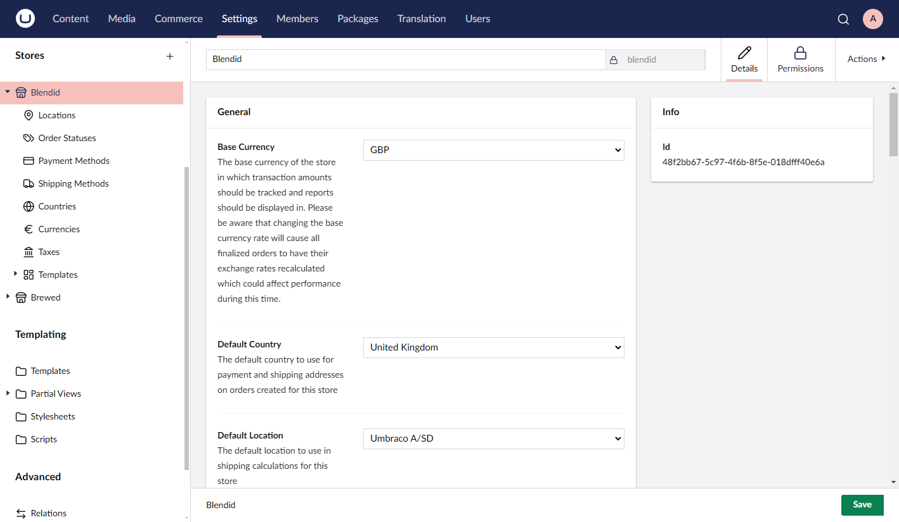
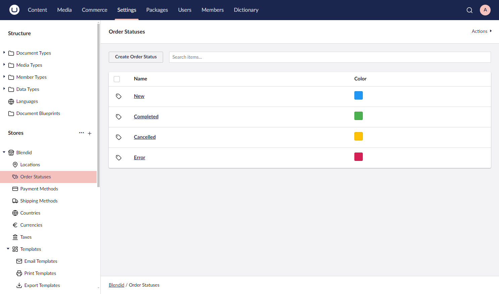
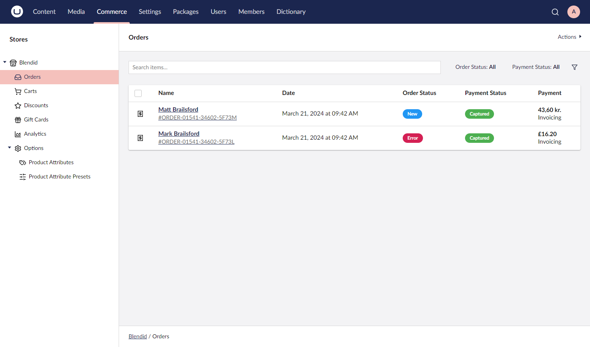
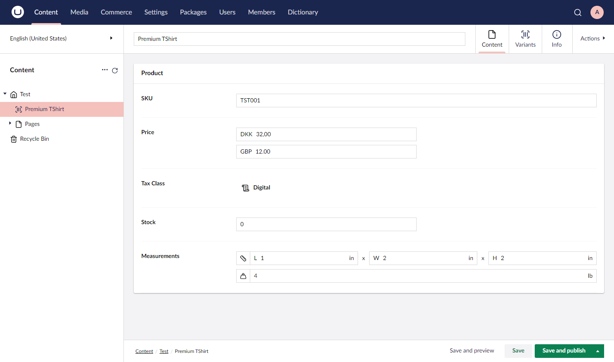

# User Interface

The Umbraco Commerce UI consists of a number of key areas, split over three sections within the Umbraco backoffice:

* **Settings** for managing the different store settings.
* **Commerce** for managing store-related content (orders, discounts, etc).
* **Content** for managing the Umbraco Commerce products.

## Settings Section

The **Settings** section is where the configuration of all Store settings is managed. From here you can manage how the Store works as well as what options will be available within the Store.

The UI for the **Settings** section consists of a Tree which lists all available Stores and their key areas available for configuration. It also contains a right-hand editor panel. This can either act as an editor interface or as a list view interface for listing items within that given configuration area.

Each Store has a number of key areas of configuration accessible within the **Settings** section:

* **Store**: Each Store node contain Store level configuration settings.
* **Locations** contain the configuration of the different locations of the store.
* **Order Statuses** contain the configuration of the different Statuses an order can be in. Think of these as an organizational structure for your Orders.
* **Shipping Methods** contains the list of Shipping Methods available to a Store.
* **Payment Methods** contains the list of Payment Methods available to a Store.
* **Countries** contain the list of Countries the Store is able to trade with.
* **Currencies** contain the list of accepted Currencies for the Store.
* **Taxes** contains the list of Tax Classes and their Tax Rates for the Store.
* **Email Templates** contains the list of Email Templates supported by the Store.
* **Print Templates** contains the list of Print Templates supported by the Store.
* **Export Templates** contains the list of Export Templates supported by the Store.

## Commerce Section

The **Commerce** section contains a Tree to access the Stores and their different features, as well as a right-hand panel for managing the items.

## Content Section

The **Content** section is where the Umbraco Commerce product nodes are managed. Managing products with Umbraco Commerce is similar to working with regular content nodes.

