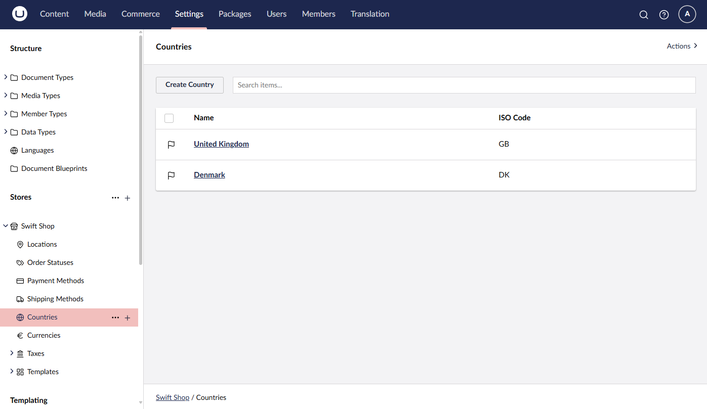
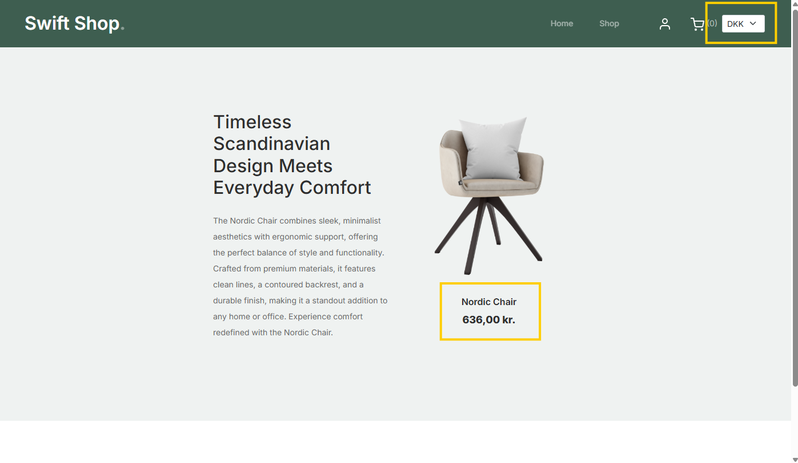

# Implementing a Currency Switcher

In a globalized world, it is essential to provide users with the ability to switch between different currencies. This feature is especially important for e-commerce websites that cater to customers from different countries.

In this guide, you can learn how to implement a currency switcher in Umbraco Commerce.


In this guide, it is assumed that each country has a single currency. If your store supports multiple currencies per country, you must adjust the implementation accordingly.


## Configure Countries and Currencies

1. Define the countries and currencies you want to support, in the Umbraco backoffice.




2. Navigate to the Content section.
3. Populate the product prices for each currency.


## Create a Currency Switcher Component

A partial view is used on the frontend to allow users to toggle between existing currencies.


This is done by creating a `CurerrencySwitcher.cshtml` partial with the following implementation:


```csharp
@using Umbraco.Commerce.Core.Api;
@using Umbraco.Commerce.SwiftShop.Extensions;
@inject IUmbracoCommerceApi UmbracoCommerceApi
@inherits Umbraco.Cms.Web.Common.Views.UmbracoViewPage

@{
    var store = Model.GetStore();
    var countries = await UmbracoCommerceApi.GetCountriesAsync(store.Id);
    var currencies = await UmbracoCommerceApi.GetCurrenciesAsync(store.Id);
    var currentCountry = await UmbracoCommerceApi.GetDefaultShippingCountryAsync(store.Id);
}

@if (countries.Count() > 1)
{
    @using (Html.BeginUmbracoForm("ChangeCountry", "Culture", FormMethod.Post, new { @name = "changeCountryForm" }))
    {
        @Html.DropDownList("countryIsoCode", countries.Select(x 
            => new SelectListItem(currencies.First(y => y.Id == x.DefaultCurrencyId!.Value).Code, x.Code, x.Code == currentCountry.Code)),
        new
        {
            @class = "form-select form-select-sm",
            @onchange = "document.forms['changeCountryForm'].submit()"
        })
    }
}
```


## Result

With the currency switcher implemented, users can switch between countries/currencies on your website.

The changes are reflected on the product details pages.



