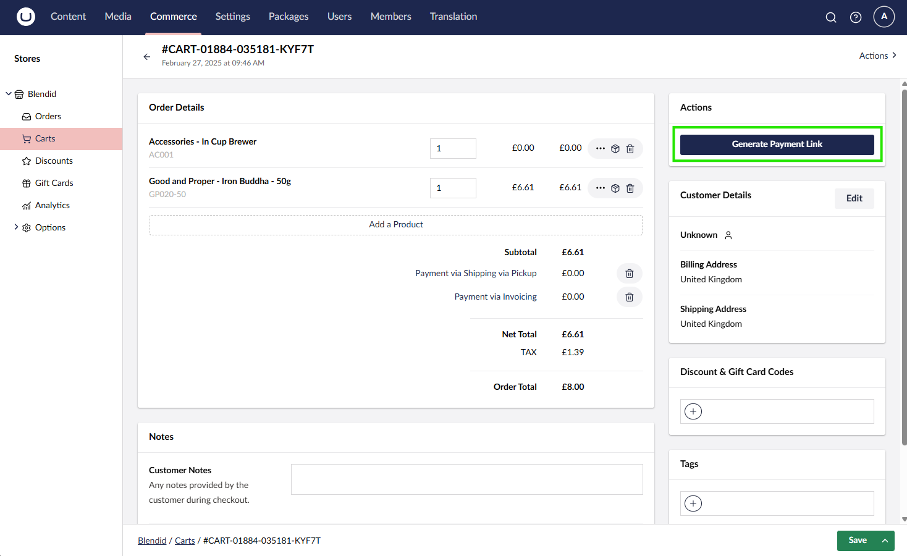
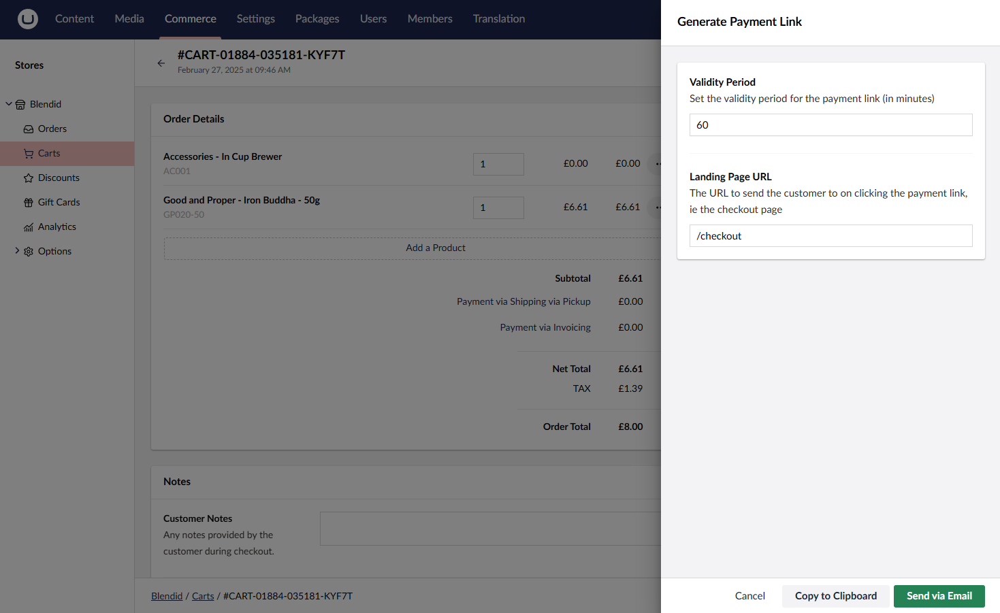
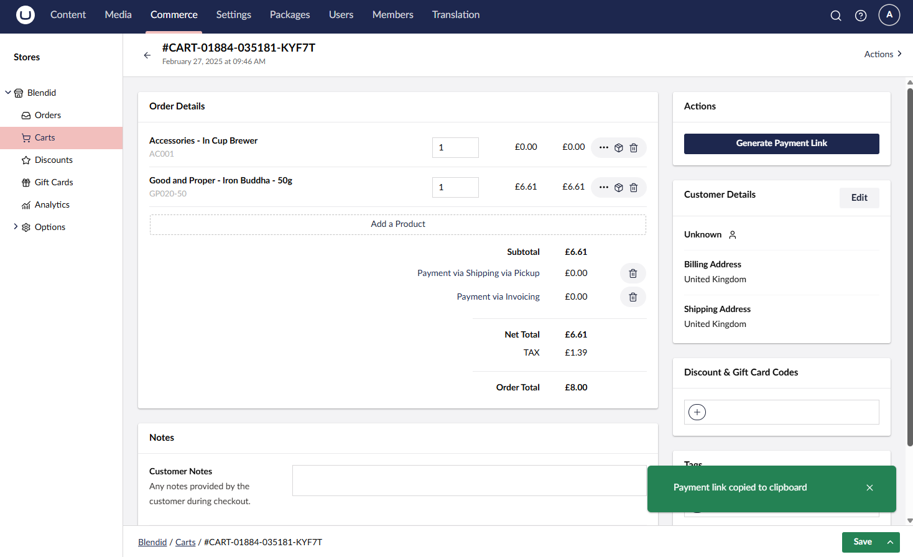
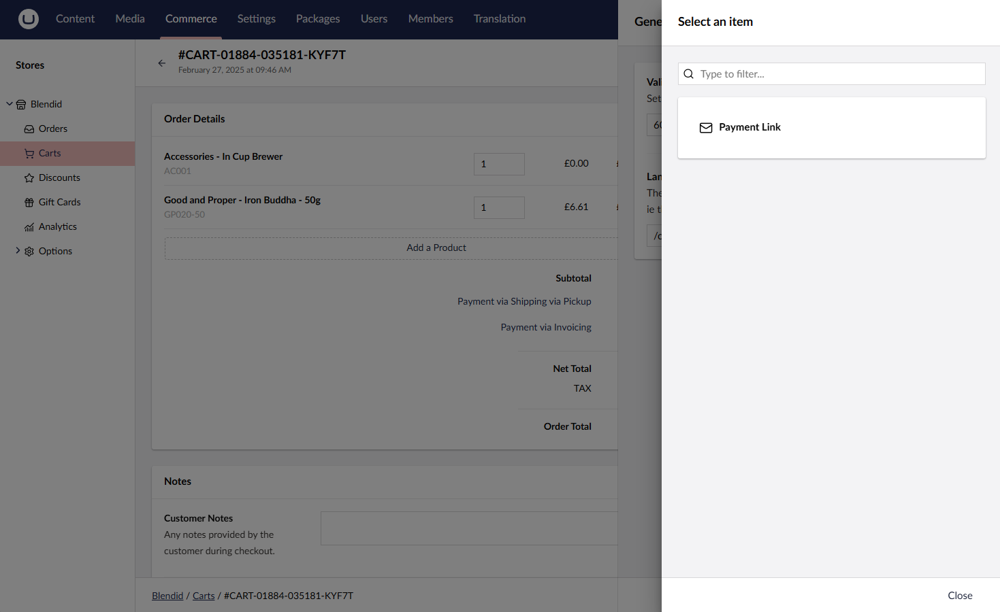
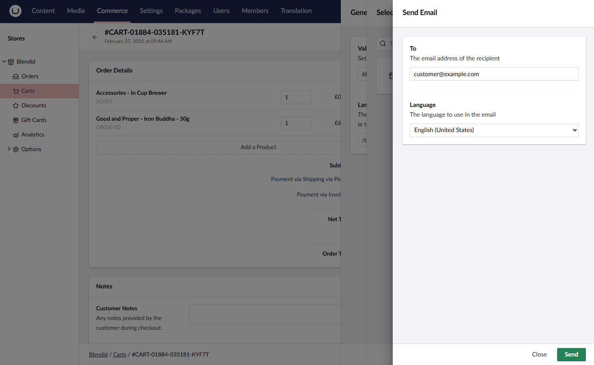
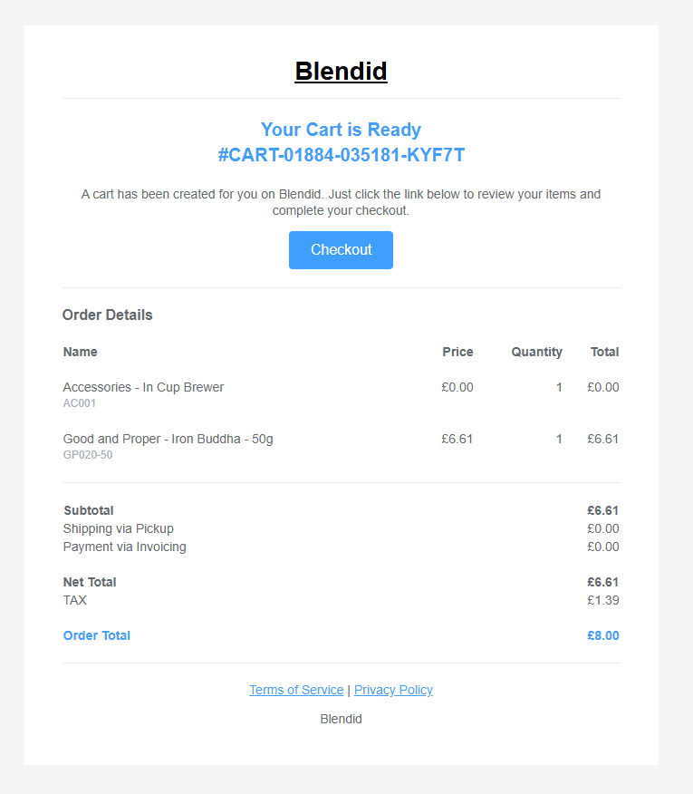
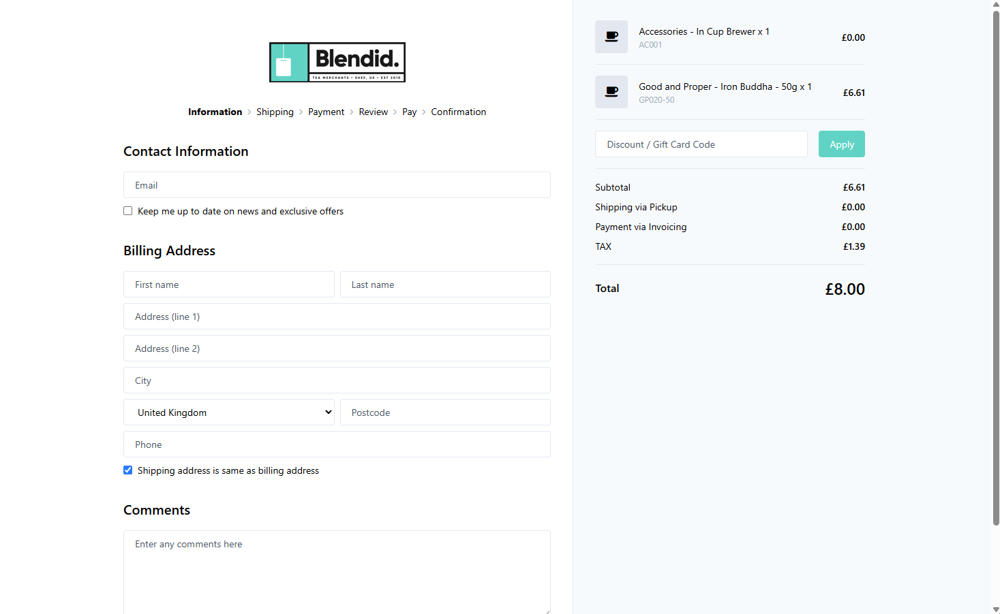

# Sending Payment Links to Customers

A common scenario in e-commerce is when a store owner wants to send a pre-filled cart to a customer for them to complete. This can be useful in many scenarios. It could be when customers request a quote, and the store owner wants to send a link to the customer to make the payment. 

In Umbraco Commerce, it only takes a few clicks to create and send a payment link. The customer can then click the link and complete the purchase.


The payment links feature was introduced in Umbraco Commerce version 15.3.0


## Generating a Payment Link

1. Go to the **Commerce** section in the Umbraco backoffice.
2. Expand the associated store and click on the **Carts** menu item.
3. Click on the **Create Cart** button.
4. Populate the cart with the products you want to include in the payment link.
5. Click on the **Save** button to save the cart.
6. Click on the **Generate Payment Link** button to launch the payment link generator modal.



7. Configure the payment link settings in the Payment Link Generator modal. You can set the following options:

   - **Validity Period**: The period in minutes for which the payment link will be valid.
   - **Landing Page URL**: The URL to which the customer will be directed when clicking on the payment link.



8. Use one of the two options to send the payment link to the customer:

   - [**Copy to Clipboard**](#copy-to-clipboard)
   - [**Send via Email**](#send-via-email)

### Copy to Clipboard

Clicking on the **Copy to Clipboard** button generates the payment link and then copies it to the clipboard. A notification will display to confirm the copy was successful. You can paste the link into an email or other communication form.



### Send via Email

Clicking on the **Send via Email** button launches the Send Email modal. From here, you can select an email template and set the recipient's email address.





Clicking the **Send** button will send the email to the recipient with the payment link.




Umbraco Commerce includes a default email template for sending payment links. You can customize this template by going to the **Settings** section in the Umbraco backoffice and selecting the **Email Templates** menu item.


## Payment Link Usage

When the customer receives the payment link, they can click on the link to open the cart in the store. The cart will be pre-filled with the products and quantities that were added when the payment link was generated.



The customer can proceed to the checkout and complete the purchase as normal.


The payment link cart will be held in session until the cart is completed or the session expires. Once completed, any previously open carts will be restored.


## Handling Expired Payment Links

If a customer tries to use an expired payment link, they will be redirected to the configured landing page URL along with a `payment_link_error` querystring parameter. The value of this parameter will contain the reason for the error.

Developers should use this querystring parameter to display a message to the customer explaining that the payment link has expired.

## Headless Considerations

The payment links handling is done automatically for standard Razor site implementations. You need to handle the payment links manually for headless Storefront API implementations.

Developers should check for a `payment_link_token` querystring parameter when a customer lands on the site. If present, the developer should use the [Storefront API](../reference/storefront-api/endpoints/order.md#umbraco-commerce-storefront-api-v1-order-paymentlinktoken) to retrieve the cart associated with the payment link token. This can then be loaded into the session for the customer to complete payment.

## Configuration Options

The payment links feature has different configuration options you can set via `appsettings.json`:


```json
{
  "Umbraco": {
    "Commerce": {
      "PaymentLinks": {
        "TokenSigningSecret": "your_secret_here",
        "TokenQueryParameterName": "payment_link_token",
        "ErrorQueryParameterName": "payment_link_error",
      }
    }
  }
}
```


By default, Umbraco Commerce payment link tokens are based on the JSON Web Token (JWT) format and are signed using the `TokenSigningSecret` value. The `TokenQueryParameterName` value is used to configure the querystring parameter name used for the payment link token. The `ErrorQueryParameterName` value is used to configure the querystring parameter name used for an error message. 
