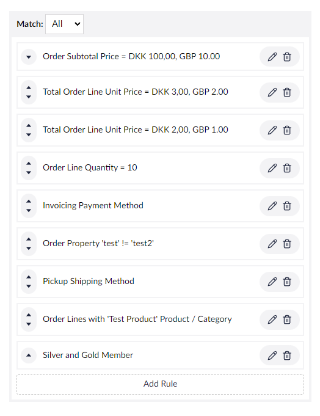

# Discount Rules / Rewards

Discounts in Umbraco Commerce are defined using a series of rules and reward builders that let you configure the following:

* When a Discount should apply.
* What the Reward should be for that Discount.

These builders come with a handful of the most common Rules and Rewards that should suit the majority of web stores' needs. When need to create your own Rules or Rewards then these are extendable via a Provider model allowing you to incorporate your own custom logic.

## Discount Rules

There are two types of Discount Rules in Umbraco Commerce:

* **Order Discount Rules**: Determine whether a discount should apply to an Order. Returns a Fulfilled/Unfulfilled status depending on whether the Rule logic has been met.
* **Order Line Discount Rules**: Determine whether a discount should apply to an Order Line within an Order. Returns a Fulfilled/Unfulfilled status depending on whether the Rule logic has been met. Where the status is Fulfilled, a list of all Order Lines that are fulfilled by this Rule is also returned.

### Example: Custom Order Discount Rule Provider

An example of an Order Discount Rule Provider would look something like this:

```csharp
[DiscountRuleProvider("customerEmailDomainRule")]
public class CustomerEmailDomainRuleProvider : OrderDiscountRuleProviderBase<CustomerEmailDomainSettings>
{
    public CustomerEmailDomainRuleProvider(UmbracoCommerceContext ctx) : base(ctx) { }

    public override DiscountRuleResult ValidateRule(DiscountRuleContext ctx, CustomerEmailDomainSettings settings)
    {
        var customerEmail = ctx.Order.CustomerInfo.Email;

        if (string.IsNullOrEmpty(customerEmail) || string.IsNullOrEmpty(settings.EmailDomain))
            return Unfulfilled();

        // Check if customer email ends with the specified domain
        return customerEmail.EndsWith($"@{settings.EmailDomain}", StringComparison.OrdinalIgnoreCase)
            ? Fulfilled()
            : Unfulfilled();
    }
}

public class CustomerEmailDomainSettings
{
    [DiscountRuleProviderSetting(Key = "emailDomain", LabelUiAlias = "My.PropertyEditorUi.MyDiscountRuleLabel")]
    public string EmailDomain { get; set; }
}
```

All Order Discount Rule Providers inherit from a base class `OrderDiscountRuleProviderBase<TSettings>`. `TSettings` is the type of a Plain Old Class Object (POCO) model class representing the Discount Rule Providers settings.


See the [Settings Objects](discount-rules-and-rewards.md#settings-objects) section below for more information on Settings objects.


The class must be decorated with `DiscountRuleProviderAttribute` which defines the Discount Rule Providers `alias` and `name`, and can also specify a `description` or `icon` to be displayed in the backoffice. The `DiscountRuleProviderAttribute` is also responsible for defining a `labelView` for the Provider.


See the [Labels](discount-rules-and-rewards.md#labels) section below for more information on Label Views.


Rule Providers have a `ValidateRule` method that accepts a `DiscountRuleContext` as well as an instance of the Providers `TSettings` settings model. Inside this you can perform your custom logic, returning a `DiscountRuleResult` to notify Umbraco Commerce of the Rule outcome.

If the passed-in context (which contains a reference to the Order) meets the Rule's criteria, then a fulfilled `DiscountRuleResult` can be returned by calling `return Fulfilled();`. Alternatively, if the Order didn't meet the Rules criteria an unfulfilled `DiscountRuleResult` can be returned by calling `return Unfulfilled();`.

### Example: Custom Order Line Discount Rule Provider

An example of an Order Line Discount Rule Provider would look something like this:

```csharp
[DiscountRuleProvider("minimumQuantityRule")]
public class MinimumQuantityRuleProvider : OrderLineDiscountRuleProviderBase<MinimumQuantitySettings>
{
    public MinimumQuantityRuleProvider(UmbracoCommerceContext ctx) : base(ctx) { }
    
    public override DiscountRuleResult ValidateRule(DiscountRuleContext ctx, MinimumQuantitySettings settings)
    {
        // Check if any line meets minimum quantity
        var qualifyingLines = ctx.ApplicableOrderLines
            .Where(line => line.Quantity >= settings.MinimumQuantity)
            .ToList();
        
        return qualifyingLines.Any() ? Fulfilled(qualifyingLines) : Unfulfilled();
    }
}

public class MinimumQuantitySettings
{
    [DiscountRuleProviderSetting(Key = "minimumQuantity")]
    public decimal MinimumQuantity { get; set; }
}

```

All Order Line Discount Rule Providers inherit from a base class `OrderLineDiscountRuleProviderBase<TSettings>` and follows much the same requirements as the Order Discount Rule Provider defined above. Where they differ is in the `ValidateRule` method implementation and when a fulfilled `DiscountRuleResult` is returned. In this case, an Order Line Discount Rule returns a collection of Order Lines processed by the Rule that have met the rules criteria. Whether the rules are met, is checked by calling `return Fulfilled(fulfilledOrderLines);`.

## Discount Rewards

### Example: Custom Discount Reward Provider

An example of a Discount Reward Provider would look something like this:

```csharp
[DiscountRewardProvider("tieredPercentageReward")]
public class TieredPercentageRewardProvider : DiscountRewardProviderBase<TieredPercentageSettings>
{
    public TieredPercentageRewardProvider(UmbracoCommerceContext ctx) : base(ctx) { }

    public override DiscountRewardCalculation CalculateReward(DiscountRewardContext ctx, TieredPercentageSettings settings)
    {
        var result = new DiscountRewardCalculation();
        var orderTotal = ctx.OrderCalculation.SubtotalPrice.Value.WithoutTax;

        // Determine discount percentage based on order value
        var discountPercentage = orderTotal >= settings.HighTierThreshold ? settings.HighTierPercentage :
            orderTotal >= settings.MidTierThreshold ? settings.MidTierPercentage :
            settings.BaseTierPercentage;

        var discountAmount = orderTotal * (discountPercentage / 100m);

        // Adjustment price must be negative for discounts or positive for fees
        var price = new Price(discountAmount * -1, 0, ctx.Order.CurrencyId);

        result.SubtotalPriceAdjustments.Add(new DiscountAdjustment(ctx.Discount, price));

        return result;
    }
}

public class TieredPercentageSettings
{
    [DiscountRewardProviderSetting(Key = "baseTierPercentage")]
    public decimal BaseTierPercentage { get; set; }

    [DiscountRewardProviderSetting(Key = "midTierThreshold")]
    public decimal MidTierThreshold { get; set; }

    [DiscountRewardProviderSetting(Key = "midTierPercentage")]
    public decimal MidTierPercentage { get; set; }

    [DiscountRewardProviderSetting(Key = "highTierThreshold")]
    public decimal HighTierThreshold { get; set; }

    [DiscountRewardProviderSetting(Key = "highTierPercentage")]
    public decimal HighTierPercentage { get; set; }
}
```

All Discount Reward Providers inherit from a base class `DiscountRewardProviderBase<TSettings>`. `TSettings` is the Type of a POCO model class representing the Discount Reward Providers settings.


See the [Settings Objects](settings-objects.md) documentation for more information on Settings objects.


The class must be decorated with `DiscountRewardProviderAttribute` which defines the Discount Reward Providers `alias` and `name`. It can also specify a `description` or `icon` to be displayed in the Umbraco Commerce backoffice. The `DiscountRewardProviderAttribute` is responsible for defining a `labelView` for the Provider.


See the [Labels](discount-rules-and-rewards.md#labels) section below for more information on Label Views.


Reward Providers have a `CalculateReward` method that accepts a `DiscountRewardContext` as well as an instance of the Providers `TSettings` settings model. Inside this, you can perform your custom calculation logic, returning a `DiscountRewardCalculation` instance that defines any Reward values to apply to the Order.

```csharp
// Add a shipping total discount
result.ShippingTotalPriceAdjustments.Add(new DiscountAdjustment(ctx.Discount, price));

// Add a subtotal discount
result.SubtotalPriceAdjustments.Add(new DiscountAdjustment(ctx.Discount, price));
```

## Common Features

### Settings Objects


See the [Settings Objects](settings-objects.md) documentation for more information on Settings objects.


### Labels

Both the `DiscountRuleProviderAttribute` and the `DiscountRewardProviderAttribute` allow you to define a `ViewUiAlias` to use as a label for the Provider. This should be the alias of a UI component registered as a Property Editor UI implementation.

```csharp
public class CustomerEmailDomainSettings
{
    [DiscountRuleProviderSetting(Key = "emailDomain", ViewUiAlias = "My.PropertyEditorUi.CustomerEmailDomainDiscountRuleLabel")]
    public string EmailDomain { get; set; }
}
```

A basic label component is defined as follows:

```typescript
import { css, customElement, html, property, when } from "@umbraco-cms/backoffice/external/lit";
import { UmbLitElement } from "@umbraco-cms/backoffice/lit-element";
import { UmbTextStyles } from "@umbraco-cms/backoffice/style";

@customElement('uc-customer-email-domain-discount-rule-label')
export class UcCustomerEmailDomainDiscountRuleLabelElement extends UmbLitElement {

    @property()
    value?: Record<string, unknown>;

    render() {
        return when(this.value, () => html`
            Customer email ends with '@${this.value!.emailDomain}'
        `)
    }

    static styles = [
        UmbTextStyles,
        css`
            :host {
                display: block;
            }
        `,
    ];
}

export default UcCustomerEmailDomainDiscountRuleLabelElement;

declare global {
    interface HTMLElementTagNameMap {
        'uc-customer-email-domain-discount-rule-label': UcCustomerEmailDomainDiscountRuleLabelElement;
    }
}
```

The component will be passed a `Record<string, unknown>` value representing the rule/rewards configured values. Use this value to create your label.

Once defined, your component can be registered as a Property Editor UI via a manifest entry.

```javascript
const customerEmailDomainDiscountRuleLabelManifest = {
    type: "propertyEditorUi",
    alias: "My.PropertyEditorUi.CustomerEmailDomainDiscountRuleLabel",
    name: "Customer Email Domain Discount Rule Label",
    element: () => import('./customer-email-domain-discount-rule-label.element.js')
};

export const manifests = [ customerEmailDomainDiscountRuleLabelManifest ];
```


Without a defined scheme, the Property Editor UI will not display in Umbraco's backoffice as a pickable property editor for use on Document Types.


The Rule/Reward Label component should provide a user-friendly summary of its settings to display in the relevant Builder UI.



## Localization

When displaying your rule/reward in the picker modal, or when displaying the configurable settings for your your rule/reward, it is neceserray to provide localizable labels. This is controlled by Umbracos [UI Localization](https://docs.umbraco.com/umbraco-cms/extending/language-files/ui-localization) feature.

Umbraco Commerce will automatically look for the following entries:

| Key |  Description |
| --- | --- | 
| `ucDiscount{type}Providers_{providerAlias}Label` | A main label for the rule/reward provider |
| `ucDiscount{type}Providers_{providerAlias}Description` | A description for the rule/reward provider |
| `ucDiscount{type}Providers_{providerAlias}Settings{settingAlias}Label` | A label for a rule/reward provider setting |
| `ucDiscount{type}Providers_{providerAlias}Settings{settingAlias}Description` | A description for a rule/reward provider setting |

Here `{type}` can be either `Rule` or `Reward`. `{providerAlias}` is the alias of the rule/reward provider, and `{settingAlias}` is the alias of a setting.
