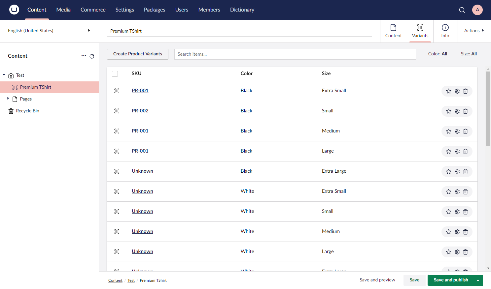
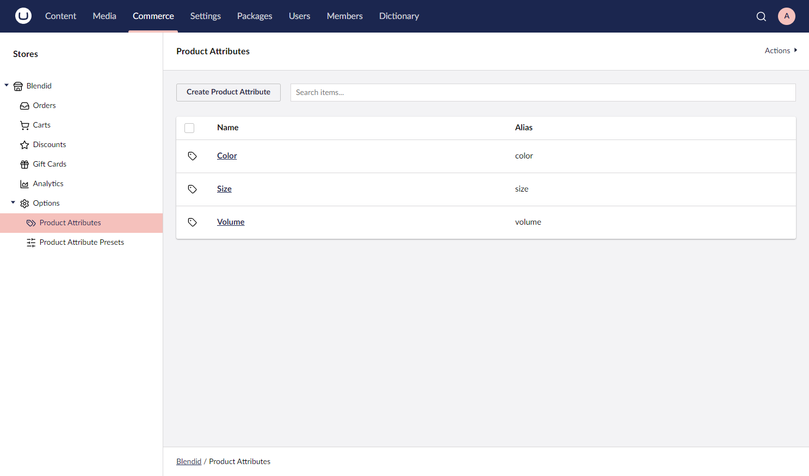
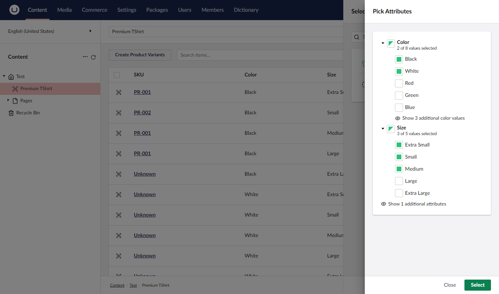

# Complex Variants

The Commerce Complex Variants feature is powered by a new Variants Editor property editor that you can attach to your product content nodes. The editor itself is based on the Umbraco Block List editor format so under the hood we make use of the new data structure.

We also make use of Umbraco’s block editor APIs. You can add supporting data needed to record against your variants simply by defining a document type and linking it with the editor. By basing the editor on the block editor data structure, we can take advantage of improvements made in Umbraco Commerce. An example is optimized persistence/searching.

The Variants Editor isn’t just a regular property editor. Managing variant data is a complex task and having variants mingled in with the product content fields would be distracting. So a bit of Umbraco magic is used to allow the editor to render itself as a content app. By doing this it gives a focused tab on which to manage complex-variants and allows to create a much richer content management experience.

<figure><figcaption><p>Variants editor table view</p></figcaption></figure>

All you have to do is add the variants editor as a property on your product Document Type and Umbraco Commerce hooks up the rest.

## Product Attributes

Before you can go creating variants, there is another concept that you need to understand and that is product attributes.

Product attributes are essentially lists of options that can be used to create your variant combinations. For example, things like color, size, or fit if you were selling clothing.

Each product attribute consists of a name and a series of attribute values for the given options. So for example, color attribute might have a series of values like red, and blue, and size might have values of large, medium, and small.

In order to manage these product attributes, we’ve created a new Options node inside the **Commerce** section, beneath each store. From this section, you can define as many product attributes + values as you need. If you're working with a multi-lingual setup, you can provide label translations.

<figure><figcaption><p>Product attributes</p></figcaption></figure>

<figure><figcaption><p>Product attributes values</p></figcaption></figure>

## Product Attribute Presets

Linked with product attributes, there is also the concept of product attribute presets.

What product attribute presets do is allow to define groups of product attributes/values based on a specific **theme**. Then they are displayed at the point of product variant creation. This is where you can choose from a smaller, focused list of product attributes than if you were just presented with every possible option.

<figure><figcaption><p>Product attribute presets</p></figcaption></figure>

<figure><figcaption><p>Product attribute preset values</p></figcaption></figure>

## Creating Variants

With the product attributes defined (and optional product attribute presets), and the variants editor defined (on product Document Type), you can start creating product variants.

With the product node open, you’ll now see the new Variants content app in the top right corner. From there you can click the **Create Product Variants** button to launch the **create** dialog.

From the create dialog, you’ll be presented with a list of product attributes so that you can select all the combinations you want to create variants. If you have setup any product attribute presets, these will be presented first.

Selecting a preset will show a smaller list of product attributes/values to choose from. To create the variants, check the checkbox against the attribute values and click Select. Then rows will be automatically created in the variants table for every combination of the selected attributes.

<figure><figcaption><p>Create variants presets</p></figcaption></figure>

<figure><figcaption><p>Create variants attributes</p></figcaption></figure>

## Managing Variants

With variants defined in the variants table, you can manage the content for each variant by clicking the **SKU** of the row. Then it will launch the content editor for that variant. From here you’ll be presented with all the fields defined on your variants Document Type and can add and save the information required.

<figure><figcaption><p>Edit variant</p></figcaption></figure>

In the variants table view, we've also added filtering features so you can filter by attribute values. You can also search for specific variant **SKUs** to easily locate items. Additionally, the table also supports sorting on the table columns, so you can also order the results as you need.

<figure><figcaption><p>Variant filtering</p></figcaption></figure>

You can change a variant attribute combination at any time by clicking the cog icon on the row. Then you can select a new combination. Lastly, you can remove a variant by clicking the trash can icon against the row.

## Variant Fields

Whilst you are free to add any fields you like to your variant, there are a few fields that you might want/need to add.

The only required field is an **SKU** field with the alias `sku`. All the following fields are optional, with Umbraco Commerce falling back to the parent node if one isn’t found.

* **Price** `[price]` - The fixed price of the product variant. Should use a **Commerce Price** input field.
* **Price Adjustment** `[priceAdjustment]` - Used instead of a price field to create a dynamic price by adding the adjustment amount to the parent product price. Should use a **Commerce Price** input field and can contain negative values.
* **Stock** `[stock]`- Allows for individual variant stock management.

## Value Converter

Once the variants are defined, you’ll then want to be able to access that data on the frontend. To do this the variants editor comes with a built-in value converter. This allows you to access a strongly typed collection of all the defined variants from the parent product node.

The property value will be of type `ProductVariantCollection` that contains a series of `ProductVariantItem` entities. Each of these entities has a Config property which contains details of the product attribute combination for the variant. It also contains a content property of type IPublishedElement from which you can access the variant's data. The _Content_ property can also be cast to a models builder model type for strongly typed access to the variant content too.

```csharp
public class ProductVariantItem
{
    public Udi ContentUdi { get; }
    public IPublishedElement Content { get; }
    public ProductVariantConfig Config { get; }
}
```

```csharp
public class ProductVariantConfig
{
    public IDictionary<string, string> Attributes { get; set; }
}
```

Umbraco Commerce also ships with a helper extension method on the `ProductVariantCollection` class, `GetInUseProductAttributes(storeId).`This provides a convenient way to get a list of all attributes + values used by the variants collection. It comes in handy when rendering out the list of options on the front end, ensuring only attributes in use are displayed.

```csharp
public class InUseProductAttribute
{
    public string Alias { get; }
    public ReadOnlyTranslatedValue<string> Name { get; }
    public IReadOnlyCollection<InUseProductAttributeValue> Values { get; }
}
```

```csharp
public class InUseProductAttributeValue
{
    public string Alias { get; }
    public ReadOnlyTranslatedValue<string> Name { get; }
}
```

```csharp
public class ReadOnlyTranslatedValue<T>
{
    public T GetDefaultValue()
    public bool HasValue(string languageIsoCode)
    public T GetValue(string languageIsoCode, bool fallbackToDefault = true)
    public bool TryGetValue(string languageIsoCode, out T value)
    public T this[string languageIsoCode]
}
```

## API Updates

The last piece of the complex variants puzzle is a few updates to Umbraco Commerce's API.

This is largely around the `AddProduct` methods on the **Order** entity which now have additional signatures. These signatures take both a _productReference_ and a _productVariantReference_ which must both be supplied when adding a variant item to an order.

Order lines have also been updated to expose a new Attribute property. This provides a collection of attribute combinations for the order lines product so that these can be rendered on carts and checkouts. The "uniqueness" logic for an order line has also been updated to take these attributes into account.

With both of these changes, updates have also been made to the `IProductAdapter/IProductSnapshot` interfaces and built-in implementations. This is in order to support product variants and attributes, as it has the product and price freezer services.

The built-in stock property editor has also had a slight overhaul in order to support both regular products and product variants. If anyone needs to provide an alternative implementation, a new `IStockService` interface has been created as well.
