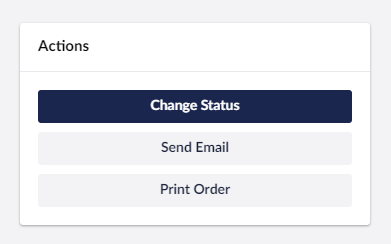

# Entity Quick Actions

Entity Quick Actions allow you to display a button directly in the entity editor screen for important actions that require instant access.



## Registering a Quick Action

```typescript
import { UcManifestEntityQuickAction } from "@umbraco-commerce/backoffice";

export const manifests : UcManifestEntityQuickAction[] = [
    {
        type: 'ucEntityQuickAction',
        kind: 'default',
        alias: 'My.EntityQuickAction.MyQuickAction',
        name: 'My Quick Action Action',
        weight: 300,
        api: () => import('./my-quick-action.api.js'),
        meta: {
            entityType: 'uc:order',
            label: "#quickActions_myQuickAction",
            look: 'primary'
        }
    }
];

extensionRegistry.register(manifests);
```

Each entry must have a type of `ucEntityQuickAction` along with a unique `alias` and `name`. Unless you wish to override the button, the `kind` key should be set to `default`. An `api` key should be defined that imports the implementation of the `UcEntityQuickActionApi` interface.

A `meta` entry provides configuration options for quick actions:

| Name | Description |  
| -- | -- |
| `entityType` | The entity type for which this quick action should be displayed |
| `label` | A label for this quick action (supports the `#` prefix localization string syntax) |
| `look` | Can be `primary` for a highlighted button, or `secondary` for a more muted button |

## The Entity Quick Action API

In order to define the logic to perform when a quick action button is clicked, you'll need to implement the `UcEntityQuickActionApi` interface. This interface is defined as

```typescript
export interface UcEntityQuickActionApi extends UmbApi {
    manifest: UcManifestEntityQuickAction;
    execute(): Promise<void>;
}
```

This provides quick action implementations with access to the defined `manifest` and expects the implementation of an `execute` method to act.

An example implementation would be

```typescript
// my-quick-action.api.js

import { UcEntityQuickActionApi, UcManifestEntityQuickAction } from "@umbraco-commerce/backoffice";
import { UmbControllerBase } from "@umbraco-cms/backoffice/class-api";

export default class MyEntityQuickActionApi extends UmbControllerBase implements UcEntityQuickActionApi {
    manifest!: UcManifestEntityQuickAction;
    async execute() {
        console.log("You clicked the My Quick Action");
    }
}
```