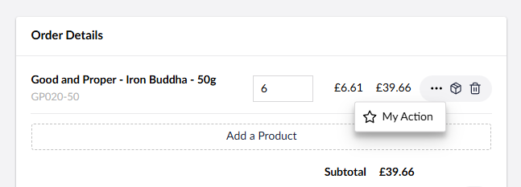

# Order Line Actions


Available from Umbraco Commerce 15.1.0


Order Line Actions allow you to display buttons against each order line of a cart/order enabling you to perform custom actions per order line.




## Registering an Order Line Action

```typescript
import { UcManifestOrderLineAction } from "@umbraco-commerce/backoffice";

export const manifests : UcManifestOrderLineAction[] = [
    {
        type: 'ucOrderLineAction',
        kind: 'default',
        alias: 'My.OrderLineAction.MyOrderLineAction',
        name: 'My Order Line Action',
        weight: 300,
        forEntityTypes: [ 'uc:cart', 'uc:order' ],
        api: () => import('./my-order-line-action.api.js'),
        meta: {
            label: "#orderLineActions_myOrderLineAction",
            icon: 'icon-star'
        }
    }
];

extensionRegistry.register(manifests);
```

Each entry must have a type of `ucOrderLineAction` along with a unique `alias` and `name`. Unless you wish to override the button, the `kind` key should be set to `default`. An `api` key that imports the implementation of the `UcOrderLineActionApi` interface, should be defined.


A `meta` entry provides configuration options for order line actions:

| Name | Description |  
| -- | -- |
| `label` | A label for this action (supports the `#` prefix localization string syntax) |
| `icon` | In icon to display for the action |

## The Order Line Action API

In order to define the logic to perform when an order line action button is clicked, you'll need to implement the `UcOrderLineActionApi` interface. This interface is defined as

```typescript
export interface UcOrderLineActionApi extends UmbApi {
    manifest: UcManifestOrderLineAction;
    storeId: string;
    orderId: string;
    orderLineId: string;
    execute(): Promise<void>;
}
```

This provides order line action implementations with access to the defined `manifest` and contextual information via the `storeId`, `orderId` and `orderLineId` properties. It expects the implementation of an `execute` method to act.


An example implementation would be

```typescript
// my-order-line-action.api.js

import { UcOrderLineActionApi, UcManifestOrderLineAction } from "@umbraco-commerce/backoffice";
import { UmbControllerBase } from "@umbraco-cms/backoffice/class-api";

export default class MyOrderLineActionApi extends UmbControllerBase implements UcOrderLineActionApi {
    manifest!: UcManifestOrderLineAction;
    storeId!: string;
    orderId!: string;
    orderLineId!: string;
    async execute() {
        console.log(`You clicked ${this.manifest!.meta.label} for order line ${this.orderLineId}`);
        return Promise.resolve();
    }
}
```