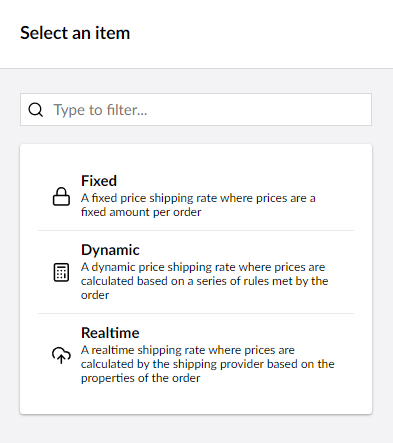
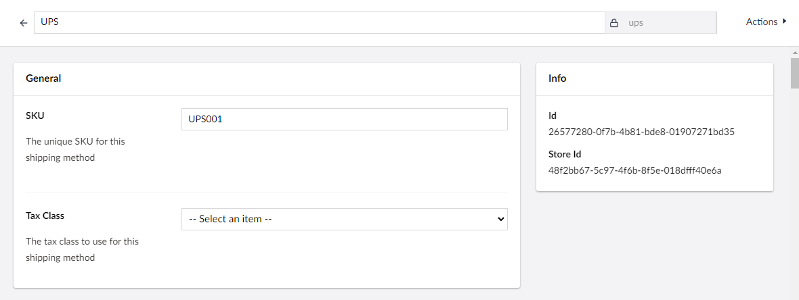
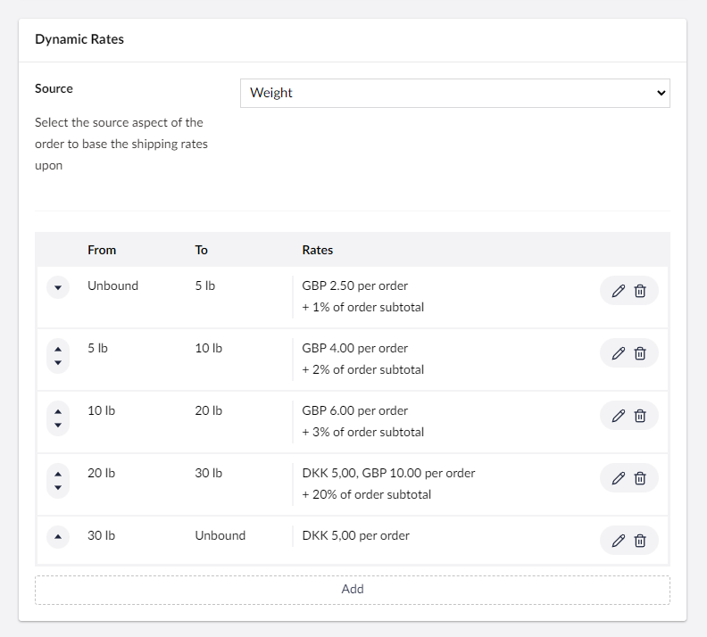

# Dynamic Rate Shipping

Dynamic rate shipping in Umbraco Commerce allows you to define a series of ranges from which an order will be checked against. These checks find which range a given order falls within which in turn identifies the rates that apply. For each range, a series of rate options can be configured. Examples include a fixed rate per order, a fixed rate per order item, or percentage-based rates. By combining these configurable ranges, and different rating options it allows you to create a more dynamic algorithm than the basic fixed-rate shipping option.

## Configuration

1. Go to **Settings** > **Stores** > {Your Store} > **Shipping Methods**.

    

2. Click **Create Shipping Method**.
3. Choose **Basic** as the shipping provider.

    

4. Choose **Dynamic** as the calculation mode option.

    

5. Enter the **Shipping Method Name**, **Alias**, **SKU**, and optional **Tax Rate**.

    

6. Choose the range unit to base the rates upon.
7. Click **Add Range** to define each range.

    

8. Enter the **From** and **To** value of the range.
9. Enter the rate details from the available rate options leaving blank any option you do not wish to apply.

    

10. Select the countries in this shipping method should be allowed in.

    

11. Click **Save**.
