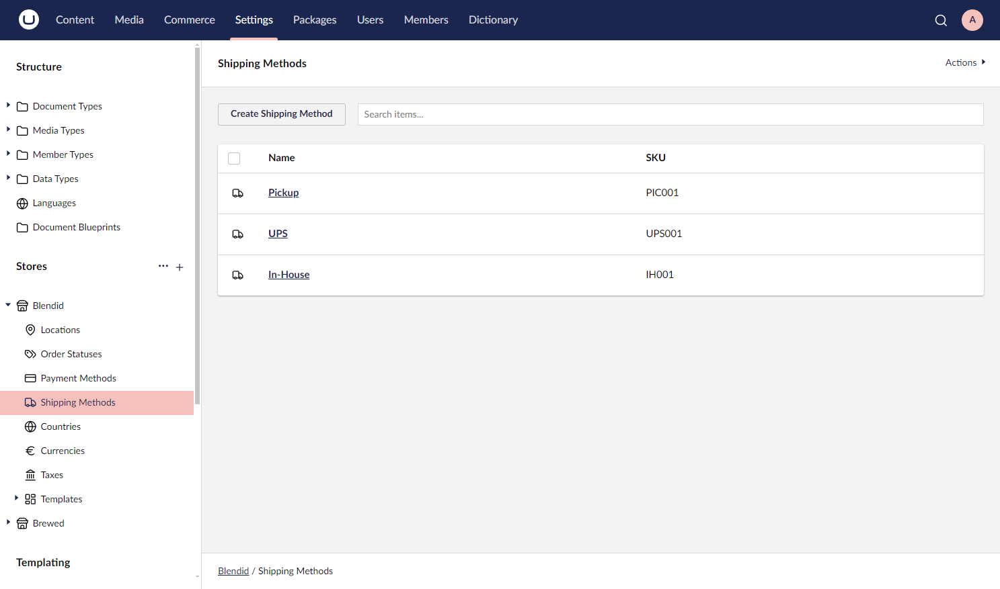
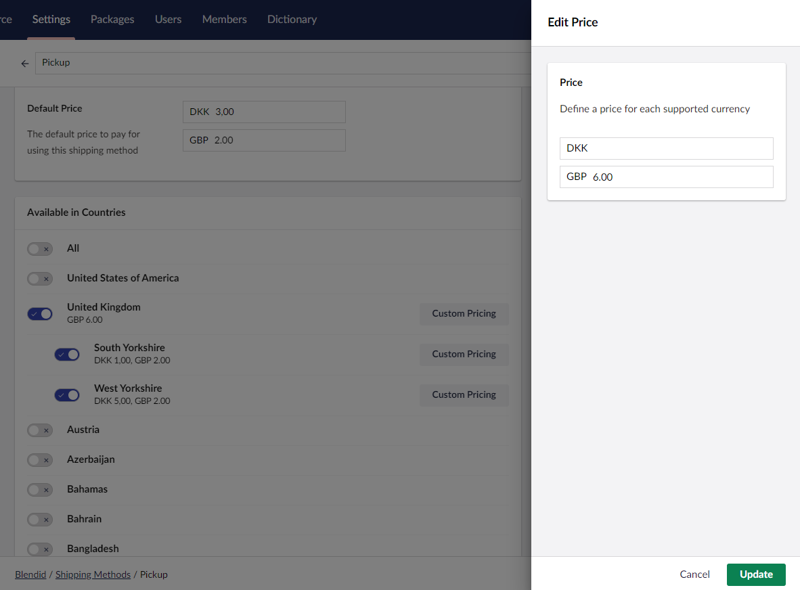

# Fixed Rate Shipping

Fixed rate shipping in Umbraco Commerce allows you to define a single, fixed shipping rate to apply to an order. This is the simplest of all the shipping calculation options, but is also the least flexible.

## Configuration

1. Go to **Settings** > **Stores** > {Your Store} > **Shipping Methods**.

    

2. Click **Create Shipping Method**.
3. Choose **Basic** as the shipping provider.

    

4. Choose **Fixed** as the calculation mode option.

    

5. Enter the **Shipping Method Name**, **Alias**, **SKU**, and optional **Tax Rate**.
6. Enter a fixed rate for the shipping method.

    

7. Select the countries this shipping method should be allowed in.

    

8. Optionally, define a country's specific fixed rate should you wish to have different rates per country.

    
9. Click **Save**.
