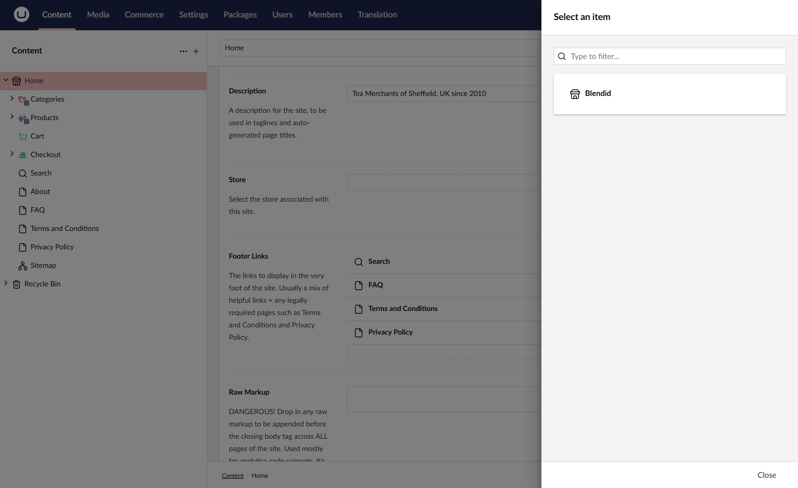

# Creating a Store

With Umbraco setup and Umbraco Commerce installed, the next step is to create a store.

A store is an online platform where products or services are listed for customers to browse, purchase, and complete transactions online.

Setting up a store allows you to manage both the content and commerce aspects of your site. It allows you to create a custom and scalable online shopping experience. For more information, see the [Stores](../../reference/stores/) article.

## Create a Store

1. Navigate to the **Settings** section of the backoffice
2. Click the "+" button next to the Stores heading in the navigation area to launch the Create Store dialog.
3. Enter a unique name for your store and click **Create**.

4. Click **Save** to create the store and auto-populate it with the default configuration.

The store is now created and ready to be used.

In this tutorial, the default configuration is used. For more information on configuring the different aspects of your store, see the [Configuring your Store](configure-store.md) article.

## Connecting the Store to your website

With the store defined, the next step is to link the store to the website. This is done by associating the store with the root content node of the website. To do this, you need to add a property to the root content node that allows for selecting the store.

1. Navigate to the **Settings** section of the backoffice.
2. Edit the root content Document Type.
3. Add a new property to the Document Type using the `Store Picker Property Editor` that comes with Umbraco Commerce.
4. Give the property the alias `store`.

5. **Save** the changes.
6. Navigate to the root content node in the **Content** section.
7. Select your store via the store property.

8. **Save and Publish** the changes.

With the store linked to the website, you can start adding products. For more information, see the [Creating your first Product](create-product.md) article.
