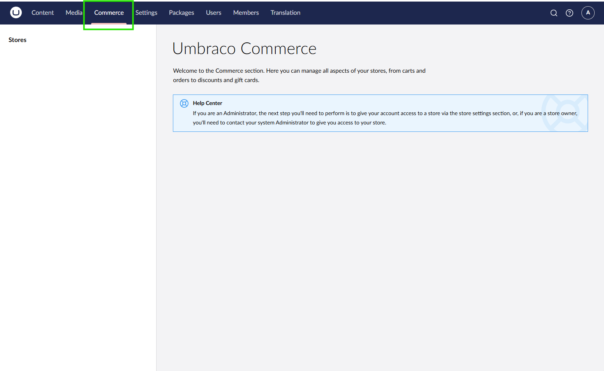
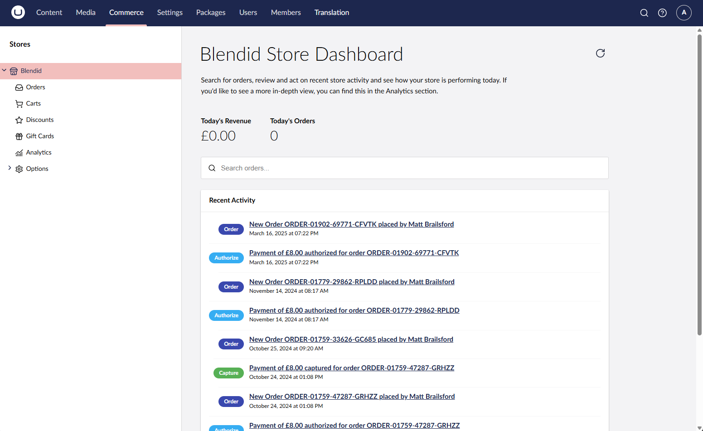

# Configuring Store Access Permissions

Configuring store permissions gives you control over who can access the store's management interface.

The setup of store permissions is split into two parts:

* [Allowing access to the `Commerce` section](permissions.md#allow-access-to-the-commerce-section)
* [Allowing access to manage a store](permissions.md#allow-access-to-manage-a-store)

## Allow Access to the Commerce Section

Store management is done through the `Commerce` section in the backoffice. To allow access to this section, you need to either create or update a user group and assign access to the `Commerce` section.

1. Navigate to the **Users** section of the backoffice.
2. Create a new user group or edit an existing one.
3. Find the **Allowed Sections** property.
4. Select the `Commerce` section.

4. **Save** the changes.

### Assign Users to the User Group

After creating the user group, you can assign users to it allowing them access to the `Commerce` section.

1. Navigate to the **Users** section of the backoffice.
2. Edit the user you want to assign to the user group.
3. Select the new user group in the **Groups** property.

4. **Save** the changes.

After assigning the user to the user group, they have the `Commerce` section in the backoffice.

At this point the user has access to the Commerce section, they will not yet be able to manage any stores. To give access to managing a store, you need to [allow access to manage a store](permissions.md#allow-access-to-manage-a-store).

## Allow Access to Manage a Store

To allow a user to manage a store, you must assign store permissions from the store's settings.

1. Navigate to the **Settings** section of the backoffice
2. Open the **Stores** area.
3. Select the store you want to assign permissions to.
4. Click the **Permissions** tab in the Store editor.

5. Select the new user group in the **User Roles** property.
6. **Save** the changes.

After assigning the user group to the store, users in that group can manage the store.

