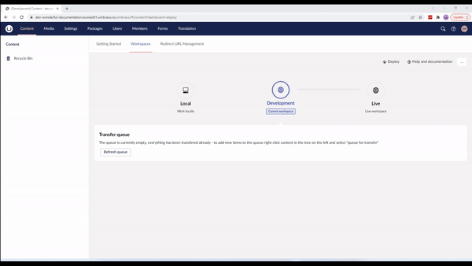
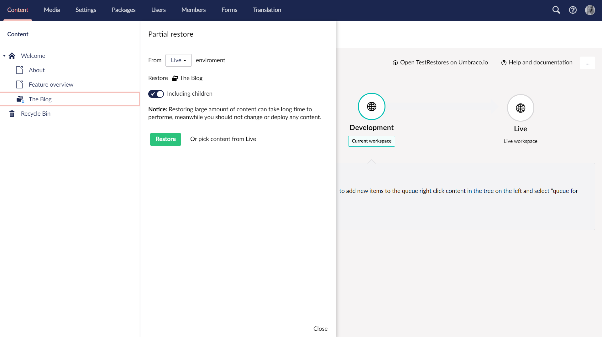

# Partial Restores

In some cases you might not want to restore the entire content tree, but only the parts that you need. **Partial restores** is a feature that allows for restoring specific parts of your content instead of restoring everything.

You can use Partial Restore on

* [Environments with existing content or media](partial-restore.md#environment-with-existing-content-or-media), and on
* [Empty environments](partial-restore.md#empty-environment)

## Empty environment

In this scenario you've cloned down your environment to your local machine or setup a new environment. In both cases the new environment will have an empty Content section as well as an empty Media section.


This feature also restores all dependencies of the selected content.

For example, restoring a content node that references media or other content will also restore those items, including any parent nodes they depend on.


Follow these steps to perform a partial restore to get only the parts you need:

1. Go to the Content section of the Umbraco backoffice on your environment or locally.
2. Click **...** next to the Content Tree.
3. Choose _Partial Restore_.
4. Select the environment that you would like to restore content from.
5. Click "_Select content to restore_" - this will open a dialog with a _preview of the content tree_ from the environment you selected.
6. Select the content node you would like to restore.
7. Decide whether you also want to restore any child nodes _below_ the selected node.
8. Start the restore by clicking _Restore_.
9. To see the restored content, _reload_ the content tree - Click **...** next to the Content tree to find this option.


Keep in mind if you select a content node deeper down the tree, all the parents above it, required for the node to exist, will be restored as well.


Partial Restores on empty environments are especially helpful when you have a large amount of content and media and do not necessarily need it all for the task you need to do.

Instead of having to restore everything which could potentially take a long time, doing a partial restore can be used to shorten the waiting time by only restoring the parts you need. This will ensure that you can quickly get on your way with the task at hand.

## Environment with existing content or media

It is also possible to use the Partial Restore feature on environments where you already have content in the Content tree.

Imagine that you are working with your Umbraco project locally. One of your content editors updates a section in the content tree on the production environment. You would like to see how this updated content looks with the new code you are working on. Follow these steps to do a Partial Restore of the updated content node:

1. Go to the Content section of your local Umbraco backoffice
2. Click **...** next to the content node which you know contains updates
3. Choose _Partial Restore_
4. Select the environment that you would like to restore content from
5. Decide whether you also want restore any child nodes under the selected node
6. Start the restore by clicking _Restore_
7. When the restore is done, reload the content tree to see the changes

