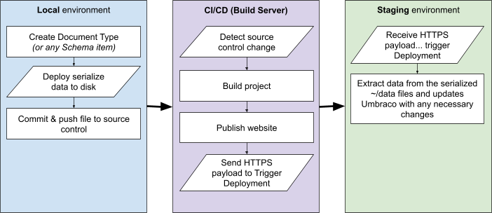

# Getting started

In this article you can learn more about what it takes to get started using Umbraco Deploy. You can also get a high-level overview of how the product works.

## How Umbraco Deploy works

Umbraco Deploy works by serializing non-content Umbraco items (called “Schema” items) to disk. These serialized files are located in the `/umbraco/Deploy/Revision` folder at the root of your website.

These items are entities like Document Types, Media Types, Data Types, etc, and these files must be committed to source control (for example Git). Umbraco Deploy works by “extracting” this serialized information back into your Umbraco installation. This is done by deployment triggers when a deployment is sent to a target environment.

For example, when working locally you might create a new Document Type. This will automatically create a new on-disk file in the `umbraco/Deploy/Revision` folder which is the serialized version of the new Document Type. You would then commit this file to your repository and push this change to your hosted source control (for example GitHub).

When you want this deployed to your next environment, you would trigger your CI/CD process (for example Azure DevOps or GitHub Actions). This will push the changes to your environment. Once the build deployment completes successfully, a Deployment Trigger would be executed as an HTTPS request to your target environment. All changes found in the `umbraco/Deploy/Revision` folder will then be extracted into the Umbraco target environment.

## [Quick start (new sites)](../installation/install-configure.md)

There are three main steps you need to go through in order to start using Umbraco Deploy on your website.

1. [Set up Git repository and new Umbraco project](../installation/install-configure.md#prerequisites)
   * Set up a repository and then install a new Umbraco project inside it.
2. [Install Umbraco Deploy via NuGet](../installation/install-configure.md#installing-and-configuring-umbraco-deploy)
   * Umbraco Deploy can be installed via NuGet.
3. [Configure CI/CD build server](../getting-started/cicd-pipeline/README.md)
   * Umbraco Deploy needs a CI/CD build server needs to be set up to run when you want changes to be deployed to next upstream environment