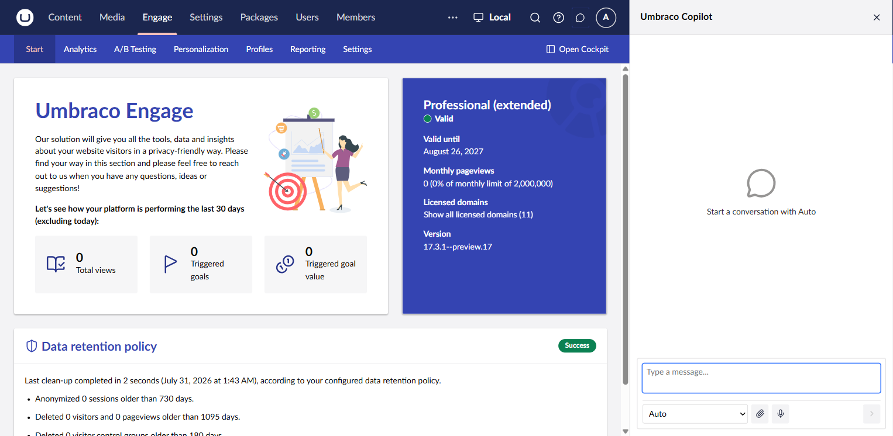
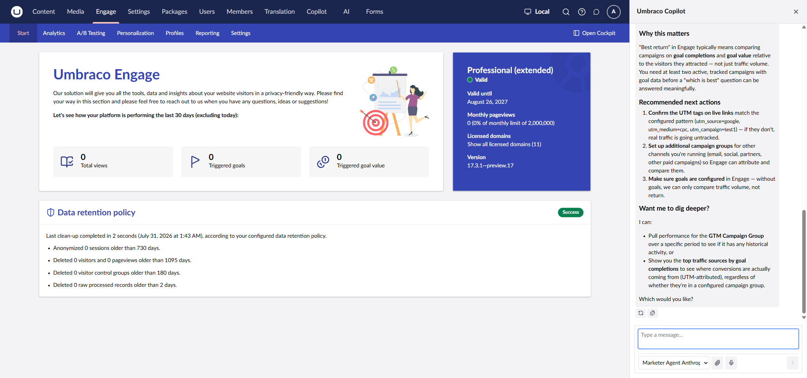
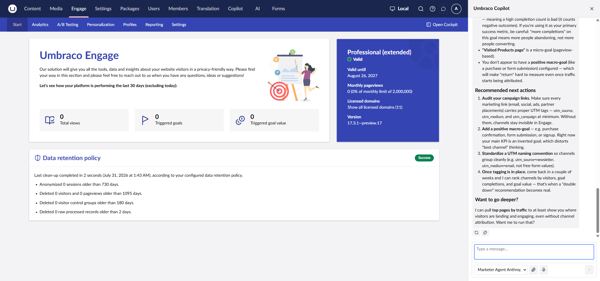
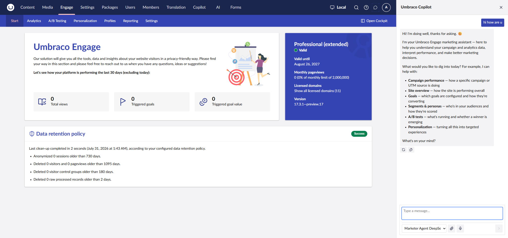

# Copilot Sidebar

The Copilot sidebar is a panel that slides in from the right of the backoffice. It's ambient — ask about whatever you're currently looking at, in the section you're currently in.

## Accessing it

1. Open the **Engage** section.
2. Click the **AI Assistant** button in the top header.
3. Pick an agent from the picker, or leave it on **Auto** to let Copilot route to the best available agent. Start typing.


Switching agents, or reloading the page, clears the sidebar's conversation — it isn't saved. For a persistent, full-page conversation, see [Copilot Workspace](copilot-workspace.md).


## Example prompts

The following ran against a demo Engage installation, using an agent with Instructions similar to the [Installation](installation.md) example. Answers and numbers are from sample/demo data — treat the numbers below as illustrative, not a preview of what your own data will look like.

**"what campaigns do we have set up?"**

**"which campaign is giving us the best return right now?"**

**"which channels should i double down on?"**

**"who are our visitor personas?"**

**"why would a visitor end up classified as a 'Window Shoppers'?"**

**"should i end any of my running tests yet, or keep waiting for more data?"**

On a site with no A/B test configured yet, this last question comes back differently. Instead of a "who's winning" readout, it explains what to consider before launching one. The tool reports what exists — it doesn't invent a running test.

## Choosing which agent answers

Different agents can be configured with different AI Profiles (models) — for example a Marketer Agent on Anthropic Claude and another on DeepSeek. Since Instructions can be shared between them, the difference shows up in tone and in what each agent leads with:

