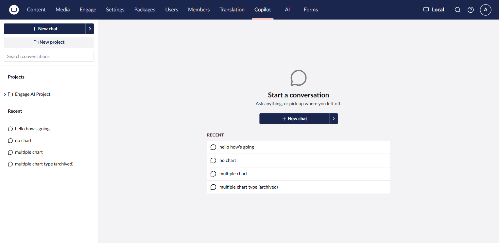
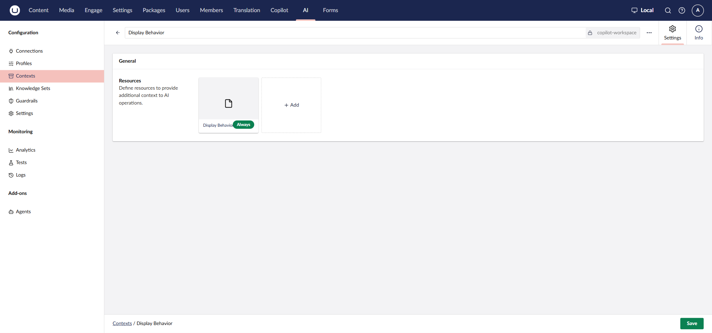
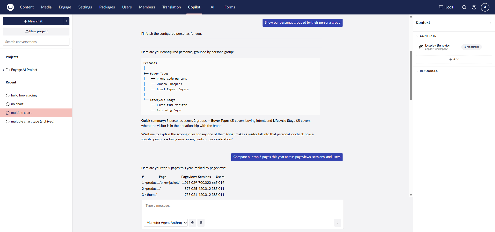
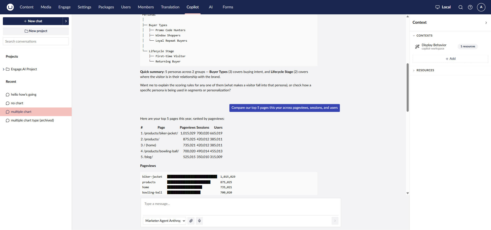
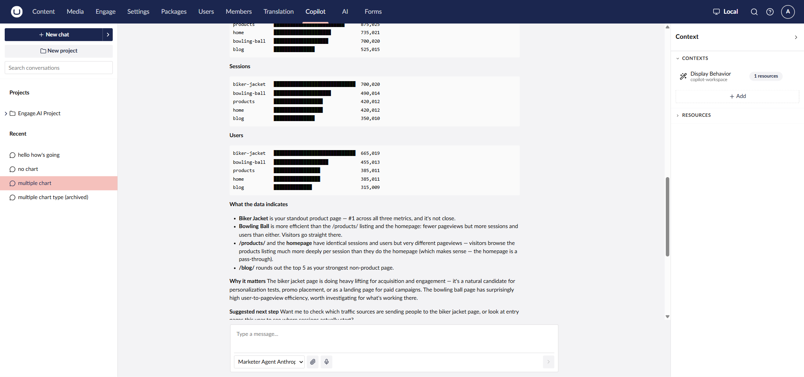
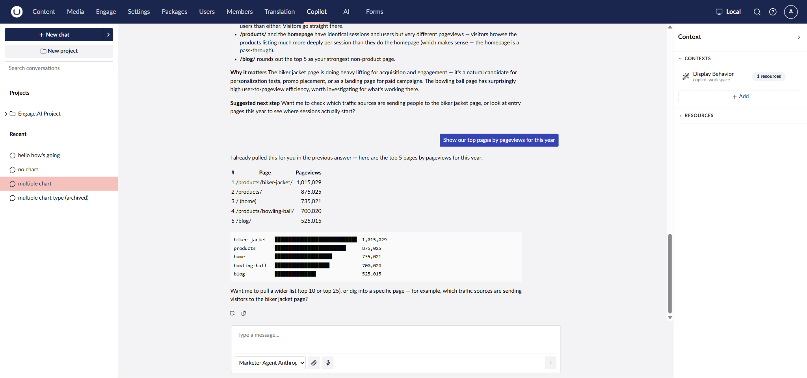

# Copilot Workspace

Copilot Workspace is a full-page alternative to the Copilot sidebar, under its own
**Copilot** tab in the top navigation. The sidebar is ambient and tied to whatever page
you're on. Workspace is a destination instead: it keeps a list of past conversations,
lets you group them into **Projects**, and shows an explicit **Context** panel for the
current conversation.

The same agent and the same Engage.AI tools answer either way. Workspace doesn't add or
remove tool capability — it changes how you get to the conversation, and how much space
the answer has to work with.




Copilot Workspace availability follows Umbraco.AI's own release schedule for the
`Umbraco.AI.Agent.Copilot.Workspace` package, separate from Engage.AI's own release.
Check the current Umbraco.AI release notes for Workspace's status before relying on it
being available in your installation.


## Making the agent available in Workspace

Same mechanism as the sidebar (see [Installation](installation.md#step-5-make-the-agent-available-where-you-want-it)):
open the agent's **Availability** tab and enable the **Copilot Workspace** surface. An
agent that's only attached to the **Copilot** surface won't show up in Workspace's agent
picker until you do this.

## Optional: a display-behavior context for tables and charts

Workspace's full-width layout has room for more than a short sentence. Engage.AI doesn't
format answers itself — that's entirely up to the agent's Instructions and any Context
attached to it. You can attach a Context resource that tells the agent to take advantage
of the extra space, for example one scoped to the Workspace surface with content along
these lines:

```
You are rendering answers in a full-width Copilot Workspace, not a narrow sidebar,
so use the space.

Choosing a layout — do this proactively, without being asked. Match the format to
the shape of the data, and never force a visual where a plain table or a sentence
reads more clearly:
- Ranked or comparable numbers, 3+ rows (top pages, counts, rankings) → a Markdown
  table AND an ASCII bar chart of the value, each bar labelled with its number.
- Multiple metrics per row → the table plus one ASCII bar chart per metric.
- Grouped or hierarchical items (e.g. personas by group, campaigns by group) → an
  ASCII tree using ├── │ └── connectors, one short label per node — not a flat
  bullet list.
- Ordered sequences (e.g. customer-journey stages) → an arrow flow:
  See → Think → Do → Care.
- Proportions → %-share bars.
- 1-2 data points → just a sentence.
Cap tables at ~10 rows; if there are more, show the top 10 and note the rest in
one line.

Rendering limits (hard rules):
- This surface renders Markdown and plain text only. Do NOT output SVG, HTML,
  canvas, image-based charts, or mermaid — they render as raw code. Express
  everything in Markdown or plain text: tables, ASCII charts, ASCII trees, arrow
  flows.

Accuracy:
- Never state a number that no tool returned — not in tables, not in prose. If
  you don't have the data, say so; do not estimate or fill it in.

Style:
- Lead with the table/chart/tree, then keep interpretation to a few short lines.
```


This is an example of what's possible through Instructions and Context, not a behavior
Engage.AI ships by default. Without a context like this attached, Workspace answers read
the same as sidebar answers: plain text, and a Markdown table when the data fits.




## Example prompts

The following ran with the display-behavior context above attached, against sample/demo
data — treat the numbers as illustrative, not a preview of your own data.

**"show our personas grouped by their persona group, as a tree"**



**"compare our top 5 pages this year across pageviews, sessions, and users"**

A ranked table plus one ASCII bar chart per metric — three metrics per row means three
charts, not one:





**"show our top pages by pageviews for this year"**

A single metric collapses back to one table and one chart:



## Limitations

- **Markdown and plain text only.** Workspace (like the sidebar) can't render SVG, HTML,
  canvas, or Mermaid. A context that asks for those produces raw, unrendered code instead
  of a chart — ASCII tables, bar charts, and trees are the ceiling.
- **No time-series breakdown.** Engage.AI's tools return totals, top-N, and per-entity
  figures — a "pageviews per day" trend line isn't something these tools currently
  produce, in either surface.
- **Accuracy depends on Instructions/Context, not only the tools.** Tool results carry
  the real numbers. A model can still combine or extrapolate them in prose unless told
  not to — the accuracy rule in the example context above exists for that reason.
