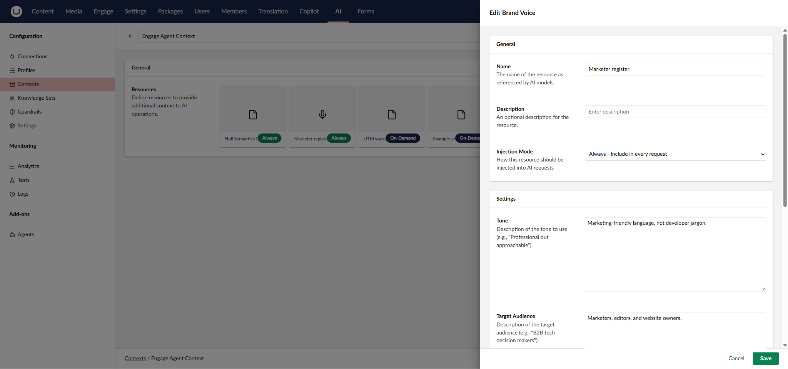
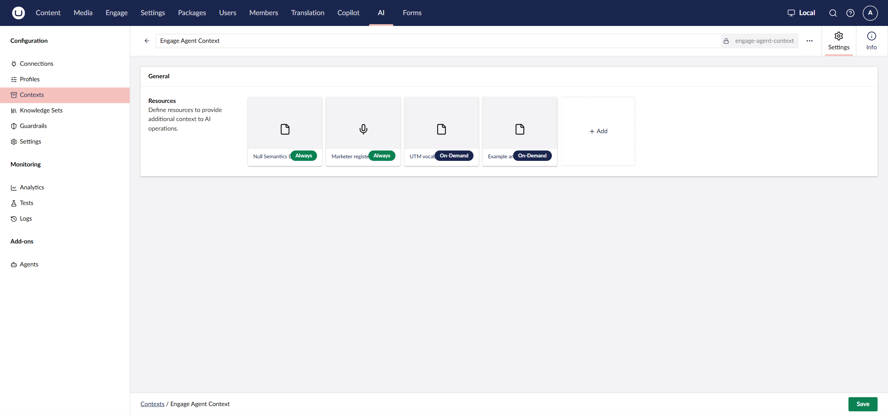
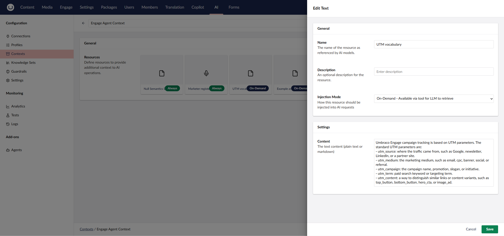
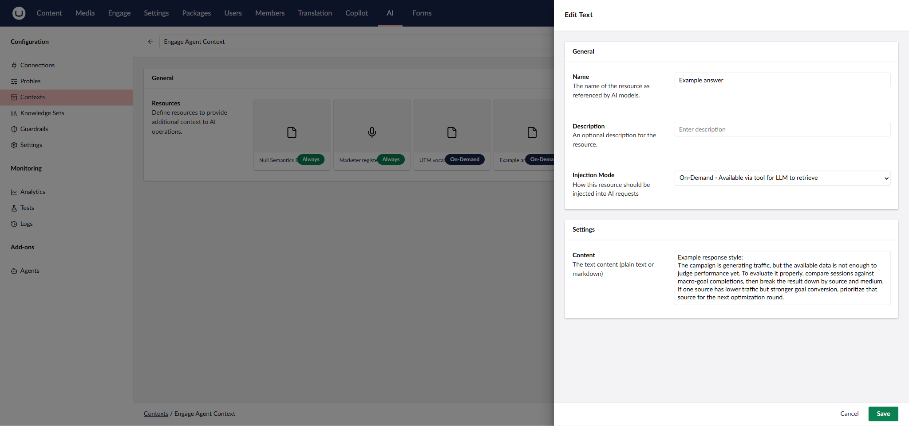

# Example: A Marketer Agent

[Installation](installation.md) walks through each piece mechanically. This page pulls
them together into one working example — a Marketer Agent on Anthropic Claude, with the
context and guardrail that make its answers noticeably better and safer, not only
functional.

## Profile

An [Engage Anthropic Chat Profile](installation.md#step-3-create-a-profile) on
`claude-opus-4-7`.

## Instructions

The same starting point from [Installation](installation.md#step-4-create-an-agent):

```
You are a Marketer Agent specialized in Umbraco Engage inside Umbraco CMS.

Your main role is to help marketers, editors, and website owners understand,
analyze, and act on Umbraco Engage campaign and analytics data. Focus on
practical marketing insight, not raw numbers.
```

## Context

Two Context resources, both set to inject **Always** (every request), attached to the
agent:

**Null Semantics Discipline** — a plain-text resource that stops the agent from
misreading a missing measurement as a zero:

```
When a tool result has nullable boolean / numeric fields:
- `null` = the tool did not observe / measure / attempt that field (e.g. no
  query ran, no resolution succeeded)
- `false` / `0` = the tool measured and the value is genuinely zero / negative
- `true` / non-zero = the tool measured and the value is positive / non-zero

Do NOT narrate null as if it were a definitive false / zero. When a result
field is null:
- Identify the upstream cause (goal not found, name ambiguous, no completed
  reporting day, etc.)
- Surface that cause to the user, not the null itself

Apply this discipline across all Engage analytics tools.
```

**Marketer register** — a **Brand Voice** context, a resource type with dedicated fields
rather than free text:

| Field | Value |
|---|---|
| Tone | Marketing-friendly language, not developer jargon. |
| Target Audience | Marketers, editors, and website owners. |



Brand Voice also has **Style Guidelines** and **Patterns to Avoid** fields, left empty
here — fill them in if you want tighter control over phrasing.



Two more resources are attached with **On-Demand** injection instead of Always — rather
than being added to every request, the model retrieves them itself via a tool call, only
when the question calls for them:

**UTM (Urchin Tracking Module) vocabulary**:

```
Umbraco Engage campaign tracking is based on UTM parameters. The standard UTM parameters are:
- utm_source: where the traffic came from, such as Google, newsletter, LinkedIn, or a partner site.
- utm_medium: the marketing medium, such as email, cpc, banner, social, or referral.
- utm_campaign: the campaign name, promotion, slogan, or initiative.
- utm_term: paid search keyword or targeting term.
- utm_content: a way to distinguish similar links or content variants, such as top_button, bottom_button, hero_cta, or image_ad.
```



**Example answer**:

```
Example response style:
The campaign is generating traffic, but the available data is not enough to judge performance yet. To evaluate it properly, compare sessions against macro-goal completions, then break the result down by source and medium. If one source has lower traffic but stronger goal conversion, prioritize that source for the next optimization round.
```



Always vs. On-Demand is a real trade-off. Always guarantees the agent has it in mind for
every answer, at the cost of a few extra tokens on every request. On-Demand keeps
requests smaller and only pulls the resource in when it's relevant — a reasonable
default for reference material like a vocabulary list or a style example that most
questions won't need.

## Guardrail

The [Input PII Redaction](guardrails.md) guardrail redacts Personally Identifiable
Information (PII) before it reaches the model, attached via the agent's **Governance**
tab. Optional, but worth attaching to any agent marketers will paste real visitor data
into.

## Putting it together

1. Create the profile and connection ([Installation](installation.md), Steps 2–3).
2. Create the agent with the Instructions above ([Installation](installation.md),
   Step 4), selecting that profile.
3. Attach the two Context resources under **Agent Behavior** on the Settings tab.
4. Attach the Input PII Redaction guardrail under **Governance** > **Guardrails**
   (see [Guardrails](guardrails.md)).
5. Attach the agent to whichever surface(s) you want it available on
   ([Installation](installation.md#step-5-make-the-agent-available-where-you-want-it)).

None of this is required to get a working agent — a profile and a short set of
Instructions is enough, as [Installation](installation.md) shows. This is what a more
deliberately configured one looks like.
