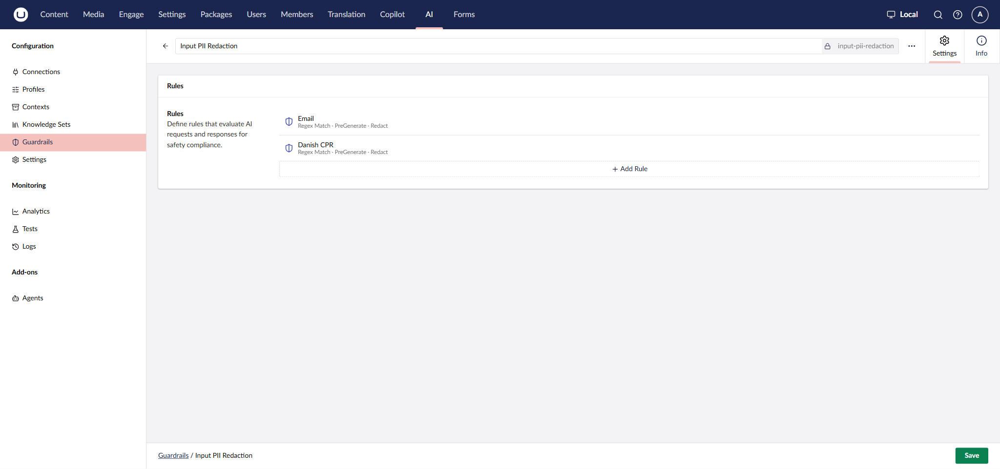
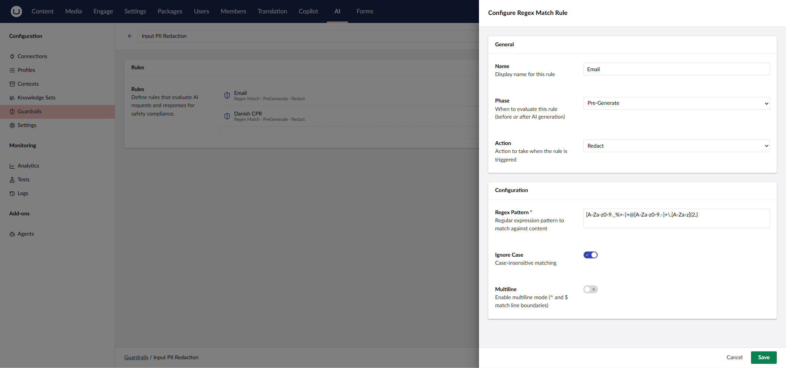
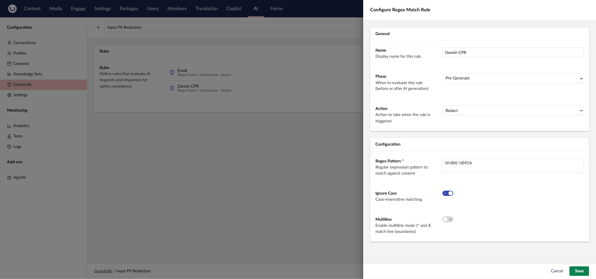
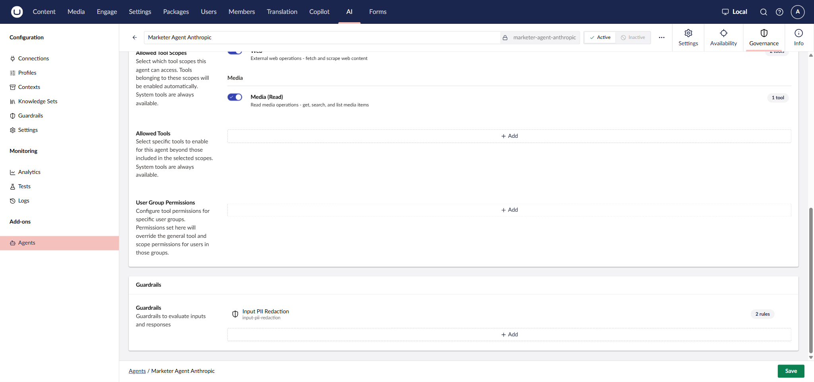

# Example: A Marketer Agent

[Installation](installation.md) walks through each piece mechanically. This page pulls them together into one working example, a Marketer Agent on Anthropic Claude. It adds the context and guardrail that make its answers noticeably better and safer, not only functional.

## Profile

An [Engage Anthropic Chat Profile](installation.md#step-3-create-a-profile) on a current Claude model.

## Instructions

The same starting point from [Installation](installation.md#step-4-create-an-agent):

```
You are a Marketer Agent specialized in Umbraco Engage inside Umbraco CMS.

Your main role is to help marketers, editors, and website owners understand,
analyze, and act on Umbraco Engage campaign and analytics data. Focus on
practical marketing insight, not raw numbers.
```

## Context

Five Context resources are attached to the agent, split across three jobs. Two general rules apply on every request. Two reference resources the model only pulls in when it needs them. One more applies only in Copilot Workspace.

### Always, on every request

**Null Semantics Discipline** is a plain-text resource that stops the agent from misreading a missing measurement as a zero:

```
When a tool result has nullable boolean / numeric fields:
- `null` = the tool did not observe / measure / attempt that field (e.g. no
  query ran, no resolution succeeded)
- `false` / `0` = the tool measured and the value is genuinely zero / negative
- `true` / non-zero = the tool measured and the value is positive / non-zero

Do NOT narrate null as if it were a definitive false / zero. When a result
field is null:
- Identify the upstream cause (goal not found, name ambiguous, no completed
  reporting day, etc.)
- Surface that cause to the user, not the null itself

Apply this discipline across all Engage analytics tools.
```

**Marketer register** is a **Brand Voice** context, a resource type with dedicated fields rather than free text:

| Field | Value |
|---|---|
| Tone | Marketing-friendly language, not developer jargon. |
| Target Audience | Marketers, editors, and website owners. |


Brand Voice also has **Style Guidelines** and **Patterns to Avoid** fields, left empty here. Fill them in if you want tighter control over phrasing.


### On-Demand, only when needed

Rather than being added to every request, the model retrieves these itself via a tool call, only when the question calls for them.

**Urchin Tracking Module (UTM) vocabulary**:

```
Umbraco Engage campaign tracking is based on UTM parameters. The standard UTM parameters are:
- utm_source: where the traffic came from, such as Google, newsletter, LinkedIn, or a partner site.
- utm_medium: the marketing medium, such as email, cpc, banner, social, or referral.
- utm_campaign: the campaign name, promotion, slogan, or initiative.
- utm_term: paid search keyword or targeting term.
- utm_content: a way to distinguish similar links or content variants, such as top_button, bottom_button, hero_cta, or image_ad.
```


**Example answer**:

```
Example response style:
The campaign is generating traffic, but the available data is not enough to judge performance yet. To evaluate it properly, compare sessions against macro-goal completions, then break the result down by source and medium. If one source has lower traffic but stronger goal conversion, prioritize that source for the next optimization round.
```


Always vs. On-Demand is a real trade-off. Always guarantees the agent has it in mind for every answer, at the cost of a few extra tokens on every request. On-Demand keeps requests smaller and only pulls the resource in when relevant. This suits reference material like a vocabulary list or style example that most questions won't need.

### Workspace only: a display-behavior context

The full-width layout in Copilot Workspace has room for more than a short sentence. Umbraco Engage AI doesn't format answers itself; that's entirely up to the agent's Instructions and any Context attached to it. A Context resource scoped to the Workspace surface can tell the agent to take advantage of the extra space:

```
You are rendering answers in a full-width Copilot Workspace, not a narrow sidebar,
so use the space.

Choosing a layout — do this proactively, without being asked. Match the format to
the shape of the data, and never force a visual where a plain table or a sentence
reads more clearly:
- Ranked or comparable numbers, 3+ rows (top pages, counts, rankings) → a Markdown
  table AND an ASCII bar chart of the value, each bar labelled with its number.
- Multiple metrics per row → the table plus one ASCII bar chart per metric.
- Grouped or hierarchical items (e.g. personas by group, campaigns by group) → an
  ASCII tree using ├── │ └── connectors, one short label per node — not a flat
  bullet list.
- Ordered sequences (e.g. customer-journey stages) → an arrow flow:
  See → Think → Do → Care.
- Proportions → %-share bars.
- 1-2 data points → just a sentence.
Cap tables at ~10 rows; if there are more, show the top 10 and note the rest in
one line.

Rendering limits (hard rules):
- This surface renders Markdown and plain text only. Do NOT output SVG, HTML,
  canvas, image-based charts, or mermaid — they render as raw code. Express
  everything in Markdown or plain text: tables, ASCII charts, ASCII trees, arrow
  flows.

Accuracy:
- Never state a number that no tool returned — not in tables, not in prose. If
  you don't have the data, say so; do not estimate or fill it in.

Style:
- Lead with the table/chart/tree, then keep interpretation to a few short lines.
```


Without a context like this attached, Workspace answers read the same as sidebar answers: plain text, and a Markdown table when the data fits. With it, a prompt like "show our top pages by pageviews for this year" renders as a table plus an ASCII bar chart:


Markdown and plain text are the ceiling on either surface. Neither can render SVG, HTML, canvas, or Mermaid; a context that asks for those produces raw code instead of a rendered chart.

## Guardrail

Umbraco Engage AI's tools only ever return aggregates and marketer-authored labels: campaign names, segment counts, performance figures. They can't return an individual visitor's Personally Identifiable Information (PII), so there's nothing to filter on the way *out*. The real risk sits on the way *in*. A marketer might paste something like "a visitor with email jane@example.com keeps abandoning cart" into the chat. Unless something stops it, that personal data gets sent straight to your AI provider.

A **guardrail** can catch this before it happens. Guardrails are an Umbraco.AI feature. They evaluate a request against a set of rules and act (block, redact, and so on) when one matches. They apply to whichever agent they're attached to, on either Copilot surface.

### Example: Input PII Redaction

A guardrail with two rules, both **Regex Match**, phase **Pre-Generate**, action **Redact**, evaluated before the message reaches the model and replacing any match with `[REDACTED]`:

| Rule | Regex pattern |
|---|---|
| Email | `[A-Za-z0-9._%+-]+@[A-Za-z0-9.-]+\.[A-Za-z]{2,}` |
| Central Person Register (CPR), Danish national ID | `\b\d{6}-\d{4}\b` |







### Attaching a guardrail to an agent

A guardrail does nothing until it's attached to an agent:

1. Open the agent, go to the **Governance** tab.
2. Scroll to **Guardrails**, click **Add**, and select the guardrail.
3. Save.



### What it stops

Same message, sent to two agents: one with the guardrail attached, one without.


```
A visitor with email john.doe@example.com and CPR 010203-4567 keeps abandoning cart. What should I do?
```



```
A visitor with email [REDACTED] and CPR [REDACTED] keeps abandoning cart. What should I do?
```


The reply itself made sense either way. Only the guardrail decided whether personal data made the trip to the provider.

### Limits worth knowing

- **Best-effort, not comprehensive.** Regex rules catch the specific patterns you define; these two cover email addresses and Danish CPR numbers, nothing else. Add more rules the same way for other PII you expect marketers to paste, such as phone numbers, other national IDs, or card numbers. Test each against realistic input before relying on it.
- **Pre-Generate acts on the input, not the answer.** These rules run on what the user sends, not on what the assistant replies with.

## Putting it together

1. Create the profile and connection ([Installation](installation.md), Steps 2 and 3).
2. Create the agent with the Instructions above ([Installation](installation.md), Step 4), selecting that profile.
3. Attach the Context resources under **Agent Behavior** on the Settings tab (the Display Behavior one only if the agent will be used in Copilot Workspace).
4. Grant it the **Engage Read** permission and attach the Input PII Redaction guardrail, both under **Governance** ([Installation](installation.md#step-5-grant-it-access-to-the-engage-tools)).
5. Attach the agent to whichever surface(s) you want it available on ([Installation](installation.md#step-6-make-the-agent-available-where-you-want-it)).

None of this is required to get a working agent. A profile, a granted permission, and a short set of Instructions is enough, as [Installation](installation.md) shows. This is what a more deliberately configured one looks like.
