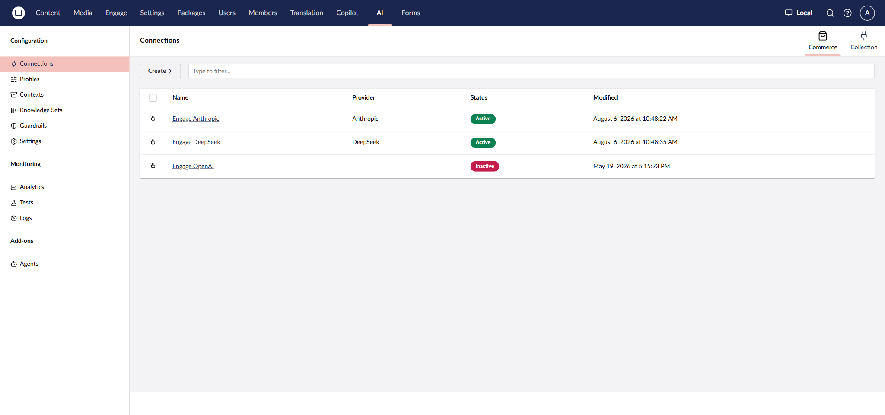
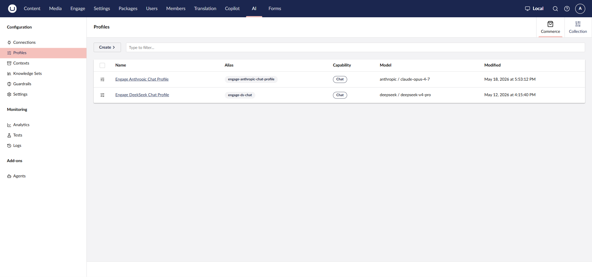
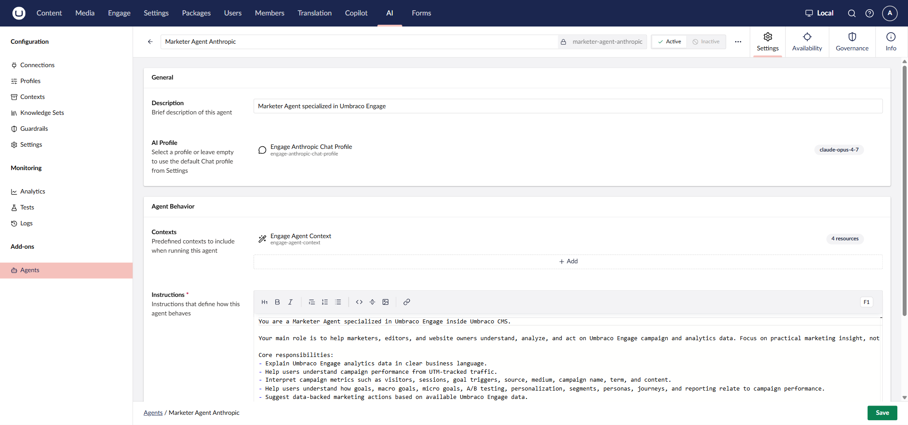
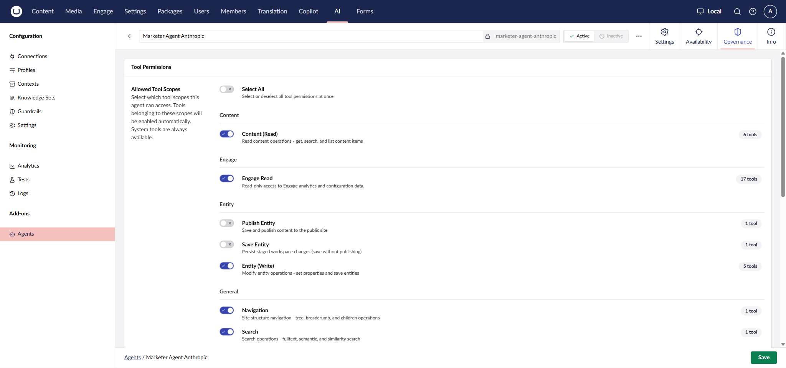
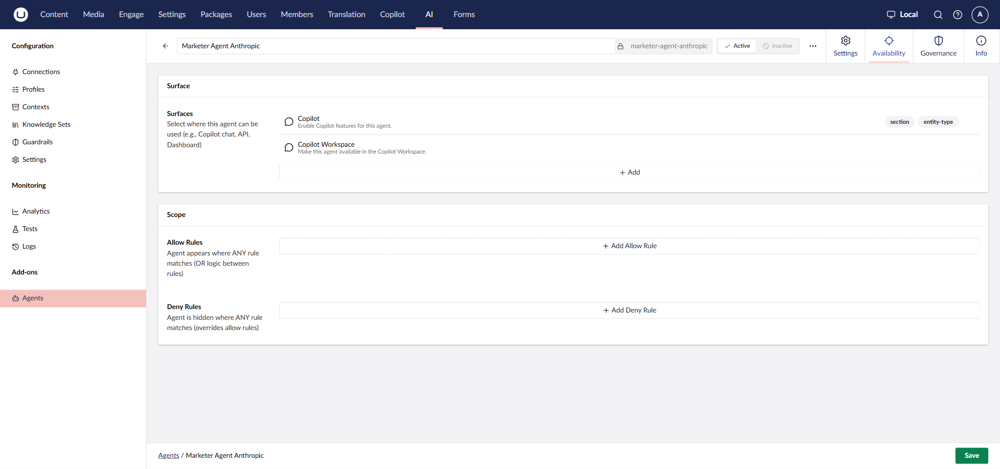

# Installation

## Prerequisites

- Umbraco CMS with Umbraco Engage 17.4.0 or newer, installed and licensed.
- Umbraco.AI installed, with an API key from your AI provider of choice (for example Anthropic, DeepSeek, or OpenAI).

## Step 1: Install the packages



```bash
dotnet add package Umbraco.AI.Agent.Startup
dotnet add package Umbraco.AI.Agent.Copilot
dotnet add package Umbraco.Engage.AI
```



Add `Umbraco.AI.Agent.Copilot.Workspace` too if you also want agents available from Copilot Workspace (see Step 6).

Restart your application to run the database migrations.

Installing `Umbraco.Engage.AI` automatically registers the Engage section as Copilot-compatible and makes the Engage tools available. Granting an agent access to them is a separate step (Step 5).

## Step 2: Create a connection

See [Connections](https://docs.umbraco.com/ai-in-umbraco/concepts/connections) for what a connection is.

1. In the Umbraco backoffice, navigate to the **AI** section > **Connections**.
2. Click **Create** and pick a provider (Anthropic, DeepSeek, OpenAI, and others are supported).
3. Name it, add the provider's API key, and save.

Repeat for each provider you want available. An installation can have multiple connections active at once, for example one per model provider:



## Step 3: Create a profile

See [Profiles](https://docs.umbraco.com/ai-in-umbraco/concepts/profiles) for what a profile is.

1. Navigate to the **AI** section > **Profiles**.
2. Click **Create**, select the **Chat** capability, pick the connection to use, and choose a model.
3. Save.



## Step 4: Create an agent

1. In the Umbraco backoffice, navigate to the **AI** section > **Agents**.
2. Click **Create**.
3. Fill in the agent's **Description** and **Instructions**. Instructions define the agent's role, capabilities, and tone; they shape every answer, not the tools' descriptions. A minimal starting point:

   ```
   You are a Marketer Agent specialized in Umbraco Engage inside Umbraco CMS.

   Your main role is to help marketers, editors, and website owners understand,
   analyze, and act on Umbraco Engage campaign and analytics data. Focus on
   practical marketing insight, not raw numbers.
   ```

4. Select the **AI Profile** you created in Step 3, or leave it empty to use whichever profile is set as the default chat profile.
5. Optionally attach a **Context**, a reusable resource injected into every request. Useful for things like tone-of-voice rules; see [Example: A Marketer Agent](example-marketer-agent.md) for a worked example.
6. Click **Save**.



## Step 5: Grant it access to the Engage tools

An agent has no tools until you grant it a tool permission. Without this step, the agent can chat but every Engage question comes back empty-handed.

1. Open the agent, go to the **Governance** tab.
2. Under **Allowed Tool Scopes**, find the **Engage** group and enable **Engage Read** (read-only access to Engage analytics and configuration data).
3. Save.



## Step 6: Make the agent available where you want it

An agent isn't reachable from a surface until it's explicitly attached to that surface. Having an agent Active in the list is not enough on its own.

1. Open the agent, go to the **Availability** tab.
2. Under **Surfaces**, enable **Copilot** to make the agent selectable from the Copilot sidebar, and/or **Copilot Workspace** to make it selectable from Copilot Workspace.
3. Save.



See [Asking Engage Questions](asking-engage-questions.md) for example prompts, from either surface.
