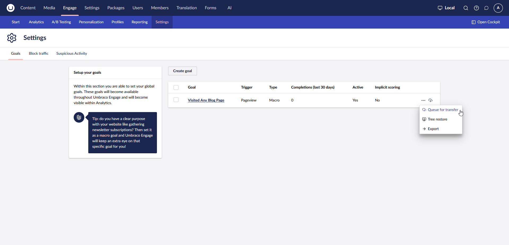

# Deploy

The Deploy add-on connects Umbraco Engage to [Umbraco Deploy](https://docs.umbraco.com/umbraco-deploy). It lets you transfer Umbraco Engage configuration items between environments, instead of recreating them by hand.

The add-on is available from Umbraco Engage version 17.

## What it adds

* Deploy support for Umbraco Engage configuration items: goals, personas, customer journeys, and A/B tests.
* Configuration items keep a shared key across environments, so transferred items stay linked.


Analytics data is not transferred between environments. Only configuration items such as goals, personas, customer journeys, and A/B tests are included in deployments.




## Prerequisites

* Umbraco Engage version 17 or higher is [installed](../installation/installation.md) and [licensed](../installation/licensing.md).
* Umbraco Deploy is installed and configured, or your project runs on Umbraco Cloud.

## Install the package

Install the [Umbraco.Engage.Deploy](https://www.nuget.org/packages/Umbraco.Engage.Deploy) package via NuGet or using your preferred approach. Install it in all environments you transfer between.



```
PM> install-package Umbraco.Engage.Deploy
```



```console
dotnet add package Umbraco.Engage.Deploy
```



Build or restart your website afterwards.
