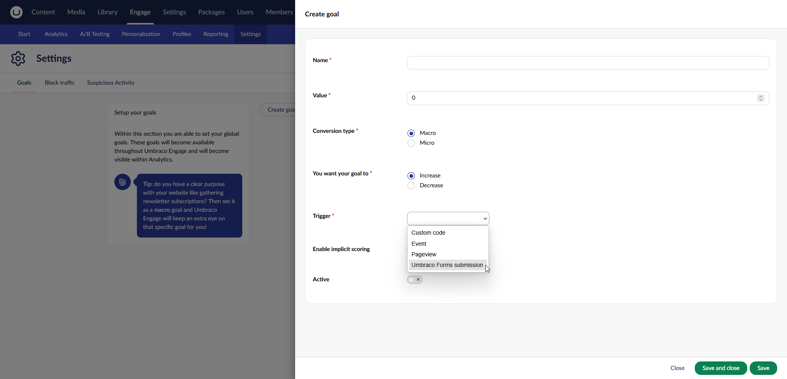

# Forms

The Forms add-on connects Umbraco Engage to [Umbraco Forms](https://docs.umbraco.com/umbraco-forms). Once installed, Umbraco Forms submissions are linked to individual visitors in Umbraco Engage. No extra configuration is needed.

## What it adds

* Tracking of Umbraco Forms submissions per visitor, stored with the visitor profile.
* An **Umbraco Forms Submission** goal type, so a form submission can count as a conversion.
* An **Analytics - VisitorId** form field that links a submission to the visitor profile in Umbraco Engage.
* A **Form Submissions** overview on the visitor profile, showing the forms submitted by that visitor.

## Prerequisites

* Umbraco Engage is [installed](../installation/installation.md) and [licensed](../installation/licensing.md).
* Umbraco Forms is installed with a valid license.
* The [clientside tracking script](../developers/analytics/client-side-events-and-additional-javascript-files/additional-measurements-with-the-analytics-scripts.md) is added to your pages. Without it, a submission cannot be linked to a visitor.

## Install the package

Install the [Umbraco.Engage.Forms](https://www.nuget.org/packages/Umbraco.Engage.Forms) package via NuGet or using your preferred approach.



```
PM> install-package Umbraco.Engage.Forms
```



```console
dotnet add package Umbraco.Engage.Forms
```



Build or restart your website afterwards.

## Verify the installation

1. Edit a form and add a new question. The **Analytics - VisitorId** field type should be available.
2. Go to **Engage** -> **Settings** and create a new goal. The **Umbraco Forms Submission** goal type should be available.



If either option is missing, see [Verify your Engage installation](../installation/troubleshooting-installs.md).

## Next steps


[Forms](../marketers-and-editors/analytics/forms.md)



[Extending forms](../developers/analytics/forms.md)

