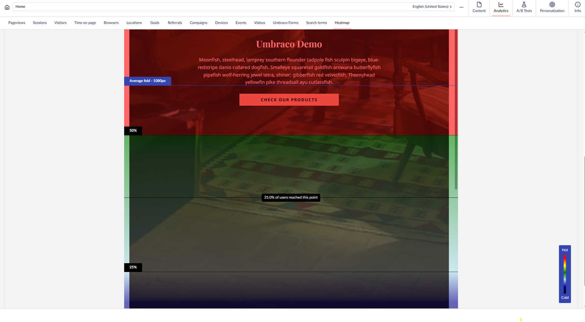

# Scroll Heatmap

The heatmap only collects data if [the client-side script](client-side-events-and-additional-javascript-files/additional-measurements-with-the-analytics-scripts.md) is installed on your website.

