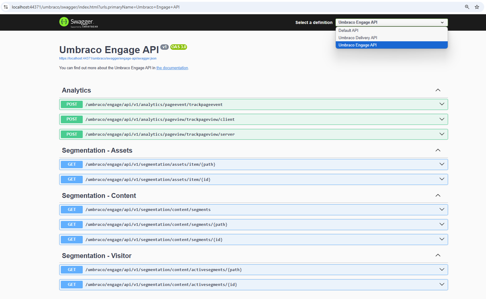

# Headless

Umbraco Engage offers the **Umbraco.Engage.Headless** package for seamless integration with Umbraco 12.0 and later. This package enables access to the Headless Content Delivery API, enabling personalized content, A/B tests, and segmentation.


All Engage features are supported except:

* Time on page tracking
* Video tracking (workaround could be to use the Events API)
* Form tracking
* Search term tracking (workaround could be to use the Events API)
* The [Bridging Library for Google Analytics](https://docs.umbraco.com/umbraco-engage/developers/analytics/client-side-events-and-additional-javascript-files/bridging-library-for-google-analytics)
* The [Bridging Library for Google Tag Manager](../analytics/client-side-events-and-additional-javascript-files/bridging-library-for-google-tag-manager.md)
* [Google Analytics Blocker Detection](../analytics/client-side-events-and-additional-javascript-files/google-analytics-blocker-detection.md)
* [Heatmap](../../marketers-and-editors/analytics/scroll-heatmap.md)
* The [Umbraco Engage Cockpit](../../getting-started/for-marketers-and-editors/cockpit.md)



## Requirements

To install Umbraco.Engage.Headless, ensure the following prerequisites:

* Umbraco v13 is required to integrate with the [Content Delivery API](https://docs.umbraco.com/umbraco-cms/reference/content-delivery-api).
* Enable the [Umbraco Content Delivery API](https://docs.umbraco.com/umbraco-cms/reference/content-delivery-api#enable-the-content-delivery-api) by adding the following configuration setting in the `appsettings.json` file:

```json
{
"Umbraco": {
    "CMS": {
        "DeliveryApi": {
            "Enabled": true
        }
    }
}
}
```

## Installing the Umbraco Engage Headless API

To install the Umbraco Engage Headless API, follow these steps:

1. Install the `Umbraco.Engage.Headless` package:

* **Using an IDE:** Install the `Umbraco.Engage.Headless` package from NuGet in Visual Studio or JetBrains Rider.
* **Using the command line:**
  * Navigate to your Umbraco website root folder in your terminal.
  * Run the following command:

```cs
dotnet add package Umbraco.Engage.Headless
```

## Updating Program.cs

To update the Program.cs file, follow these steps:

1. Open your `Program.cs` file.
2. Add the line `.AddEngageApiDocumentation()` after `.AddDeliveryApi()`. Your `CreateUmbracoBuilder` method should look like this:

```cs
builder.CreateUmbracoBuilder()
    .AddBackOffice()
    .AddWebsite()
    .AddDeliveryApi()
    .AddEngageApiDocumentation()
    .AddComposers()
    .Build();

```

3. Rebuild and run your site.
4. Navigate to **/umbraco/swagger** in your browser.
5. Check for the **Umbraco Engage API** from the top right definition dropdown.


