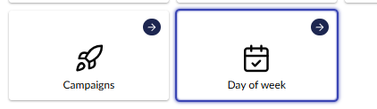
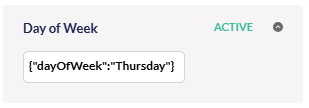
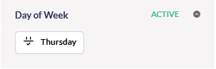

# Implement your own segment parameters

Umbraco Engage comes with built-in parameters to build a segment, such as "Customer Journey" and "Time of Day".
However, custom segments can be built by providing your own segment parameters.

The following guide explains how to achieve this. It is aimed at developers.
There are three steps, two are mandatory, and the last one is optional:

1. C# definition
2. Web component definition
3. Cockpit visualization (optional)

This guide uses code samples to add a "Day of week" segment parameter where you can select a single day of the week. If a pageview happens on that day, the segment parameter is satisfied.

## 1. C# definition

Your custom segment parameter needs to be defined in C# for Engage to use it.
In code, a segment parameter is referred to as a "segment rule".

A segment rule is not much more than this:

-   A unique rule identifier, e.g. "DayOfWeek".
-   A configuration object, e.g. "{ dayOfWeek: "Monday" }"
    -   This is optional, but most rules will have some sort of configuration that the user can alter in the Segment Builder. In our example, the user can configure the specific day of the week.
-   A method that specifies whether the rule is satisfied by the current pageview.

You will have to implement the following interfaces for a new custom parameter:

-   `Umbraco.Engage.Infrastructure.Personalization.Segments.Rules.ISegmentRule`
    -   You can extend the existing `BaseSegmentRule` to simplify the implementation.
    -   The most important part to implement is the `bool IsSatisfied(IPersonalizationProfile context)` method.
-   `Umbraco.Engage.Infrastructure.Personalization.Segments.Rules.ISegmentRuleFactory`
    -   Register your implementation of the segment rule factory with `Lifetime.Transient` in a composer.

For the "Day of week" example, the code looks like this:

```c#
public class DayOfWeekSegmentRule : BaseSegmentRule
{
    public DayOfWeekSegmentRuleConfig TypedConfig { get; }

    public override SegmentRuleValidationMode ValidationMode => SegmentRuleValidationMode.Once;

    public DayOfWeekSegmentRule(long id, Guid key, long segmentId, string type, string config, bool isNegation, DateTime created, DateTime? updated, DayOfWeekSegmentRuleConfig typedConfig)
        : base(id, segmentId, type, config, isNegation, created, updated)
        => TypedConfig = typedConfig;

    public override bool IsSatisfied(IPersonalizationProfile context)
        => context.Pageview.Timestamp.DayOfWeek == TypedConfig.DayOfWeek;
}
```

And the factory which is used to create an instance of this rule:

```c#
public class DayOfWeekSegmentRuleFactory : ISegmentRuleFactory
{
    public string RuleType { get; } = "DayOfWeek";
    public ISegmentRule CreateRule(string config, bool isNegation, long id, Guid key, long segmentId, DateTime created, DateTime? updated)
    {
        var typedConfig = JsonSerializer.Deserialize<DayOfWeekSegmentRuleConfig>(config) 
            ?? throw new InvalidOperationException("Failed to deserialize DayOfWeekSegmentRuleConfig");

        return new DayOfWeekSegmentRule(id, key, segmentId, RuleType, config, isNegation, created, updated, typedConfig);
    }
}
```

The class `DayOfWeekSegmentRuleConfig` is used to represent the rule configuration. This is not strictly necessary, but it makes it easier.
The configuration is stored as a string in the database. In code, Intellisense is enabled to parse the stored configuration to this class:

```c#
public class DayOfWeekSegmentRuleConfig
{
    public DayOfWeek DayOfWeek { get; set; }
}
```

## 2. Web component definition


Check the [Creating your first extension](/umbraco-cms/tutorials/creating-your-first-extension) and [Vite Package Setup](/umbraco-cms/customizing/development-flow/vite-package-setup) articles for detailed extension-building tutorials.


The business logic for the segment parameter has been implemented, but the parameter cannot yet be used in the backoffice. In this step, a web component will be added to render the new rule in the Engage segment builder.

This demo assumes you are creating multiple custom rules, which are then provided as a bundle in the backoffice.

First, follow the [Vite Package Setup](/umbraco-cms/customizing/development-flow/vite-package-setup) article to scaffold your extension. Use `MySegmentRules` as your package name.

1. Install `@umbraco-engage/backoffice` package, replacing `x.x.x` with your Engage version:

```text
npm install @umbraco-engage/backoffice@x.x.x
```

2. Ensure your `vite.config.ts` looks like the example below:

```typescript
import { defineConfig } from "vite";

export default defineConfig({
    build: {
        lib: {
            entry: "src/my-element.ts", // your web component source file
            formats: ["es"],
        },
        outDir: "./client", // all compiled files will be placed here
        emptyOutDir: true,
        sourcemap: true,
        rollupOptions: {
            external: [/^@umbraco/], // ignore the Umbraco Backoffice package in the build
        },
    },
    base: "/App_Plugins/MySegmentRules/client", // the base path of the app in the browser (used for assets)
});
```

3. Update `umbraco-package.json` to register the bundle and segment rule. Note the `meta.type` property matches the `RuleType` defined above in `DayOfWeekSegmentRuleFactory`.

```json
{
  "$schema": "../../umbraco-package-schema.json",
  "name": "My Custom Engage Segment Rules",
  "allowPublicAccess": true,
  "extensions": [
    {
      "name": "My Engage Segment Rules Bundle",
      "alias": "My.Bundle.SegmentRules",
      "type": "bundle",
      "js": "/App_Plugins/MySegmentRules/client/client.js"
    },
    {
      "type": "engageSegmentRule",
      "alias": "Engage.Segment.Rule.DayOfWeek",
      "name": "Engage Day of Week Segment Rule",
      "weight": 100,
      "elementName": "ue-segment-rule-day-of-week",
      "meta": {
        "name": "Day of week",
        "icon": "icon-calendar",
        "type": "DayOfWeek",
        "config": { "dayOfWeek": "Sunday" }
      }
    }
  ]
}
```

4. Update `src/my-element.ts` as below. Note `DayOfWeekSegmentRuleConfigModel` reflects the same data contract as the `DayOfWeekSegmentRuleConfig` class in C#. While it is possible to generate this using code-gen tools, this has been done manually to avoid complicating this tutorial.

Note too the `meta.config` object defined above in the package JSON implements the `DayOfWeekSegmentRuleConfigModel` interface.

By extending `UeSegmentRuleBaseElement` you avoid writing boilerplate code, and don't have to worry about handling value updates or syncing data back to the segment.

```typescript
import {
  customElement,
  html,
  state,
} from "@umbraco-cms/backoffice/external/lit";
import type { UUISelectEvent } from "@umbraco-cms/backoffice/external/uui";
import { UeSegmentRuleBaseElement } from "@umbraco-engage/backoffice/personalization";

export interface DayOfWeekSegmentRuleConfigModel {
  dayOfWeek: string;
}

@customElement("ue-segment-rule-day-of-week")
export class UeSegmentRuleDayOfWeekElement extends UeSegmentRuleBaseElement<DayOfWeekSegmentRuleConfigModel> {
  @state()
  private _options: Array<Option> = [];

  connectedCallback(): void {
    super.connectedCallback();
    
    this._options = [
      "Sunday",
      "Monday",
      "Tuesday",
      "Wednesday",
      "Thursday",
      "Friday",
      "Saturday",
    ].map((x, i) => ({
      value: x,
      name: x,
      selected: this.value?.config.dayOfWeek === x || i === 0,
    }));
  }

  renderReadOnly() {
    return html`Day of week: ${this.value?.config.dayOfWeek}`;
  }

  renderEditor() {
    return html`
      <umb-property-layout label="Day" orientation="horizontal">
          <uui-select
            slot="editor"
            .options=${this._options}
            @change=${(e: UUISelectEvent) => this.onSelectChange(e)}
          ></uui-select>
      </umb-property-layout>
    `;
  }

  onSelectChange(e: UUISelectEvent) {
    if (!this.value) return;
    this.updateParameterValue(e.target.value as string, "dayOfWeek");
  }
}
```

5. Build the typescript file:

```text
npm run build
```

That's it. If all went well you will see your custom parameter editor show up in the segment builder:

<figure><figcaption><p>Day of week Segment.</p></figcaption></figure>

## 3. Cockpit visualization (optional)

The new segment parameter will show up automatically in the Cockpit that is part of our package. The cockpit is a live view of Engage data for the current visitor. This includes active segments of the current visitor, and therefore your new segment parameter can also show up in the cockpit.

By default, it will display the raw configuration of the parameter as stored in the database ("{ dayOfWeek: Thursday }" in our example). If you hover over it, you will see the rule identifier "DayOfWeek" rather than a friendly name.

<figure></figure>

If you would like to change this to be a bit more readable, you can implement the `Engage.Web.Cockpit.Segments.ICockpitSegmentRuleFactory` interface. For the `DayOfWeek` demo parameter, this is the implementation:

```c#
//Registering this factory.
[RegisterService(ServiceLifetime.Transient)]
public class DayOfWeekCockpitSegmentRuleFactory : ICockpitSegmentRuleFactory
{
    public DayOfWeekCockpitSegmentRuleFactory() { }

    public bool TryCreate(ISegmentRule segmentRule, bool isSatisfied, out CockpitSegmentRule? cockpitSegmentRule)
    {
        cockpitSegmentRule = null;
        if (segmentRule is DayOfWeekSegmentRule dayOfWeekRule)
        {
            cockpitSegmentRule = new CockpitSegmentRule
            {
                Name = "Day of week",
                Icon = "/path/to/icon.png",
                Config = dayOfWeekRule.TypedConfig.DayOfWeek.ToString(),
                IsNegation = segmentRule.IsNegation,
                IsSatisfied = isSatisfied,
                Type = segmentRule.Type,
            };
            return true;
        }
        return false;
    }
}
```

The JSON is transformed into a human-readable representation, and an icon is configured to appear in the cockpit. Make sure to register this class in a composer (you can reuse the composer from step 1):

Engage will then use the additional information to render your segment parameter correctly in the cockpit. The "DayOfWeek test" string is the name of the segment. This segment happens to have only 1 parameter which is the DayOfWeek parameter.

<figure></figure>
