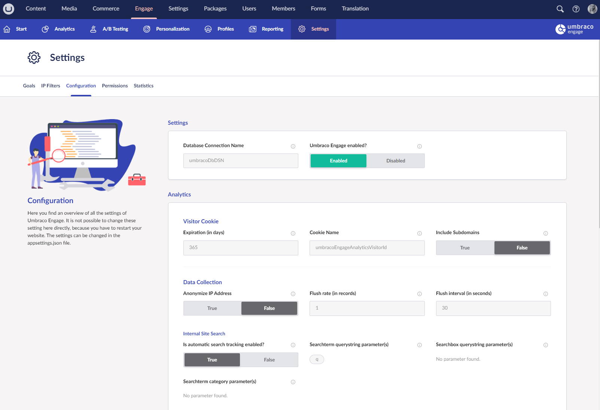

# Configuration

Most of the Umbraco Engage configuration options are stored in the configuration file. Umbraco Engage uses the standard for .NET Core applications, in which we make use of the `appsettings.json` (and environment variable support). Because of this new standard, most configuration options no longer require the application to restart to take effect. This comes with a few exceptions.

Umbraco Engage ships with an `appsettings-schema.json` file, allowing Visual Studio or Jetbrains Rider to auto-complete the configuration options. It comes with information about default values and a description of what each configuration option does. Do not change the `-schema.json` files.

The default configuration will look like this:


```json
{
  "Engage": {
    "Settings": {
      "DatabaseConnectionStringName": "umbracoDbDSN",
      "Enabled": true,
      "UseLegacySegmentNames": false
    },
    "Analytics": {
      "VisitorCookie": {
        "ExpirationInDays": 365,
        "CookieName": "umbracoEngageAnalyticsVisitorId",
        "LegacyCookieName": "uMarketingSuiteAnalyticsVisitorId",
        "IncludeSubdomains": false
      },
      "DataCollection": {
        "AnonymizeIPAddress": true,
        "FlushRateInRecords": 100,
        "FlushIntervalInSeconds": 30,
        "InternalSiteSearch": {
          "AutomaticSearchTracking": true,
          "SearchTermParameters": "q",
          "SearchBoxParameters": "a,b,c",
          "CategoryParameters": ""
        }
      },
      "DataProcessing": {
        "IntervalInSeconds": 30,
        "SessionLengthInMinutes": 30,
        "IsProcessingServer": true
      },
      "DataStorage": {
        "AnonymizeAnalyticsDataAfterDays": 730,
        "DeleteAnalyticsDataAfterDays": 1095,
        "DeleteControlGroupDataAfterDays": 180,
        "DeleteRawDataAfterDays": 5
      },
      "DataCleanup": {
        "StartAfterSeconds": 300,
        "IntervalInSeconds": 1800,
        "NumberOfRows": 1000
      }
    },
    "ABTesting": {
      "RequiredVisitorPercentageBeforeShowingAdvice": 10,
      "MinimumPercentageMacroGoalWarning": 10
    },
    "DeliveryApi": {
      "Segmentation": {
        "ContentById": true,
        "ContentByIds": true,
        "ContentByPath": true,
        "ContentByQuery": true
      }
    },
    "Profiles": {
      "Potential": {
        "ActiveThresholdInDays": 30,
        "EngagedThresholdInSeconds": 300,
        "EngagedThresholdNumberOfSessions": 3
      },
      "Identification": {
        "Name": "{{name}}",
        "Abbreviation": "{{name[0]}}"
      }
    },
    "Reporting": {
      "DataGenerationEnabled": true,
      "DataGenerationTime": "04:00:00"
    },
    "Cockpit": {
      "EnableInjection": true,
      "Authentication": {
        "TokenLifetimeSeconds": 60,
        "SessionLifetimeMinutes": 30,
        "RequireHttps": true,
        "CleanupIntervalMinutes": 60,
        "TokenRetentionBufferMinutes": 5,
        "SessionRetentionBufferMinutes": 1440,
        "SessionCookieSameSite": "Lax"
      }
    },
    "Segmentation": {
      "ExcludedPropertyAliases": []
    }
  }
}
```


All these settings are also visualized in Umbraco Engage. This overview can be found in the **Engage** -> **Settings** -> **Configuration** section.




You cannot change any of the settings in the backoffice. To use the new settings, the website must be restarted.

