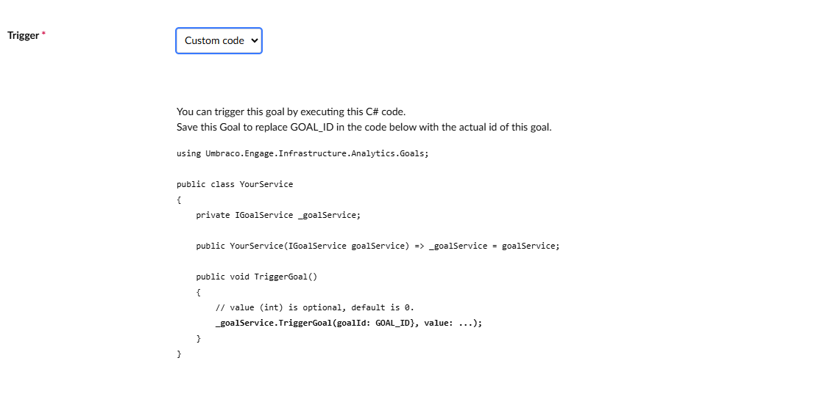

# Custom goals scoring

## Setting up custom goals

To set custom goals:

1. Navigate to **Settings** > **Goals** in the Umbraco Engage section.
2. Set the goal type to **Custom code**.
3. Execute C# code to trigger the goal.

Creating the goal is similar to creating a page view or page event goal. The **goal ID** displayed in the code snippet after saving, as it's needed to trigger the goal from the code.



## Trigger goal in C\#

To trigger the goal, execute C# code during the visitor's pageview. Inject `Umbraco.Engage.Infrastructure.Analytics.Goals.IGoalService`, which provides multiple overloads to trigger goals:

- `TriggerGoal(long goalId, int value)` - Using numeric ID
- `TriggerGoal(Guid goalKey, int value)` - Using GUID key (preferred)

An implementation looks like:

```cs
using Umbraco.Engage.Infrastructure.Analytics.Goals;

public class YourService
{
    private IGoalService _goalService;

    public YourService(IGoalService goalService) => _goalService = goalService;

    public void TriggerGoalById()
    {
        // Using numeric ID (legacy approach)
        _goalService.TriggerGoal(goalId: 37, value: 42);
    }

    public void TriggerGoalByKey()
    {
        // Using GUID key (preferred approach)
        _goalService.TriggerGoal(goalKey: new Guid("a1b2c3d4-e5f6-7890-abcd-ef1234567890"), value: 42);
    }
}
```

### Triggering Outside of HttpContext

The method automatically determines the current page view, linking the goal to a session and visitor. This means the `HttpContext` should be available and `triggerGoal` should be called from within a valid pageview. See [what-is-measured-by-default.md](../analytics/what-is-measured-by-default.md "mention") for what is considered a valid pageview.

To trigger a goal outside of an HTTP request or a valid pageview, use the overload of `TriggerGoal` that takes the GUID of the pageview.

Retrieve the pageview GUID in the original request using `Umbraco.Engage.Infrastructure.Analytics.Common.IPageviewGuidManager.GetPageviewGuid()`. You will need to store this pageview GUID for later use when invoking:

```cs
// Using numeric goal ID
_goalService.TriggerGoal(pageviewGuid, goalId, value);

// Using GUID goal key (preferred)
_goalService.TriggerGoal(pageviewGuid, goalKey, value);
```

This custom goal can now be used like other goals and will show up in any statistics related to goals.

## Available Method Overloads

| Method | Parameters | Use Case |
|--------|------------|----------|
| `TriggerGoal` | `(long goalId, int value = 0)` | Within HttpContext/pageview, using numeric ID |
| `TriggerGoal` | `(Guid goalKey, int value = 0)` | Within HttpContext/pageview, using GUID key (preferred) |
| `TriggerGoal` | `(Guid pageviewGuid, long goalId, int value = 0)` | Outside HttpContext, using numeric ID |
| `TriggerGoal` | `(Guid pageviewGuid, Guid goalKey, int value = 0)` | Outside HttpContext, using GUID key (preferred) |
