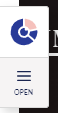
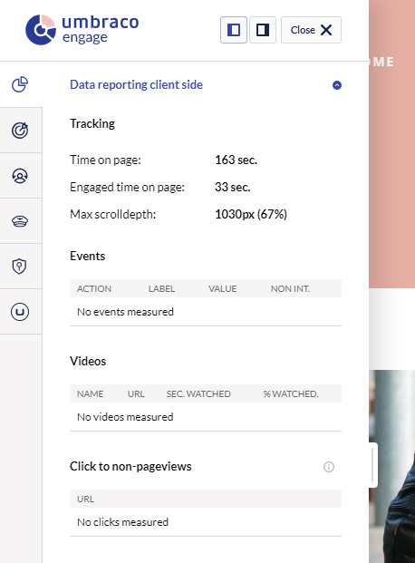

# Cockpit

Umbraco Engage includes a cockpit feature to help verify the tracking of analytics and understand personalization behavior. The cockpit adds a button to the front end, giving real-time insights.

As of Umbraco Engage 16, the cockpit is automatically added and visible for logged-in Umbraco users.


Automatic injection of the Cockpit can be disabled by setting ‘**Engage:Cockpit:EnableInjection**’ configuration to **false** in your appsettings.json file.


When visiting the front-end website, the Umbraco Engage Cockpit will appear on the left or right side of the screen. The cockpit will only be rendered if the user is logged into Umbraco.

Clicking the **Open** button provides detailed information:

If the Cockpit is missing and the Umbraco backoffice runs on a different domain, see the [Load Balancing and CM/CD Environments](loadbalancing-and-cm-cd-environments.md) article.

## Opening the Cockpit in CM/CD Environments

In load-balanced setups where the backoffice runs separately, you can use the **Open Cockpit** button in the Engage dashboard to open the Cockpit. This provides secure authentication without requiring cookie domain configuration.

See [Load Balancing and CM/CD Environments](loadbalancing-and-cm-cd-environments.md#cockpit) for detailed setup instructions.
