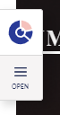
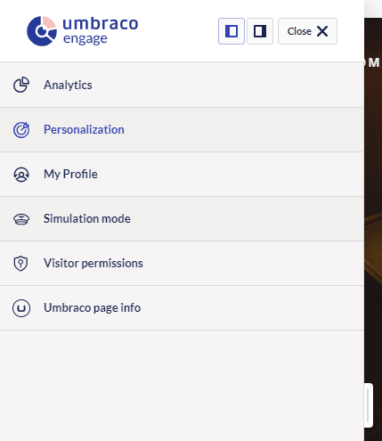
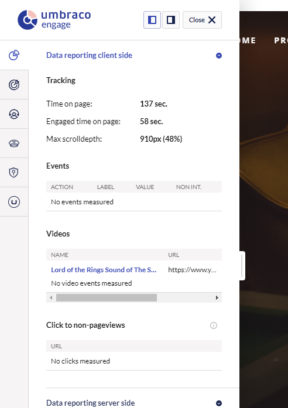
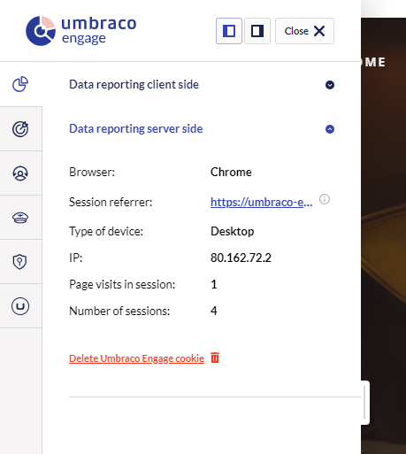
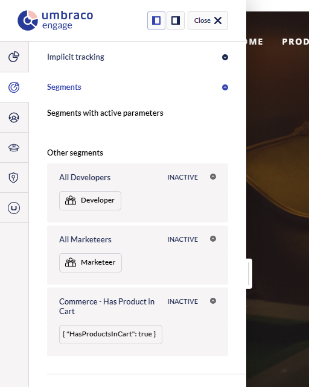

# Cockpit

The cockpit lets you check out all the stored data when browsing the website. It is also a good way to verify your personalization setup.

You should see the Umbraco Engage Cockpit on the left or right side of the screen:

Click **Open** to see all the features of the Cockpit:

## Access to the cockpit

When the Umbraco Engage code has been added to the page you can see it when you are logged in to Umbraco. Visitors to your website do not have access to the Cockpit.

If the Cockpit is missing while the Umbraco backoffice runs on a different domain, contact the technical team. You can also refer to the [Load Balancing and CM/CD Environments](../for-developers/loadbalancing-and-cm-cd-environments.md) article.

### Opening the Cockpit from the Backoffice

If your website runs on a different server than the Umbraco backoffice (a CM/CD setup), you may not see the Cockpit automatically when browsing the frontend.

In this case, you can open the Cockpit from the Umbraco backoffice:

1. Go to the **Engage** section in the backoffice.
2. Click the **Open Cockpit** button on the dashboard.
3. Select the domain you want to view, and the Cockpit opens in a new browser tab.

Your Cockpit session stays active for 30 minutes. After that, click the Open Cockpit button again to continue.


If you don't see the Open Cockpit button, your Umbraco Engage version may need to be updated. Contact your development team for assistance.


### Data reporting client-side

If the [additional analytics script](../../developers/analytics/client-side-events-and-additional-javascript-files/additional-measurements-with-the-analytics-scripts.md) of Umbraco Engage is installed, you can find all tracked data in the Cockpit.

The following information is tracked:

* The time on page. This is defined between the time the page was loaded and the current time. If you visit the website at 11:23:12 and it is now 11:25:30, your time on the page is 2 minutes and 18 seconds.
* The engaged time on page. This measures the time you were active on the page. When you scroll, move your mouse, type, or select text on the website you are considered "engaged". As soon as you stop one of these actions and have no other interaction in the next five seconds this engaged timer will be stopped. This could happen when you are browsing in another window or tab of your browser or system or when you leave your computer. The time on the page is still counting, but you are not engaged at that moment.
* The script tracks the maximum scroll depth that you have reached. This counts in absolute pixels and as a percentage.
* All [fired events](../../developers/analytics/client-side-events-and-additional-javascript-files/create-your-own-events.md) are tracked.
* Every out-click to other domains, a pdf file or excel file is measured by default.

### Data reporting server-side

In this section you can see all the data that is captured on the server side:

* The browser,
* The type of device,
* The IP address (anonymized or not; depending on your [settings](../../developers/settings/configuration.md))
* The total number of pages visited in this session
* The total number of sessions with this cookie

Also, you have the option to delete your Umbraco Engage cookie

### Segments

In the segments section, you can see which segments are configured and which are applied to the current visitor.

