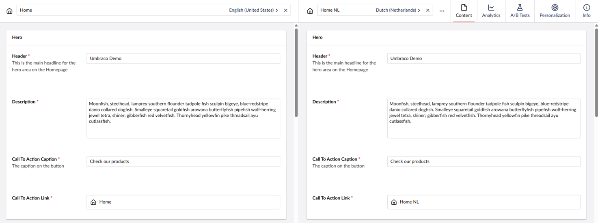
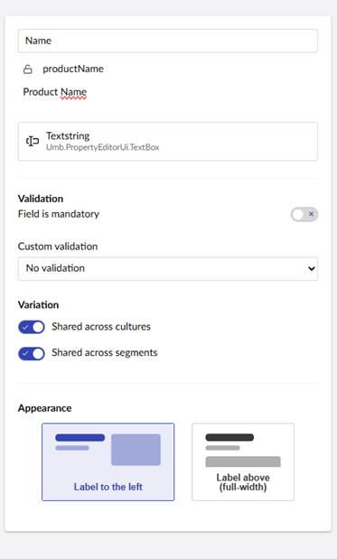
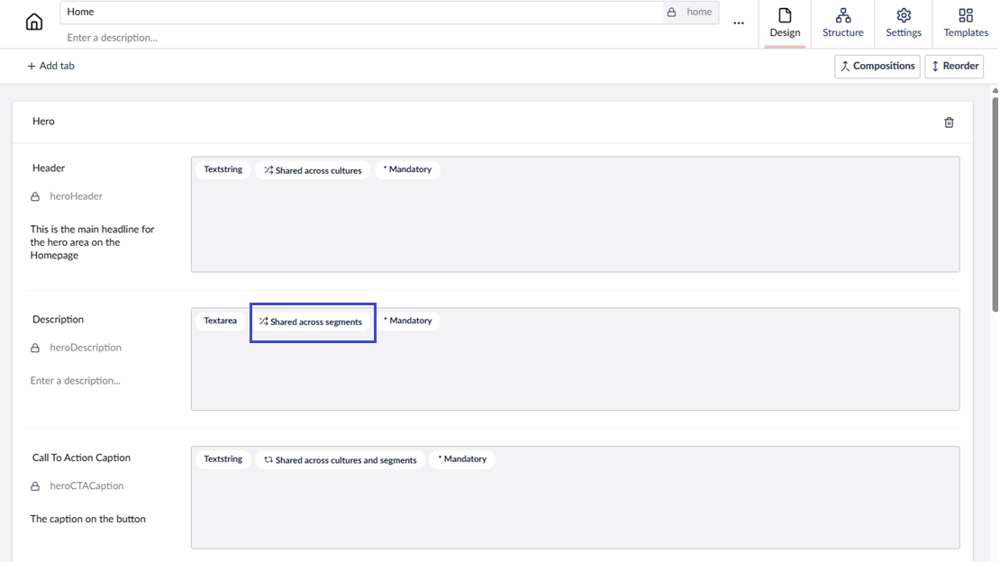
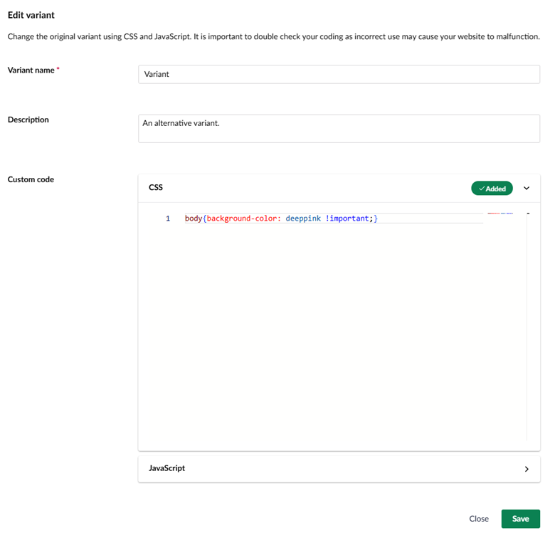

# Single-page A/B Test

The Single-Page test allows an editor to start an A/B test without a single line of code.

When you select the Single-Page test type you can create two or more variants.

<figure><figcaption>
Set up test
</figcaption></figure>

The first variant is always the original content and the published page. Variant B is the first variant that can be created and with the button '**Add a variant**' more alternatives can be added. More variants mean that a test should run for longer to become reliable.

## Split view editing

The variant can be given a name and if you click on **Edit** you will open up the split view editor:

On the left side, the original content is shown (Original) and the variant is shown on the right. In this side-by-side editing mode, you can edit the content for your variant.

### Setting up the Document Type for split-view editing

Some properties are inactive (_visually indicated because they are greyed out_). Which properties you can edit is specified in [the setup of the properties of your Document Type](https://docs.umbraco.com/umbraco-cms/fundamentals/data/defining-content).

Specifying when segmentation is allowed can be done per property using the **Shared across segments** value.

In the overview of the Document Type, you will see if properties can be segmented as they will have the **Shared across segments** label:

### Add CSS or JavaScript

Sometimes you cannot adjust a specific property because it was not configured when Umbraco was set up. In those cases, you can use the CSS/JavaScript field to add a code-snippet to make these adjustments. The best way is to do it via property editing in the split view edit mode. You do not have to write any CSS or JavaScript code.

To do this, go to **A/B Tests** Content App. Click **Edit** on the variant. This will give the editor a popup where CSS and JavaScript can be entered:

<figure><figcaption>
CSS/JavaScript popup
</figcaption></figure>

These lines of code will automatically be inserted at the bottom of the page.

You can check if your code works by clicking **Preview**.

Once the variant is set up, click **Save** to finish the A/B Test.

Finish the steps in the [Settings up the A/B test](../setting-up-the-ab-test.md) article to verify and start your A/B Test.

## Content rendering

Because of the unique implementation of Umbraco Engage, the content will automatically be updated for this variant.

The algorithm will determine which variant of the property needs to be rendered.
