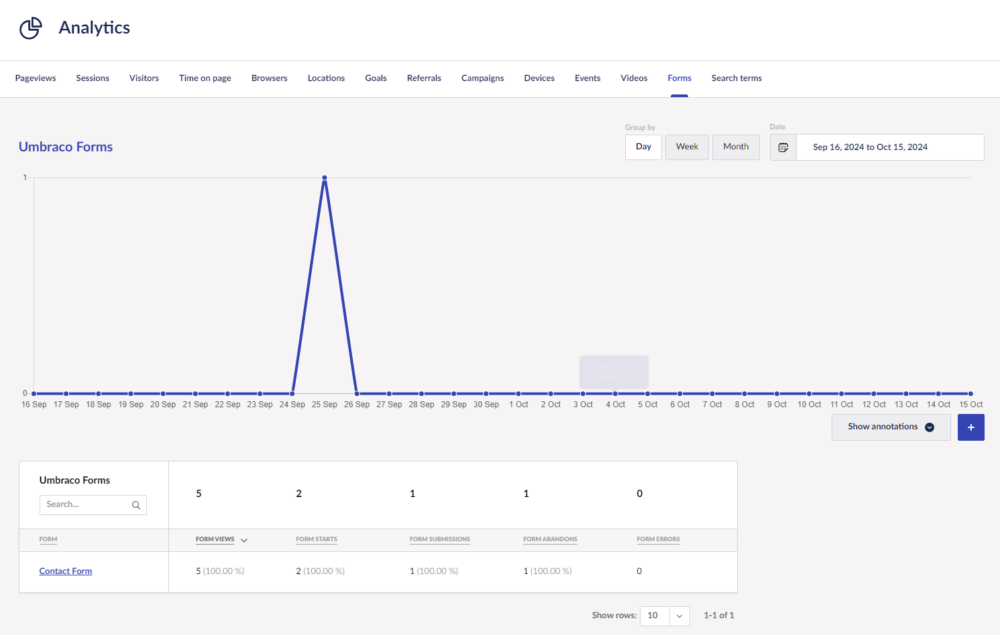
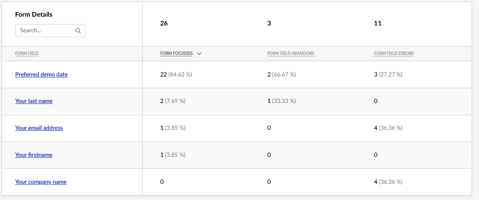

# Forms

To track Umbraco Forms submissions, you need to install [Umbraco Forms](https://umbraco.com/products/add-ons/forms/) with a valid license. You also need to install the Umbraco Engage [Forms Add-on package from Nuget](https://www.nuget.org/packages/Umbraco.Engage.Forms).

## Summary

Umbraco Engage measures interactions with Umbraco Forms on your website automatically if you include the [analytics JavaScript file](../../developers/analytics/client-side-events-and-additional-javascript-files/). No additional configuration is needed. The data is visualized in the backoffice in **Engage > Analytics > Umbraco Forms**.

The following are measured:

* The time a visitor started filling in the form.
* The time a visitor finished filling in the form (like when it was submitted).
* If the visitor has seen the form, and whether it was in their viewport.
* If the form was submitted successfully.
  * This is based on client-side validation only. If client-side validation passes it is seen as a successful submit.
* If the form raised any client-side errors, and how many were raised?
* Focus/unfocus events of each field and whether the field was empty or contained data at that time.

## The Report

The **Forms** tab in the **Analytics** section holds all data gathered about your forms.



In this overview, you can see the following:

* How many times a form is shown.
* How many times a visitor started filling in the form.
* The number of times a form was submitted (filled in and hitting the "submit" button).
* How often a form was abandoned before it was submitted.
* How many errors were triggered in the form.

Select a form to drill down to this specific form and see more details for the specific form fields.

For each field you see:

* How many times did the field receive focus.
* How often was this field the last field before a visitor abandoned the form.
* How often an error was triggered on the specific field.



This data gives you insights on how to optimize your forms to create a better conversion rate.

Finally, drill down to a specific field to see which type of error was triggered, be it a validation error or a mandatory error.

### Tracking a visitor Form submissions

It is possible to track a specific visitor to your website and see if they have made any form submissions. To do so, follow these steps:

1. Edit the Umbraco Form you wish to track visitors for and go to the **Design** view.
2. Add a new field to your form called **Analytics - VisitorId**.
3. Give the new form field a name such as **Visitor ID**.
4. Specify a URL in the settings of the field type called **Template**:

```console
https://**yoursite.com**/umbraco/#Engage/profiles/profiles/insights?id=**[[visitor.id]]**`
```

The URL above is a link to your website, including a visitor ID. By using a URL like this you can click directly through to view the visitor profile from Forms workflows. This includes emails, Slack messages as well as exported Excel data.


## Disable Umbraco Forms tracking

By adding the `umbraco-engage-no-tracking` attribute you can disable Umbraco Forms tracking on the form or field level. The attribute needs to be added to either the form tag or to a field tag (like input, select, or textarea).
