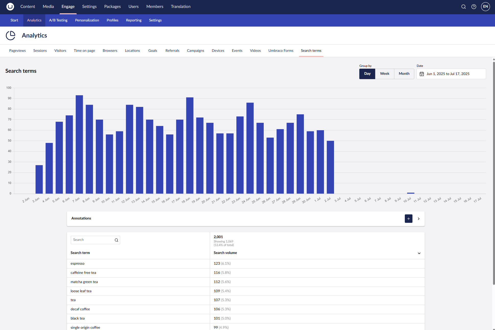

# Search Terms

The **Search Terms** feature within **Analytics** allows you to monitor and analyze the keywords visitors use when searching within your website. By using these terms, you gain valuable insights into what your audience is looking for, helping you optimize your content strategy and improve user experience.

Search terms automatically track keywords entered in your website's search field. By default, it looks for the `"q="` parameter in the URL's query string and stores the associated keywords.

You can identify common user interests and personalize their experience by tracking search terms both site-wide and per-profile basis. This helps in delivering more targeted content, improving engagement, and increasing conversion rates.

<figure><figcaption>
Search terms
</figcaption></figure>

## Configure Search Term Parameters

To configure the search terms parameters:

1. Go to the `appsettings.json` file.
2. Locate the `InternalSiteSearch` parameter.
3. Set values for `SearchTermParameters`, `SearchBoxParameters`, or `CategoryParameters` depending on your needs.

For more information, see the [Configuration](../../developers/settings/configuration.md) article.
