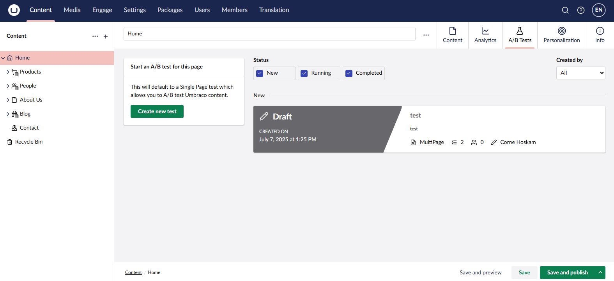

# Content Apps

In the Content section of Umbraco, you will see the Umbraco nodes. Most of them will relate to a specific page in your website. If you have installed the Umbraco Engage, each Umbraco node will have three extra Content Apps.

## Analytics

If you navigate to a node, you will see the Analytics content app. If you open the Content App, the Analytics data of this specific node is loaded.

## A/B Tests

The A/B Tests content app allows you to test your Umbraco node within the splitview functionality. Every Document Type can be A/B tested:

## Personalization

The Personalization content app allows you to score a specific page based on the customer journey and persona (for implicit content scoring).

It also allows you to set up personalized variants for each node.

## Managing the access to content apps

In the **Settings** section, navigate to **Engage** -> **Configuration** and select the **Permissions** tab. Here you can manage which Document Types the content apps are displayed on, and which Umbraco user groups can access them. They can be managed per Document Type and per user group

