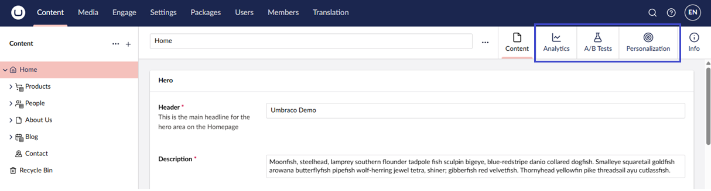
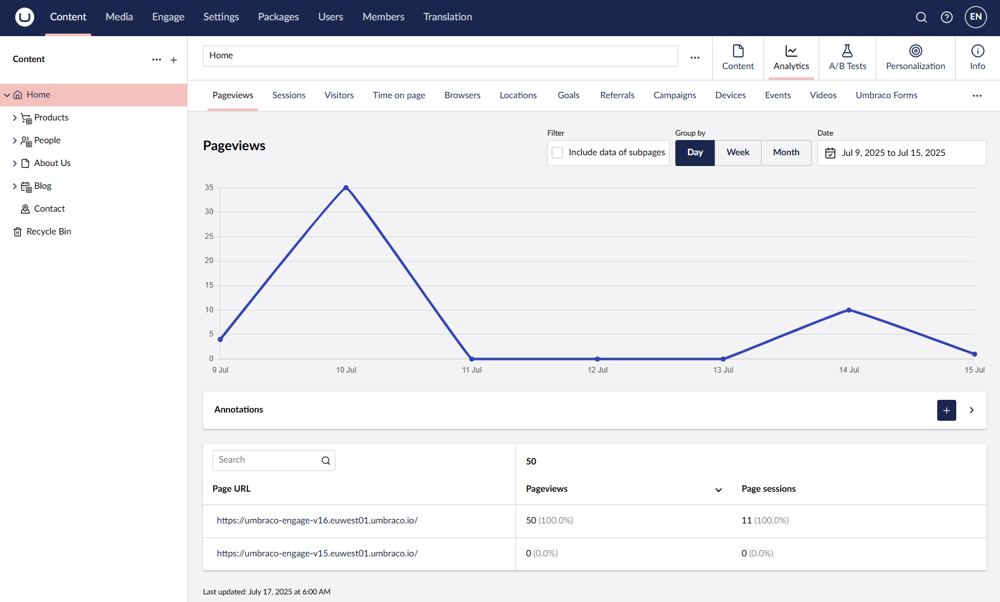
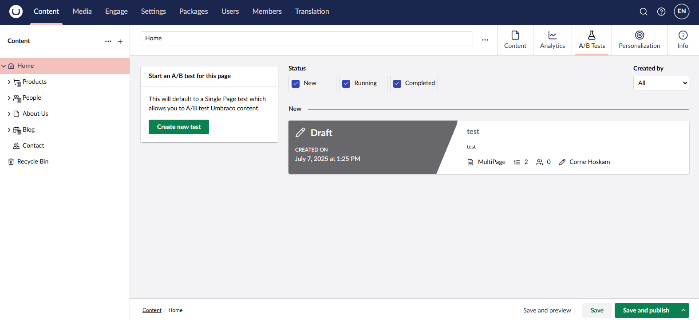
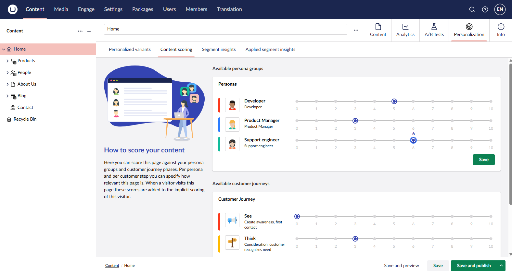
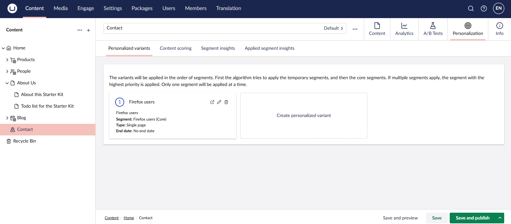
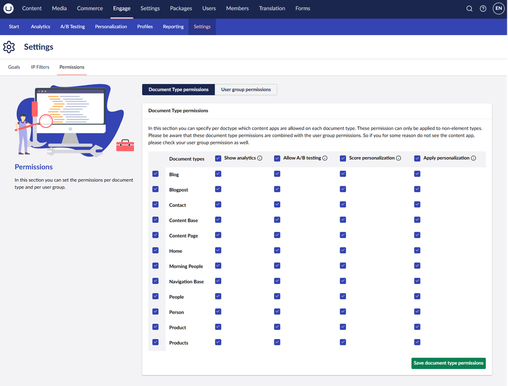
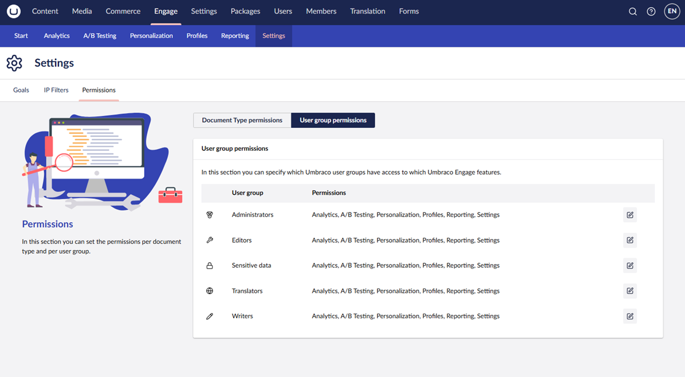

# Workspace Views

In the Content section of Umbraco, you will see the Umbraco nodes. Most of them will relate to a specific page in your website. If you have installed the Umbraco Engage, each Umbraco node will have three extra Workspace Views.


Workspace Views are a concept in Umbraco CMS. See the [Workspace Views](https://docs.umbraco.com/umbraco-cms/extend-your-project/backoffice-extensions/extending-overview/extension-types/workspaces/workspace-views) article in the CMS documentation to learn more.


## Analytics

If you navigate to a node, you will see the Analytics workspace view. If you open the Workspace View, the Analytics data of this specific node is loaded.

## A/B Tests

The A/B Tests workspace view allows you to test your Umbraco node within the splitview functionality. Every Document Type can be A/B tested:

## Personalization

The Personalization workspace view allows you to score a specific page based on the customer journey and persona (for implicit content scoring).

It also allows you to set up personalized variants for each node.

## Managing the access to Workspace Views

In the **Settings** section, navigate to **Engage** -> **Configuration** and select the **Permissions** tab. Here you can manage which Document Types the workspace views are displayed on, and which Umbraco user groups can access them. They can be managed per Document Type and per user group.

