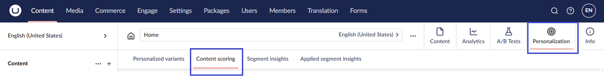
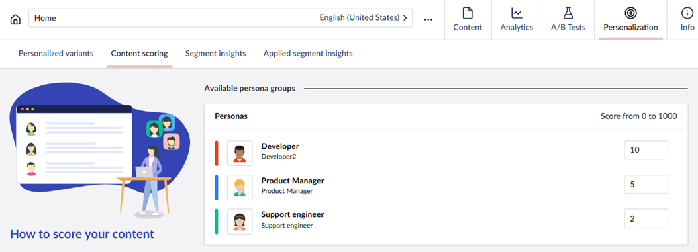

# Content Scoring

Each Umbraco node can be scored against personas and the customer journey.

To do this navigate to a node in Umbraco and open the content app "**Personalization**" on that node:

You can navigate to the tab "**Content scoring**" to score this Umbraco page. Writing your content for a specific set of personas you can assign a score that will be added to this persona or customer journey step.

Set up the score and save the scoring.

In the example below, the persona "**Developer**" will get **10 points** and the "**Product Manager**" will get **5 points** when they read this Umbraco node.

<figure><figcaption>
Set up content scoring.
</figcaption></figure>

