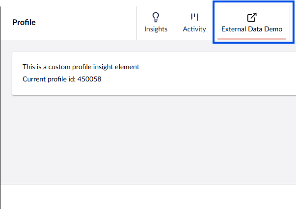

# External profile data

Your system may associate an Umbraco Engage visitor with other data coming from an external system such as a Customer Relation Management (CRM) system.

If you want to use external data in a custom segment you have to write the data access yourself in the custom segment code. Learn more about this in the [Profiling section for Developers](../../developers/profiling/external-profile-data.md).

