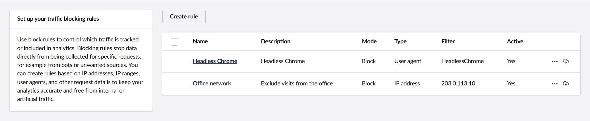
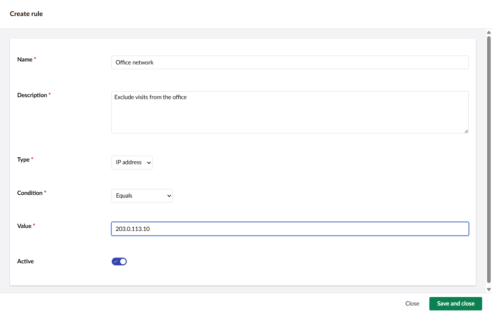

# Block traffic

Block traffic helps you keep your analytics clean. When people you do not want in your reports keep visiting the site, such as you and your team, an agency, or automated bots, their requests inflate your numbers. A block rule stops matching requests from being counted, so your reports reflect real visitors.

This does **not** stop anyone from using your website. The page still loads normally. A blocked request is only left out of your Engage analytics.

> If you used **IP filtering** before, nothing is lost. Your existing filters were moved over automatically and now appear here as **IP address** rules.

## Where to find it

Open the Engage section and go to **Settings** > **Block traffic**. The overview lists every rule you have set up. Before you add any, it shows "No rules have been added yet."

<figure><figcaption>
The Block traffic overview
</figcaption></figure>

## Not sure what to block?

The **Suspicious Activity** view, next to Block traffic in Settings, surfaces requests that behave differently from normal visitors, such as automated browsers. Use it to spot candidates worth turning into a block rule.

## Creating a rule

Select **Create rule**, fill in the fields, and select **Save and close**:

* **Name**: a short name for the rule.
* **Description**: a short note about what the rule is for.
* **Type**: what part of the request the rule looks at. See [Rule types](#rule-types).
* **Condition**: how the value is compared. See [Conditions](#conditions).
* **Value**: what to match against, for example an IP address or part of a user agent. With the **List** condition this becomes a **Values** field where you add entries one by one.
* **Active**: whether the rule is switched on. It is on by default, and you can switch it off later without deleting the rule.

The new rule then appears in the overview.

**Example, exclude your own visits:** set **Type** to *IP address*, **Condition** to *Equals*, and **Value** to your office IP address (your IT team can tell you the public one). Leave **Active** on and select **Save and close**. From then on, visits from that address stay out of your reports.

<figure><figcaption>
Creating a rule
</figcaption></figure>

## Rule types

* **IP address**: the visitor's IP address. Enter a single address (for example `203.0.113.10`) or a range that covers a whole network in CIDR notation (for example `203.0.113.0/24`). Ask your IT team if you are unsure which to use.
* **User agent**: the text a browser or bot sends to identify itself. Useful for keeping out automated clients.
* **Country**: the country a visit comes from, based on the visitor's detected location. The **Location** report under Analytics shows the country values Engage records.

## Conditions

When you choose a **Type**, the **Condition** list updates to show only the options that apply to it.

| Type | List | Equals | Contains | Regular expression |
|---|---|---|---|---|
| IP address | ✓ | ✓ | | ✓ |
| User agent | ✓ | ✓ | ✓ | ✓ |
| Country | ✓ | ✓ | ✓ | ✓ |

* **List**: matches when the value is one of several entries you add.
* **Equals**: matches when the value is exactly what you provide.
* **Contains**: matches when the value contains the text you provide.
* **Regular expression**: matches the value against a pattern. This is an advanced option; leave it to a developer if you are not familiar with regular expressions.

## Managing rules

Select a rule's name in the overview to open and edit it. To switch a rule off without deleting it, open it and turn **Active** off. To delete a rule, tick its checkbox in the overview and select **Delete**.

**Active applies from the moment you switch it on.** Turning a rule on does not remove data that was already collected, and turning it off does not bring back visits that were left out while it was active.

## What to expect

Blocked requests do not appear in your reports, so you will not see them there. To check a rule is doing its job, make sure it is **Active** and that the **Value** is correct. The **Suspicious Activity** view is a good place to see what is still coming through.
