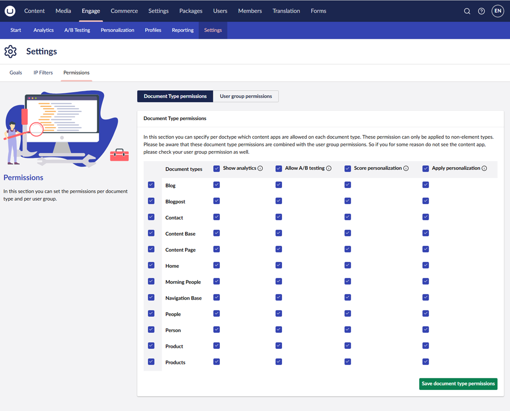
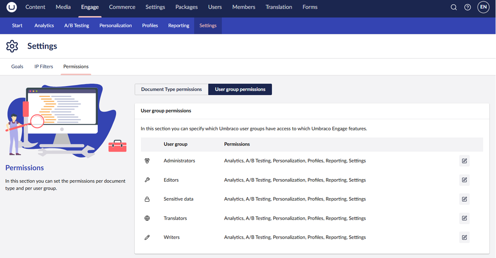

# Permissions

In the **Settings** section, navigate to **Engage** → **Configuration** and select the **Permissions** tab. Here you manage which Document Types show content apps and which Umbraco user groups can access them. This can be configured per Document Type and user group.

