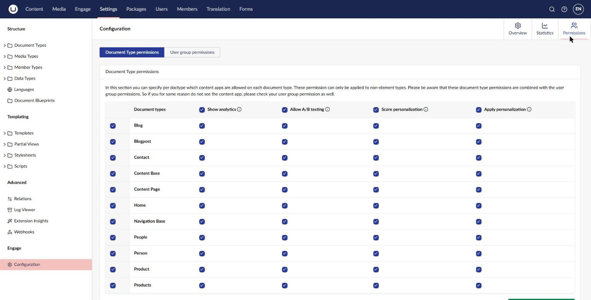
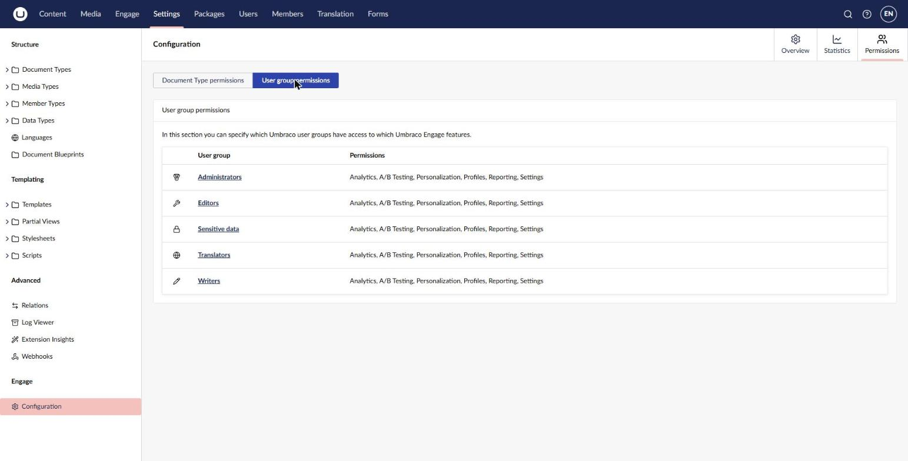

# Permissions

In the **Settings** section, navigate to **Engage** > **Configuration** and select **Permissions** in the top-right corner. Choose **Document Type permissions** or **User group permissions**. Here you manage which Document Types show workspace views, and which Engage features each Umbraco user group can access. This can be configured per Document Type and user group.

