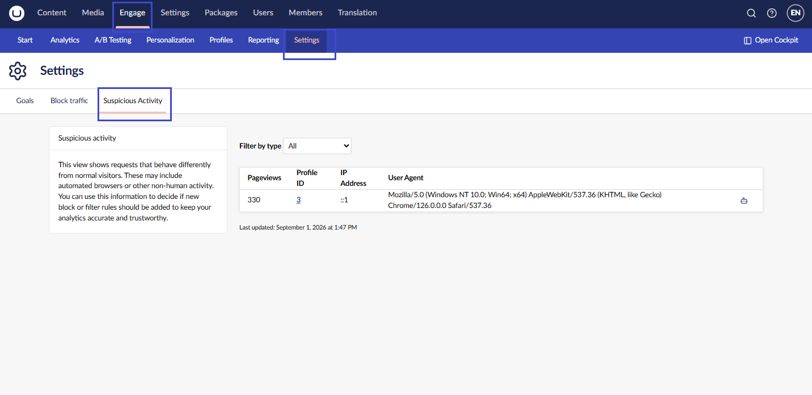
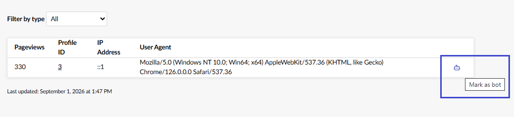
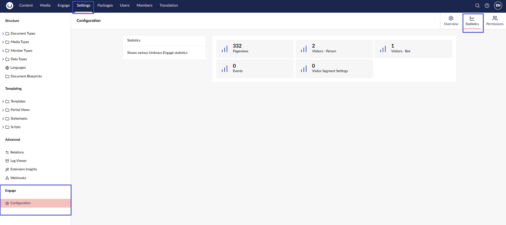
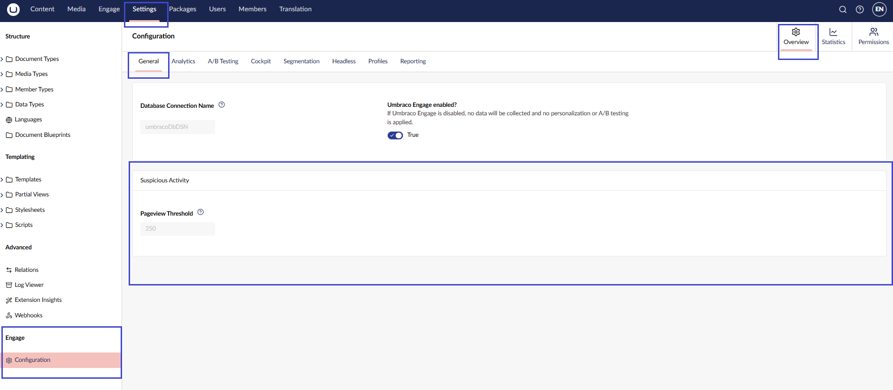

# Suspicious Activity

Suspicious Activity surfaces visitors whose traffic pattern doesn't look human, so you can keep your analytics accurate.

## Accessing suspicious activity

To access Suspicious Activity, go to **Engage > Settings > Suspicious Activity**.

The view lists visitors whose pageview count reaches or exceeds a configurable threshold (250 by default). For each visitor, you can see:

* **Pageviews**: The visitor's total pageview count.
* **Profile ID**: Links to the visitor's [Profile detail](../profiling/profile-detail.md) view.
* **IP Address**: The visitor's most recent IP address.
* **User Agent**: The visitor's most recent user agent string.

The built-in **Anonymous Visitor** is excluded from this list.


This view reads from Engage's reporting data. If you don't see visitors you expect, the reporting job may not have run yet. You can trigger it manually from the Umbraco **Settings** section, under **Configuration** > **Reporting** > **Regenerate reporting data**.


<figure><figcaption></figcaption></figure>

## Filtering by type

Use the **Filter by type** dropdown to filter the list:

* **All**: Every visitor over the threshold.
* **Real visitors**: Visitors still classified as a person.
* **Bots & excluded**: Visitors marked as a bot, plus visitors Engage detected automatically as a monitor or spam. Those rows have no toggle icon.

## Marking a visitor as a bot

If a visitor's traffic looks automated, mark them as a bot directly from the table:

1. Find the visitor's row.
2. Select the bot icon at the end of the row.

The icon's tooltip reflects the visitor's current state. **Mark as bot** if they're currently classified as a person, or **Revert to person** if they're already marked as a bot. Selecting it toggles between the two.

Marking a visitor as a bot only changes the visitor's type. It does not delete any data and it does not create a Block Traffic rule. The visitor's pageviews are left out of the reports after the next nightly reporting run.

<figure><figcaption></figcaption></figure>

Reclassifying a visitor updates the **Filter by type** results immediately. The visitor's status such as Person/Bot is also counted under **Settings > Configuration > Statistics**.

<figure><figcaption></figcaption></figure>

## Changing the pageview threshold

The number of pageviews that triggers a visitor's inclusion in this list defaults to 250. You can view the current value under **Settings > Configuration > General** (in the main Umbraco **Settings** section), in the **Suspicious Activity** section. This field is read-only in the backoffice.

<figure><figcaption></figcaption></figure>

To change the value, set it in `appsettings.json`:

```json
{
  "Umbraco": {
    "CMS": { ... }
  },
  "Engage": {
    "Settings": {
      "SuspiciousActivity": {
        "PageviewThreshold": 100
      }
    }
  },
  "ConnectionStrings": { ... }
}
```


This change requires a website restart to take effect.

