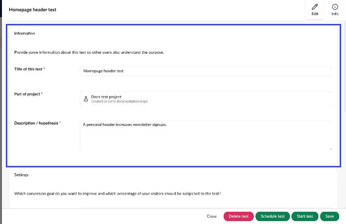
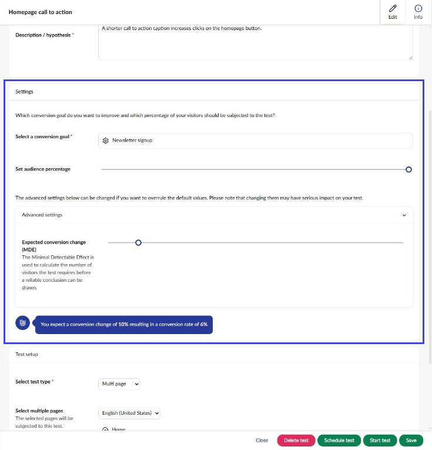
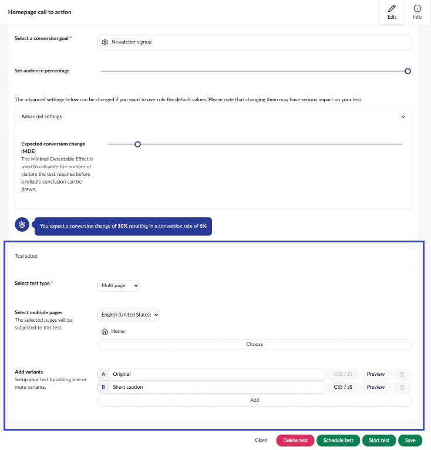
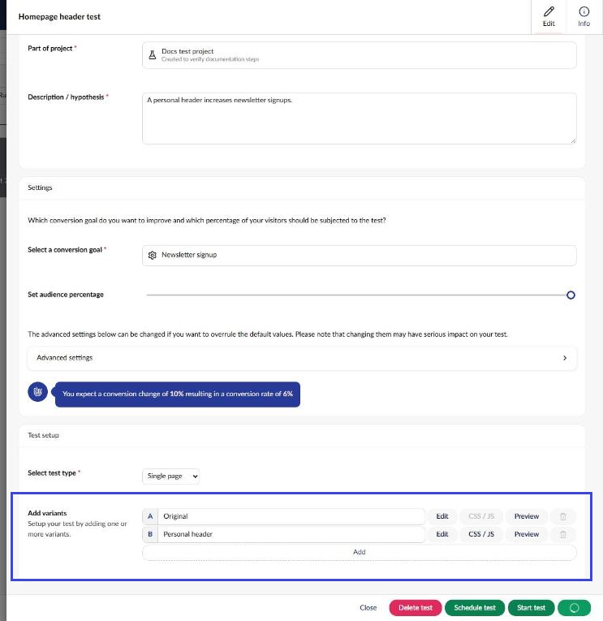
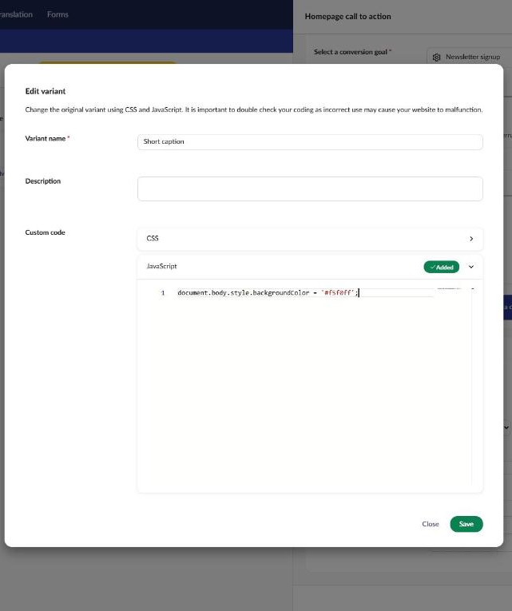
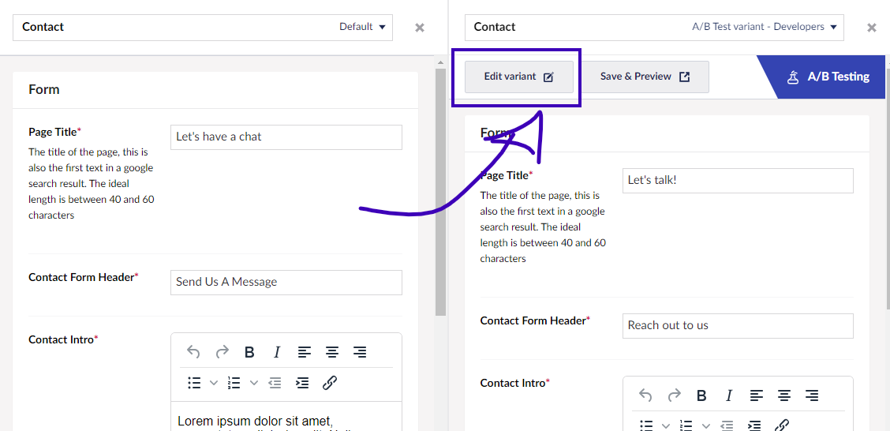

# How to set up an A/B Test

In this tutorial, you will go through the necessary steps for setting up and configuring an A/B test on your Umbraco website.

Before you start, it is recommended to read the [What is A/B Testing article](../marketers-and-editors/ab-testing/what-is-ab-testing.md) to get familiar with the concept.

## Tutorial Content

1. [Make a Plan](set-up-your-first-ab-test.md#make-a-plan)
2. [Choose test type](set-up-your-first-ab-test.md#choose-test-type)
3. [Create the test](set-up-your-first-ab-test.md#create-the-test)
4. [Configure the test](set-up-your-first-ab-test.md#configure-the-test)
5. [Edit the test variants](set-up-your-first-ab-test.md#edit-the-test-variants)
6. [Start the test](set-up-your-first-ab-test.md#start-the-test)
7. [Next steps](set-up-your-first-ab-test.md#next-steps)

## Make a plan

The first step to setting up an A/B test on your website is to define a solid plan. It is also important to ensure that your website receives enough traffic to make the tests valid.

This tutorial does not cover defining a plan or what makes a project valid for testing. However, find some general recommendations below.

* **Set a Clear Objective:** Start by defining a specific goal for your A/B test. Knowing what you aim to improve or measure allows you to design the test accordingly. For example, do you want more clicks on a button, a higher conversion rate, or something else?
* **Ensure a valid amount of data:** A significant amount of traffic and conversions is important to produce reliable results from A/B tests. Use a tool like the Risk Optimization Automation Rethink (ROAR) model to determine whether your website is eligible.
* **Develop a Hypothesis:** Based on your objective, create a clear hypothesis. This should include what change you expect and why. The stronger your hypothesis, the more valuable your test results will be.

Once you have confirmed your website is eligible for testing and defined a clear hypothesis and objective, you are ready to set up the test.

## Before you start

Every test must belong to a project. If none exist yet, see [Create a project](../marketers-and-editors/ab-testing/setting-up-the-ab-test.md#create-a-project) before starting the test.

## Choose test type

Umbraco Engage enables you to run different types of tests depending on your objective and goal for running the test.

* [Single Page Test](../marketers-and-editors/ab-testing/types-of-ab-tests/single-page-ab-test.md)
* [Multi-page Test](../marketers-and-editors/ab-testing/types-of-ab-tests/multiple-pages-test.md)
* [Document Type Test](../marketers-and-editors/ab-testing/types-of-ab-tests/document-type-test.md)
* [Split URL Test](../marketers-and-editors/ab-testing/types-of-ab-tests/split-url-test.md)

The steps for setting up each test are more or less the same. You can set up the tests on content items in the Content section or from the A/B Testing dashboard in the Engage section. In the table below, you can see which tests can be initialed from which section.

| Content section    | Engage section     |
| ------------------ | ------------------ |
| Single Page Test   | Multi-page Test    |
| Multi-page Test    | Document Type Test |
| Document Type Test | Split URL Test     |

### Allow segmentation on your Document Types

Only content that uses Document Types configured for segmentation can be used for the tests. See the **For Developers** box below for more details.

For Developers: Configure Document Types for segmentation

To set up A/B testing on your content, segmentation must be configured on the Document Types and properties used. Follow the steps below to allow segmentation.

1. Open the Document Type that needs to allow segmentation.
2. Access the **Settings** view.
3. Turn on **Vary by segment** under **Allow segmentation**.
4. **Save** the Document Types.
5. Access the **Design** view for the same Document Type.
6. Select the property where segmentation should be allowed.
7. Turn off **Shared across segments** under **Variation**.
8. **Submit** the changes.
9. Repeat steps 6-8 for each property that should allow segmentation.
10. **Save** the Document Type.

## Create the test

The following steps will take you through the initial setup of the test. Use the table above to determine from which backoffice section the test should be created.

### Set up a test from the Content section

1. Navigate to the content item where you want to set up an A/B test.
2. Open the **A/B Tests** view.
3. Click on **Create new test**.

### Set up a test from the Engage section

* Navigate to the **A/B Testing** dashboard in the Engage section.
* Click on **Add new test**.

## Configure the test

The following steps guide you through configuring the different parts of the test.

### Information

1. Enter the **Title of this test**.
2. Under **Part of project**, select **Choose** to pick an existing project. Select **+** to create a new one.
3. Enter a **Description / hypothesis**, ideally focused on the hypothesis the test is based on.

<figure><figcaption></figcaption></figure>

### Settings

1. Under **Select a conversion goal**, select **Choose** to pick a goal. Select **+** to create a new one.
2. Use **Set audience percentage** to decide how many visitors take part in the test.
3. Change the **Expected conversion change** under **Advanced settings** if relevant.
4. Select **Save**. The **Test setup** section becomes available once the test is saved.

<figure><figcaption></figcaption></figure>

### Test setup

1. Choose the test type in **Select test type**.
   1. Single page: Available from the Content section only. No more configuration required.
   2. Multi page: Select the pages to use with **Choose** under **Select multiple pages**.
   3. Content type: Select the Document Types to use under **Select document types**.
   4. Split URL: Available from the Engage section only. Select the pages to use with **Choose** under **Select multiple pages**.
2. Give the new variant a name under **Add variants**. Select **Add** to add more variants.
   * You can edit the variants at a later point.
3. Select **Save**.

<figure><figcaption></figcaption></figure>

With all the configurations in place, editing the variants added to the test is next.

## Edit the test variants

When you have configured and set up the test, it will be in _draft mode_ until you decide to start the actual test.

It is now time to start building the variant(s). This is primarily done by adding custom code to each variant. If you are running a Single Page Test you can edit the content on the page using the split-view functionality.

### Add variations to content (Single Page Test only)

1. Navigate to the content item in the Content section.
2. Open the **A/B Tests** view.
3. Select the test.
4. Click on **Edit** next to the variant you want to make changes to.

<figure><figcaption></figcaption></figure>

You can now edit the content item in split view. Only fields that have been configured for segmentation can be edited. If you leave a field blank, it will use the values from the original version.

<figure><figcaption></figcaption></figure>

1. Select **Save and preview** to preview the changes before publishing.
2. **Save and publish** the content variant.

### Add custom code



1. Navigate to the content item in the Content section.
2. Open the **A/B Tests** view.
3. Select the test.
4. Select **CSS / JS** next to the variant you want to make changes to.

<figure><figcaption></figcaption></figure>

5. Add an optional description to the variant.
6. Expand **CSS** or **JavaScript** under **Custom code** and add your code.

<figure><figcaption></figcaption></figure>

7. Select **Save**.
8. Select **Preview** next to the variant to check the changes.



1. Access the test from the **A/B Testing** dashboard in the Engage section.
2. Select **CSS / JS** next to the variant you want to make changes to.

<figure><figcaption></figcaption></figure>

3. Add an optional description to the variant.
4. Expand **CSS** or **JavaScript** under **Custom code** and add your code.

<figure><figcaption></figcaption></figure>

5. Select **Save**.
6. Select **Preview** next to the variant to check the changes.



## Start the test

You have now set up all the variants and the test is ready to be started.

1. Open the test in the Engage section.
2. Select **Schedule test** to pick a start date, or **Start test** to start right away.

## Next steps

The A/B test has been set up on your website and will start gathering data and results. This concludes the tutorial.

Find resources for the next steps in the articles listed below.

### [Monitor the test](../marketers-and-editors/ab-testing/monitor-the-ab-test.md)

Monitor and keep an eye on your A/B test while it is running. You can track the results throughout the process, but it is encouraged not to make changes until the test is complete.

### [Finish the test](../marketers-and-editors/ab-testing/finish-an-ab-test.md)

Learn how to wrap up an A/B test once a result has been found.
