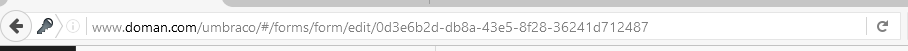

# Custom Markup

With Umbraco Forms, it is possible to customize the output markup of a Form, which means you have complete control over what Forms will display.


We recommend using [Themes](themes.md) to customize your Forms. This will ensure that nothing is overwritten when you upgrade Forms to a newer version.


## Customizing the Default Views

The razor macro uses some razor views to output the Form:

* 1 view for each fieldtype
* 1 view for the scripts
* 1 view for the rest of the Form

You can find the default views in the `~\Views\Partials\Forms\Themes\default` folder.

To avoid your custom changes to the default views from being overwritten, you need to copy the view you want to customize into your theme folder, e.g. `~\Views\Partials\Forms\Themes\YourTheme`, and edit the file in `YourTheme` folder.

### Form.cshtml

This is the main view responsible for rendering the Form markup.

The view is separated into two parts, one is the actual Form and the other will be shown if the Form is submitted.

This view can be customized, if you do so it will be customized for all your Forms.

### Script.cshtml

This view renders the JavaScript that will take care of the conditional logic, customization won't be needed here.

### FieldType.\*.cshtml

The rest of the views start with FieldType, like `FieldType.Textfield.cshtml` and those will output the fields. There is a view for each default fieldtype like _textfield_, _textarea_, _checkbox_, etc)

Contents of the `FieldType.Textfield.cshtml` view (from the default theme):

```csharp
@model Umbraco.Forms.Mvc.Models.FieldViewModel
@using Umbraco.Forms.Mvc

<input type="text"
    name="@Model.Name"
    id="@Model.Id"
    class="@Html.GetFormFieldClass(Model.FieldTypeName) text"
    value="@Model.ValueAsHtmlString"
    maxlength="500"
    @{if(string.IsNullOrEmpty(Model.PlaceholderText) == false){<text>placeholder="@Model.PlaceholderText"</text>}}
    @{if(Model.Mandatory || Model.Validate){<text>data-val="true"</text>}}
    @{if (Model.Mandatory) {<text> data-val-required="@Model.RequiredErrorMessage"</text>}}
    @{if (Model.Validate) {<text> data-val-regex="@Model.InvalidErrorMessage" data-val-regex-pattern="@Html.Raw(Model.Regex)"</text>}}
/>
```

Umbraco Forms uses ASP.NET Unobtrusive Validation which is why you see attributes like `data-val` and `data-val-required`.

This can be customized but it's important to keep the ID of the control to `@Model.Id` since that is used to match the value to the Form field. For fields that are conditionally hidden, without an ID of `@Model.Id` the control won't be shown when the conditions to show the field are met. An ID needs to be added to text controls such as headings and paragraphs.

The view model for the partial view for a field is `FieldViewModel`. This defines properties that may be useful when creating new themes or custom fields, some of which are shown in the code samples above. Others include:

* `AdditionalSettings` - a dictionary of the settings keys and values populated for the form field. These can be retrieved in typed form by key using e.g. `Model.GetSettingValue<int>("MaximumLength", 255);`.

The following are available on the model but only populated for fields that support file upload:

* `AllowAllUploadExtensions`- a boolean indicating whether all file extensions are permitted for upload.
* `AllowedUploadExtensions`- a collection of strings indicating the file extensions that are permitted for upload.
* `AllowMultipleFileUploads`- a boolean indicating whether selecting multiple files for upload is allowed.

### Customizing for a Specific Form

It is also possible to customize the markup for a specific Form.

You will need to create folder using the ID of the Form: `~\Views\Partials\Forms\{FormId}` (find the id of the Form in the URL when you are viewing the Form in the backoffice.)



As an example if your Form ID is 0d3e6b2d-db8a-43e5-8f28-36241d712487 then you can overwrite the Form view by adding the `Form.cshtml` file to the directory. Start by copying the default one and then making your custom changes: `~\Views\Partials\Forms\0d3e6b2d-db8a-43e5-8f28-36241d712487\Form.cshtml`.

You can also overwrite views for one or more fieldtypes by adding the views to the `Fieldtypes` folder: `~\Views\Partials\Forms\0d3e6b2d-db8a-43e5-8f28-36241d712487\Fieldtypes\Fieldtype.Textfield.cshtml`.
