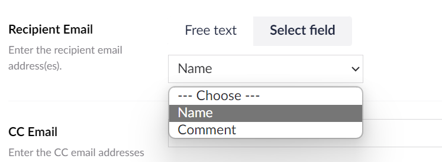

# Setting Types

Umbraco Forms field, prevalue source and workflow types are defined in C# and include one or more setting values.

These settings are completed by the editor when using the type on their form.

Each setting type can have it's own user interface. So a string can use a text box but a more complicated JSON structure can use a more appropriate user interface.

From Forms 14, each interface is defined as an Umbraco [property editor UI](https://docs.umbraco.com/umbraco-cms/customizing/property-editors/composition/property-editor-ui).

The user interface used for a particular setting is defined by the `View` property:

```csharp
[Umbraco.Forms.Core.Attributes.Setting("Message", View = "Umb.PropertyEditorUi.TextBox")]
public string Message { get; set; }
```

If not specified, the default `Umb.PropertyEditorUi.TextBox` is used.

## Built-in setting types

The following setting types are available and are used for the field, prevalue source and workflow types that ship with the package.

Some are defined with the Umbraco CMS and some ship with the Forms package.

| Name                                             | Source       | Description                                                       | Used in                                         |
|--------------------------------------------------|--------------|-------------------------------------------------------------------|-------------------------------------------------|
| Umb.PropertyEditorUi.ContentPicker.Source        | CMS          | Uses a content picker with the option for XPath entry             | The "Save as Umbraco node" workflow             |
| Umb.PropertyEditorUi.DocumentPicker              | CMS          | Uses a content picker                                             |                                                 |
| Umb.PropertyEditorUi.Dropdown                    | CMS          | Used for selection from a list of options                         |                                                 |
| Umb.PropertyEditorUi.Integer                     | CMS          | Uses numerical text box for entry                                 |                                                 |
| Umb.PropertyEditorUi.MediaEntityPicker           | CMS          | Uses a media item picker for entry                                | The "Send email with XSLT template" workflow    |
| Umb.PropertyEditorUi.MultipleTextString          | CMS          | Uses multiple text boxes for entry                                | Not used in core types                          |
| Umb.PropertyEditorUi.Slider                      | CMS          | Uses a slider for range input                                     | The "reCAPTCHAv3" field type                    |
| Umb.PropertyEditorUi.TextArea                    | CMS          | Uses a multiline textbox for entry                                |                                                 |
| Umb.PropertyEditorUi.TextBox                     | CMS          | Uses a single-line textbox for entry                              |                                                 |
| Umb.PropertyEditorUi.Tiptap                      | CMS          | Uses a rich text editor for input                                 | The "Send email" workflows                      |
| Umb.PropertyEditorUi.Toggle                      | CMS          | Uses a single checkbox for entry                                  |                                                 |
| Umb.PropertyEditorUi.UploadField                 | CMS          | Used for selection of a file                                      | The "Text file" prevalue source                 |
| Forms.PropertyEditorUi.DataTypePicker            | Forms        | Uses a datatype picker                                            | The "Umbraco prevalues" prevalue source         |
| Forms.PropertyEditorUi.DocumentTypePicker        | Forms        | Uses a Document Type picker                                       | The "Umbraco nodes" prevalue source             |
| Forms.PropertyEditorUi.DocumentTypeFieldPicker   | Forms        | Uses to select fields from a Document Type                        | The "Umbraco nodes" prevalue source             |
| Forms.PropertyEditorUi.DocumentMapper            | Forms        | Used for mapping of fields from a Document Type                   | The "Save as Umbraco node" workflow             |
| Forms.PropertyEditorUi.EmailTemplatePicker       | Forms        | Used for selection of an email template                           | The "Send email with Razor template" workflow   |
| Forms.PropertyEditorUi.FieldMapper               | Forms        | Used to map fields from a form to required aliases                | The "Send to URL" workflow                      |
| Forms.PropertyEditorUi.Password                  | Forms        | Uses password text box for entry                                  |                                                 |
| Forms.PropertyEditorUi.StandardFieldMapper       | Forms        | Used to map system fields from a form to required aliases         | The "Send to URL" workflow                      |
| Forms.PropertyEditorUi.TextWithFieldPicker       | Forms        | Uses a single-line textbox/form field list for entry              | Not used in core types                          |

Most of the above setting types are used in one or more field, prevalue source and workflow types available with Umbraco Forms. For the less common ones, a usage has been indicated in the table.

## Additional setting types

Some types we don't use within the package, but we make available for developers to use when creating their own types.

For example `Forms.PropertyEditorUi.TextWithFieldPicker`. This offers the option of text field entry or the selection of a field from the form. This can be useful in workflows where you need to reference the value of a specific field.



## Creating a setting type

It's also possible to define your own setting type using a combination of server and client-side code.

Read how do this in the article on [adding a field type](./adding-a-fieldtype.md#field-settings).
