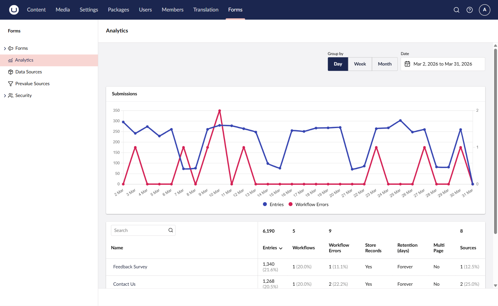
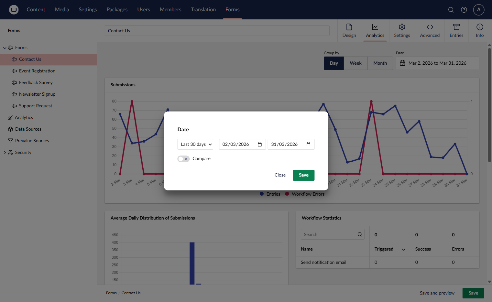
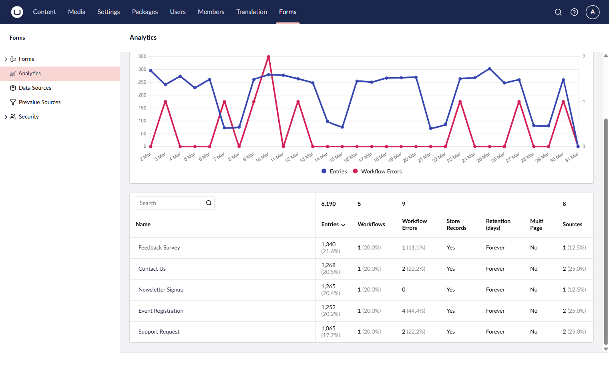
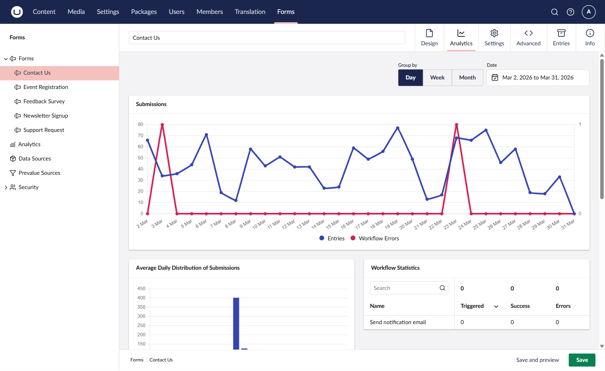
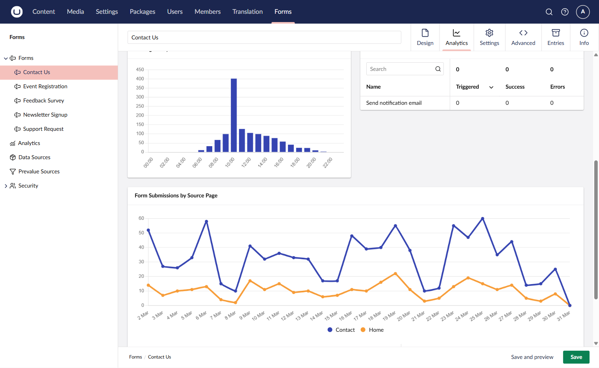
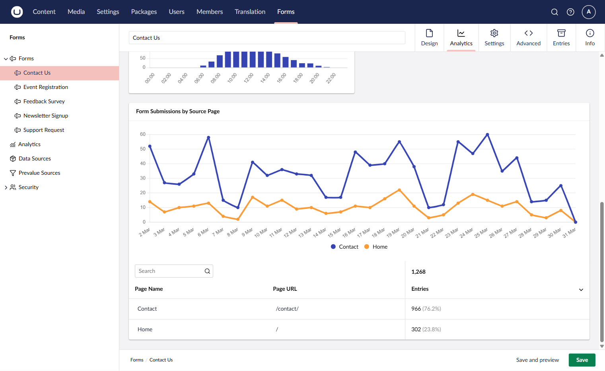

# Analytics


This feature is available from Umbraco Forms 17.3.


Umbraco Forms provides built-in analytics that give you insight into how your forms are performing. You can view submission trends over time, monitor workflow success rates, and identify which pages are driving submissions.

## Accessing Analytics

There are two ways to access form analytics in the backoffice.

### From the Forms Section Menu

In the Forms section, click the **Analytics** menu item in the sidebar. This opens the analytics overview where you can browse analytics across all your forms.

### From a Specific Form

You can navigate directly to analytics for a specific form:

1. Go to the **Forms** section.
2. Right-click on a form or open its action menu.
3. Select **View Analytics**.

This opens the **Analytics** tab on the form workspace, showing analytics data for that form only.


The Analytics tab appears as a workspace view on existing forms. It is not available when creating a new form that has not yet been saved.


## Controls

The analytics view provides controls to adjust the data displayed.

### Date Range

Use the date range picker to select the time period for the analytics data. You can choose from preset ranges such as "Last 7 days" or "Last 30 days", or set a custom date range. You can also enable a comparison date range to compare the current period against a previous one.

### Group By

Use the group by control to change how the data is aggregated in the time-series charts:

* **Day** — shows data points for each day in the selected range.
* **Week** — groups data by week.
* **Month** — groups data by month.

## Overview Table

The overview table lists all forms you have access to with summary statistics for the selected date range. This includes entry counts, workflow counts, workflow errors, and source pages.

Click on a form name to navigate to its detailed analytics view.

## Analytics Widgets

When viewing analytics for a specific form, the view displays four widgets providing different perspectives on form performance.

### Submissions

A time-series chart showing the number of form submissions and failed workflows over the selected date range.

### Submissions by Hour

A chart showing the distribution of form submissions across the 24 hours of the day. This helps identify peak submission times and can inform decisions about when to schedule maintenance or review submissions.

### Workflow Statistics

A table listing each workflow attached to the form. It shows the number of times each workflow was triggered, succeeded, and failed. Use this to monitor the health of your form processing workflows.

### Origins

A time-series chart showing form submissions broken down by the page where the form was submitted. This is useful when the same form is placed on multiple pages across your site, as it shows which pages are driving the most submissions.

Below the chart, a table lists each source page with its name, URL, and entry count.

## Permissions

To view form analytics, you need:

* Access to the **Forms** section in the backoffice.
* The **View Entries** permission for the form.

Users will only see analytics for forms they have permission to manage.

## Data Processing

Analytics data is pre-aggregated by a background process that runs daily. This means the analytics views load quickly even for forms with a large number of submissions.

When forms are first installed or upgraded to a version that includes analytics, the background process will aggregate historical submission data. This may take some time depending on the volume of existing records.


The analytics data processing is enabled by default. It can be configured or disabled via the `AnalyticsProcessing` settings in `appsettings.json`. See the [Configuration](../developer/configuration/README.md) article for details.

