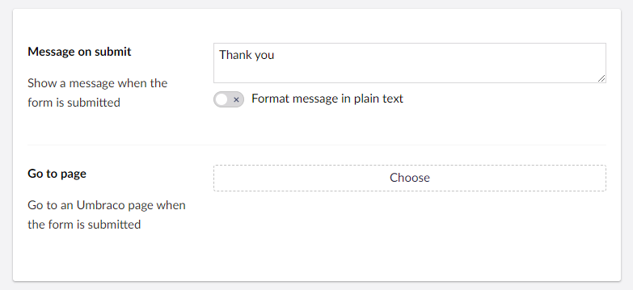
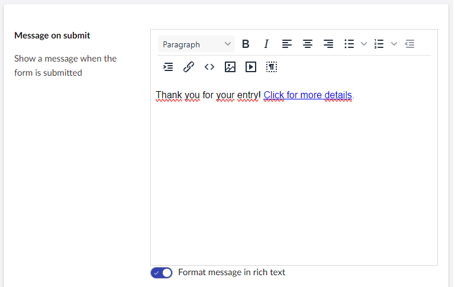
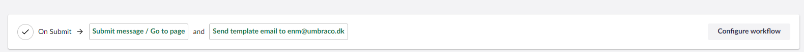
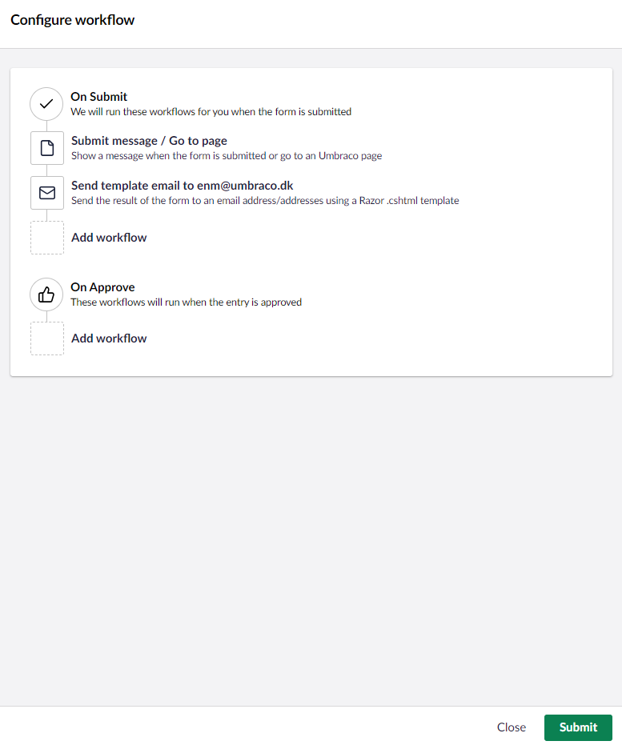
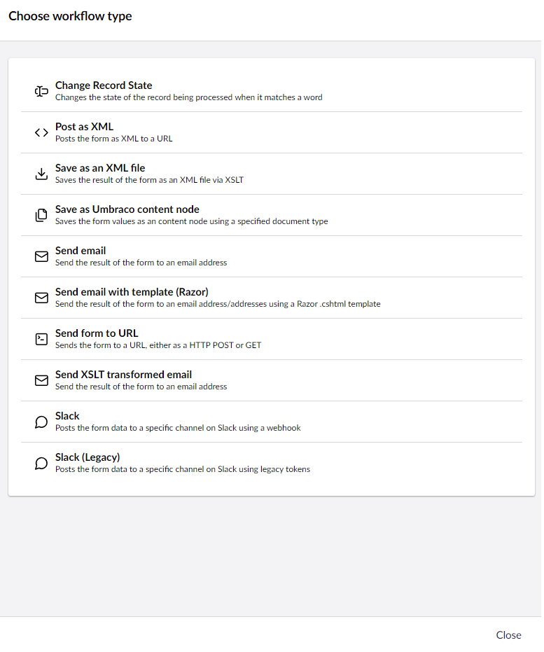
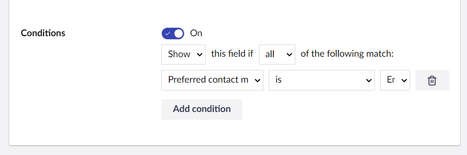
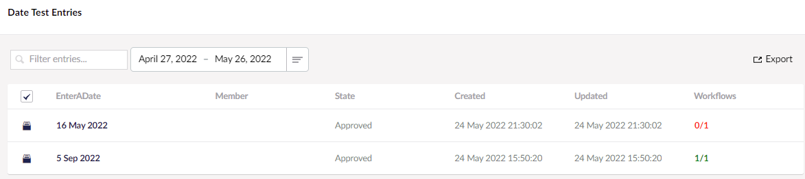
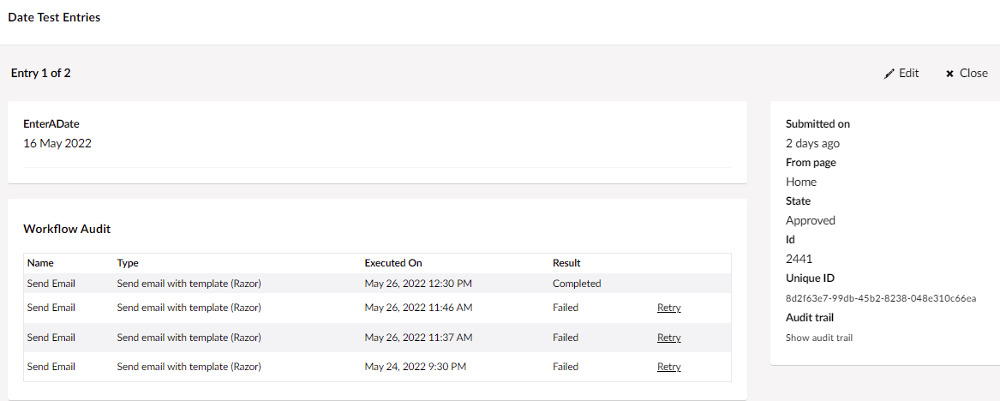

# Attaching Workflows

In this article, you can learn how to add extra functionality to your Form by attaching **workflows**.

Workflows are a way of defining actions after your Form is submitted like sending an email or creating a content node.

## Default Workflow

By default, when a Form is submitted the record data is stored in the database. This can be configured in the [Store records](../creating-a-form/form-settings.md#settings-options) of the Forms settings.

The behavior to display a message to the user who submitted the form can be configured by clicking on the built-in first workflow step. This step is labelled **Submit message/Go to page**, and it can also configure the redirection to another page.

If a value is selected for **Go to page**, it will be used to redirect to that page once the form has been submitted.

If no value is selected, the message in **Message on submit** is displayed to the user on the same page, instead of the form fields. This is implemented via a redirect to the current page, ensuring that the form can't be accidentally resubmitted.

By default, the message is created and rendered in plain text. If you need to add formatting to the message, toggle the **Format message in rich text** button.

## Video Tutorial


Attaching Workflows to Umbraco Forms


## Adding a Workflow

At the bottom of your Form, a default workflow is already attached to the Form, as well as an option to configure the workflows.

Clicking **Configure workflow** will give you the option to configure existing workflows, as well as setup new ones.

### Choose a Workflow

A new workflow can be of different types and Umbraco Forms ships with a few default ones. You can find an overview of the types in the [Workflow types](workflow-types.md) article.

### Update Type-specific Settings

Once the Workflow Type has been selected, you will need to configure the workflow. There are different settings depending on the type that has been selected.

To use data from the submitted Form in your workflow, head over to the [Magic Strings](../../developer/magic-strings.md) article and learn more about how that's done.

### Configuring Condition on a Workflow

You can apply conditions to a workflow that trigger it only under specific circumstances. After adding the desired workflow type (for example, sending an email), you can add a condition to the workflow.

Select **Enable conditions** to open the condition editor. In the condition editor, you will see options to create logic that determines when the workflow should run. The condition is generally based on the values of the form fields.

For example: You have a form with a dropdown field labeled **Preferred Contact Method** with options such as **Email** and **Phone**. You can set up a workflow that sends an email notification only when the user selects **Email**.

Now, this email notification will only be sent when the user selects **Email** as their preferred contact method.

Fill in the rest of the settings and click **Submit**. The workflow is added to your Form and displayed at the bottom of the page.

## Workflow Processing

When a form is submitted, any workflows associated with the "submit" stage of the form will run sequentially in the configured order. The record is stored after these workflows are completed, and as such they can make changes to the information recorded.

Similarly, approval of a form entry, whether automatic or manual, will trigger the execution of the workflows associated with the "approve" stage.

Rejection of an entry will trigger the execution of the workflows associated with the "reject" stage.

If a workflow encounters an unexpected error, it will silently fail from the perspective of the user submitting the form. The exception along with the other details of the failed operation is recorded to the log.

From Umbraco Forms versions 8.13.0 and 10.1, an audit trail has been made available. In the list of entries for a form, a summary is presented that shows how many workflows were executed, and how many were successful:

For each entry, in the backoffice a table can be viewed that shows each of the workflows and the success, or otherwise, of the operation.

For any workflows that did not complete successfully, a "Retry" link is available to trigger the workflow again. This is useful for example if there was a temporary infrastructure issue that perhaps prevented an email going out. You would be able to retrigger the workflow once the issue is resolved.
