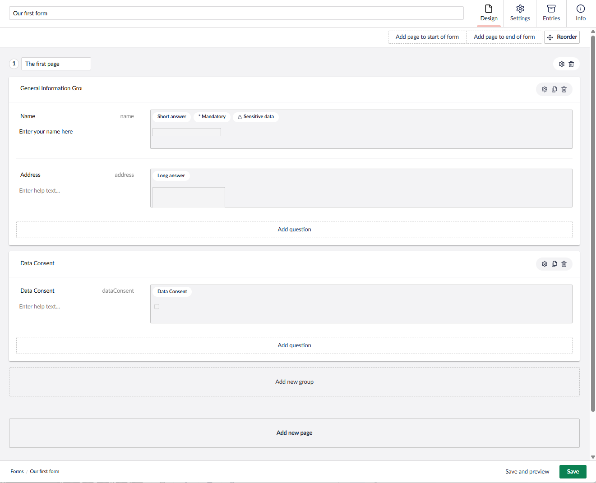
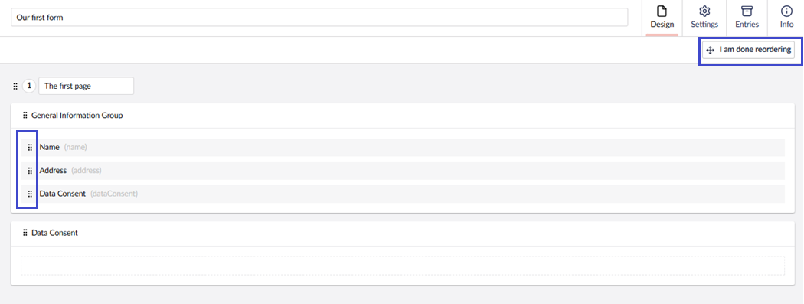
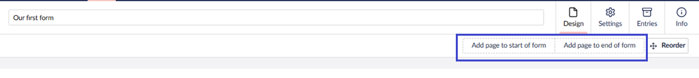
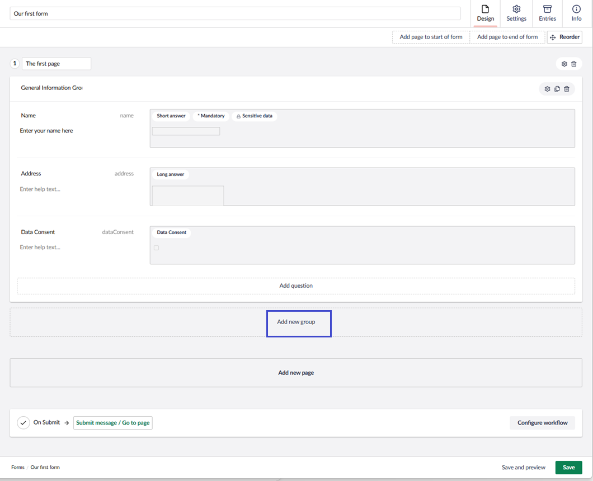
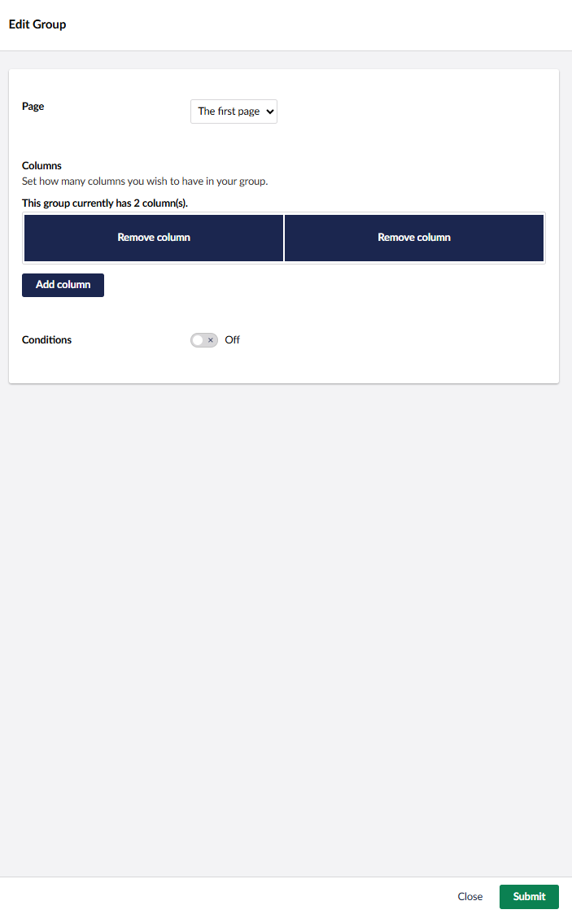
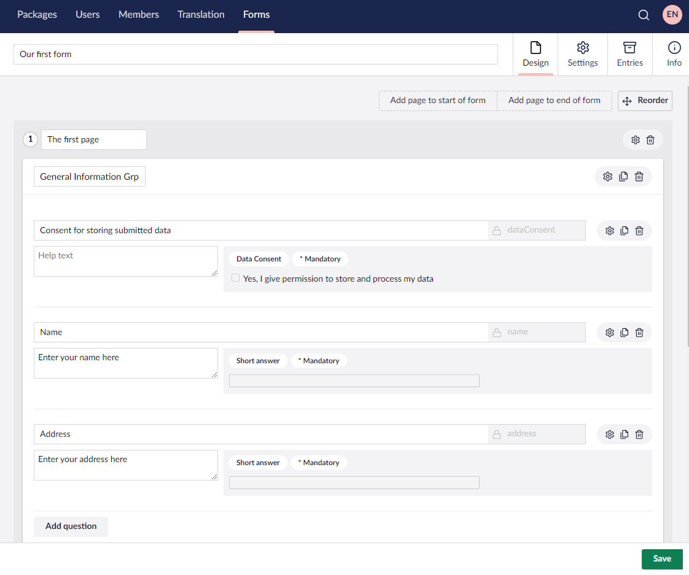
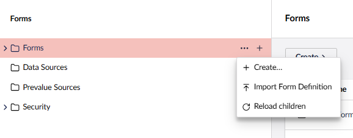
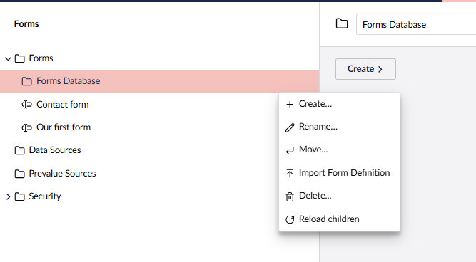
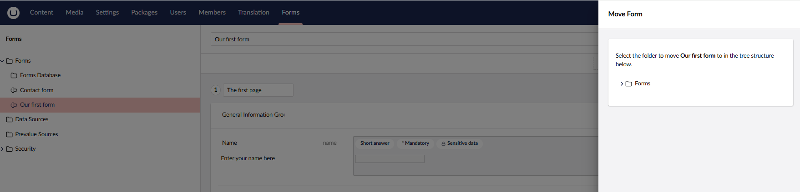

# Creating a Form - The Basics

This article walks you through creating a basic form in Umbraco Forms and adding it to your site. You’ll learn how to access the Forms section, build a form with pages, groups, and fields, and publish it on a content page.

## Accessing the Forms Section

You can manage the Forms in the **Forms** section of the Umbraco backoffice. You need access to the section to see it.

If you cannot see the **Forms** section, ask an Administrator to grant you access from the **Users** section.

## Creating a new Form

To create a Form, follow these steps:

1. Go to the **Forms** section in the backoffice.
2. Click **...** next to the **Forms** folder.
3. Select **Create** > **New Form**. The Form Designer opens in the editor.
4. Enter a **Name** for the Form. For example, _Our first form_.
5. Click **Add new page**.
6. _[Optional]_ Enter a **Page Name**. For example, _The first page_.
7. _[Optional]_ Enter a **Group Name**. For example, _General Information Group_.
8. Click **Add Question**.
9. Select **Short Answer** in the **Choose field type** dialog.
10. Enter the following values in the **Edit field** window:

| Field Name         | Value                |
| ------------------ | -------------------- |
| Enter a name       | Name                 |
| Enter help text    | Enter your name here |

11. Click **Submit** to add the field to the form.
12. Click **Save**.

Similary, you can add other fields to the form.

### Editing a Field

To edit a field:

1. Click the **cog** icon next to the field.
2. Edit the desired field.
3. Click **Submit**.

### Copying a Field

Click the **Copy** icon to duplicate the field and all its settings. The copied field is added below the original.

### Deleting a Field

To delete a field or a group:

1. Go to the field or group you wish to delete.
2. Click the **Trash** icon.
3. Click **Delete**.

### Structuring the Form

#### Ordering Fields

Once you've added a few fields to your Form, you might want to change the order of questions. 

To change the order of fields:

1. Click **Reorder** in the top-right corner of the Form designer.
2. Drag and drop the fields into the desired order.
3. Click **I am done reordering** to get back to the Form designer.

#### Form Pages

Forms can be grouped into pages. When rendered, each page will be presented one at a time to the user. They will need to complete the first page before moving onto the second and can navigate back and forth between pages.

To add a new page at the start or end of the form, use the buttons in the top right corner of the editing view.

You can also add a new page directly to the bottom of the form via the **Add new page** button. This will appear below other pages when at least one exists.

### Form Groups

Within a page, form fields can be arranged into groups. These will display all together on a single page but can be styled so the fields are appropriately grouped in fieldsets.

New groups are added via the **Add new group** button.

## Form Columns

The last level of structure are columns that can be created within a group. To set the number of columns, click the **cog** icon next to the Group Name. You can now add or move fields to the new columns created.

## Saving the Form

Once you have created the Form, save the design by clicking the **Save** button.

## Importing a Form

**Import Form Definition** allows you to import a form into your Umbraco site using a predefined JSON file. This file contains the form’s structure, fields, validations, workflows, and settings.

When you import a form definition, Umbraco uses the JSON structure to recreate the form as it was defined, enabling you to:

* Reuse existing forms across multiple projects or environments.
* Migrate forms between development, testing, and production environments.
* Restore forms from backups or previously exported definitions.

Using the **Import Form Definition** option, you can manage your forms without having to recreate them.

## Organizing Forms in Folders

If the product installation is set up to store form definitions in the database, you will be able to store forms within folders. This can help with organization and makes it easier to locate the forms for modification, especially if you plan to create many Forms.

To create a folder:

1. Go to the **Forms** section.
2. Click **+** next to the Forms folder.
3. Select **Create** > **New Folder**.
4. Enter a **Folder Name**.
5. Click **Create Folder**.

You can create folders within folders, rename, move, import forms, delete, or reload children.

To move or copy forms into folders, click the **...** next to the Form and select **Move**.

## Adding the Form to the Umbraco Site

To add the Form, follow these steps:

1. Go to the **Content** section of the Umbraco Backoffice.
2. Open the content page where you want to display the form.

The page you choose should have a _Form Picker_ Data Type which you can add in the **Settings** section under **Document Types**.

3. Click **Choose** and select the Form you want to insert.

You will be able to select from the full list of forms. If available on your installation, you can select using a folder based view, which can be quicker to navigate when many forms have been prepared.

4. Click **Choose**.
5. Click **Save and publish**.
