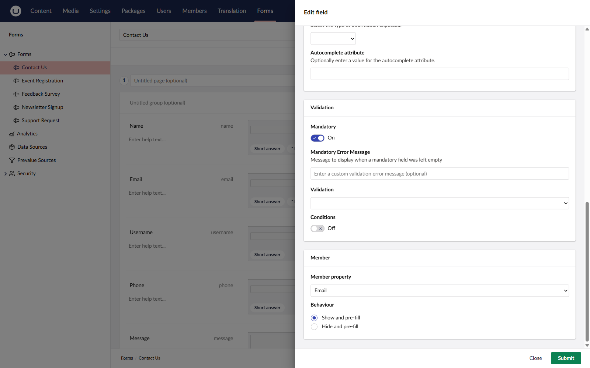

# Connecting Fields to Member Data


This feature is available from Umbraco Forms 17.5 and 18.1.


You can link a form field to a property on your site's members. When a logged-in member opens the form, Umbraco pre-fills the field with the value it already holds for that member. This saves the member from re-entering data you already have.

## The Member pane

When you edit a field, the field editor shows a **Member** pane alongside the other settings.

The pane has two controls:

* **Member property** — the member property to link the field to, or **None** to leave the field unlinked.
* **Behaviour** — how the field behaves for a logged-in member. This control appears once you select a property.

## Choosing a member property

The **Member property** list contains:

* The built-in member fields: **Name**, **Email**, and **Username**.
* The custom properties defined on your site's member type or types.

Password properties are always excluded.

The list is filtered to properties whose type is compatible with the field type. Incompatible properties are not shown.

### Compatibility

A member property can be linked to a field only when their types are compatible.

| Field type | Compatible member property types |
| ---------- | --------------------------------- |
| Short answer | Any property |
| Long answer | Any property |
| Date | Date properties |
| Checkbox | True/false properties |
| Data Consent | True/false properties |

Text fields accept any property because every member value resolves to text. Fields that expect a specific type, such as **Date**, only accept a matching member property type.

A custom field type that stores a whole number accepts whole number and decimal member properties.

## Behaviour

When a field is linked, choose how it behaves for a logged-in member:

* **Show and pre-fill** — the field is visible and shows the member's value. The member can change the value before submitting.
* **Hide and pre-fill** — the field is hidden from the member. The value is still submitted with the form.

You can link one member property per field, or **None**. The mapping and behaviour are saved with the field and persist across save and reload.

## Front-end behaviour

The mapping only affects the form when a member is logged in.

| Situation | Result |
| --------- | ------ |
| Member logged in, property has a value | The field is pre-filled and shown or hidden per the chosen behaviour. |
| Member logged in, property is empty | The field is shown so the member can provide the value, whatever the chosen behaviour. |
| No member logged in | The field renders as a normal field. The mapping has no effect. |

If the field also has a **default value** configured, the default value acts as the fallback. A member value takes priority: when the member has a value for the mapped property, it overrides the default value. When the member has no value (or no member is logged in), the field falls back to its default value.

## How the value is stored

The pre-filled value is stored in the form entry, including when the field is hidden.

For a **Hide and pre-fill** field, Umbraco resolves the value from the member on the server when the form is submitted. It does not trust the value posted by the browser. This keeps hidden values tamper-proof.

For a **Show and pre-fill** field, the member can change the value, so Umbraco stores the value as submitted.

The stored value is a snapshot taken at submission time. If the member later changes the property on their profile, the existing entry keeps the value as it was submitted.
