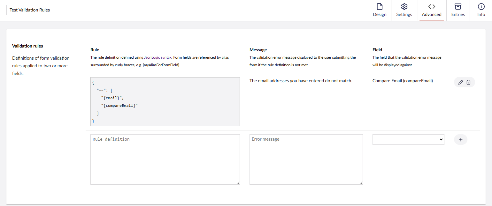

# Form Advanced Options

In this article, you will find information about accessing the Forms Advanced Options and the features available to customize your Form.

To access the Form Advanced Options:

1. Navigate to the **Forms** section.
2. Open a Form you wish to customize.
3.  Click **Advanced** in the top-right corner of the screen.


The advanced options for forms are only available when [configured to display](../../developer/configuration/README.md#enableadvancedvalidationrules).


## Validation Rules

When creating forms you can add validation to individual fields, making them mandatory or applying a regular expression pattern. You can provide validation rules for the entire form via the advanced options. This allows you to validate expressions based on multiple fields. For example, "these two email fields should be the same", or "this date should be after this other one".



To add new rules, you need to provide the rule definition, an error message and select a field to which the message will be associated.  Once created you can click to edit or delete them from the list.

Crafting the rule definition itself requires use of [JSON logic](https://jsonlogic.com/) along with placeholders for the field or fields that are being validated.

### Examples

One example use case would be ensuring that two fields match each other, perhaps when asking for a user's email address.  Given two fields on the form, one with the alias of `email` and the other `compareEmail`, the rule would be:

```json
{
  "==": [
    "{email}",
    "{compareEmail}"
  ]
}
```

A slightly more complex example could be with two dates, where, if provided, you want to ensure the second date is later than the first. So given fields with aliases of `startDate` and `endDate` a rule would look like this:

```json
{
  "or": [
    {
      "==": [
        "{startDate}",
        ""
      ]
    },
    {
      "==": [
        "{endDate}",
        ""
      ]
    },
    {
      ">": [
        "{endDate}",
        "{startDate}"
      ]
    }
  ]
}
```

Rules can be nested too. In this final illustrative example, we have two fields. One with the alias `choose` is a drop-down list with two values: `A` and `B`. The second field with alias `test` we want to be completed only if the user selects `B`.  So we create a rule that is valid only if A is selected OR B is selected AND `test` is completed.

```json
{
  "or": [
    {
      "==": [
        "{choose}",
        "A"
      ]
    },
    {
      "and": [
        {
          "==": [
            "{choose}",
            "B"
          ]
        },
        {
          "!=": [
            "{test}",
            ""
          ]
        }
      ]
    }
  ]
}
```

Overall, you can create rules of varying complexity, using comparisons between fields and static values.

When the form is rendered, these validation rules will be applied on both the client and server-side. In this way, you can ensure the submission is only accepted if it meets the requirements.