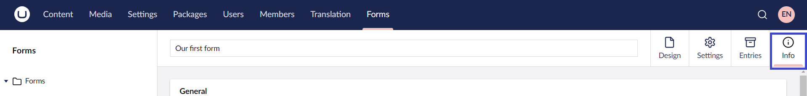
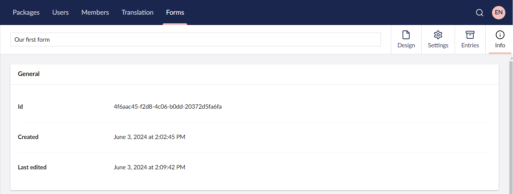
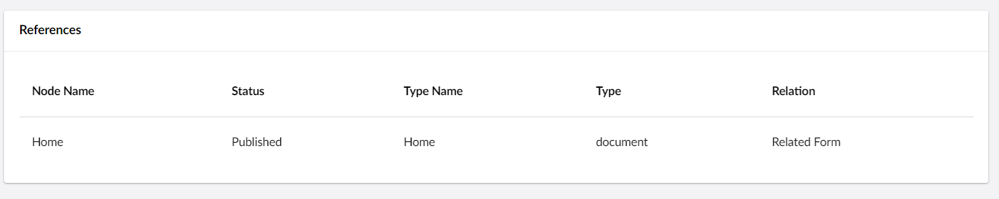

# Form Information

You can view the System information of the form in the **Info** tab.

To access the Form Information:

1. Go to the **Forms** section.
2. Open a Form you wish to customize.
3. Click **Info** in the top-right corner of the screen.

## General

The "General" panel displays system information about the form. The date the form was created and last updated are shown. Also available are the integer and GUID identifiers that are useful when referring to the form in code.

## References

Information about which pages a form is hosted on is tracked by Umbraco every time a content item is saved.

The list of pages where the form is hosted is shown in this section.

