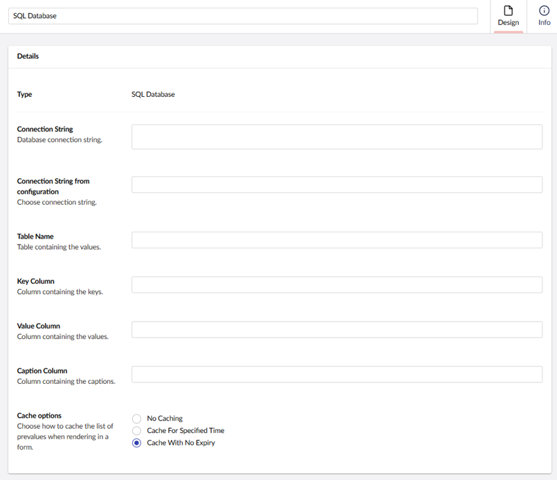

# Prevalue Source Types Overview

There are some default prevalue source types that can be used. In this article, we will give a quick overview of them:

## Get values from textfile

Upload a textfile that contains the prevalues. Each prevalue should have its own line in the file. Once the file has been uploaded, you can find it in `~/wwwroot/App_Data/UmbracoForms/Data/PreValueTextFiles/{GUID}` where the `{GUID}`is replaced with the pre-value ID.

## Umbraco Documents

Allows you to use content nodes from a specific source as prevalues. Configure the following options in the **Details** section:

* Define the root node by either:
  * Selecting the type of item the picker should target such as **Content**, **Media**, or **Members**, or
  * Specifying a dynamic root.
* Enable **Use current page as root** instead of choosing a specific root node. _Preview is not available when this setting is enabled._
* Choose a specific **Document type**, if the selected root node contains a different Document Type.
* Select the **Value field** to define the value stored for the prevalue.
* Select the **Caption field** to define the label shown in the list.
* Enable **List all Descendants** of the selected root node to include all child nodes beneath the root.
* Select **Order by** from the drop-down list to display how the prevalue list is sorted.
* Select your preferred **Cache option** for caching the list of prevalues when rendering in a form.

## SQL Database

Connect to a OleDB compatible database table and construct a prevalue source from it. Once selected, it will be editable from the Forms interface.

Configure the following options in the **Details** section:

* Connection string (either choose one from your web.config or add another from a textfield).
* Connection String from configuration
* Table Name
* Key Column
* Value Column
* Caption Column
* Select your preferred **Cache option** for caching the list of prevalues when rendering in a form.

## Umbraco Data Type Prevalues

Choose an Umbraco Data Type to use its configured prevalue collection.

In the example below, the prevalue collection from a Data Type called `Home - Font - Radio button` is used:

